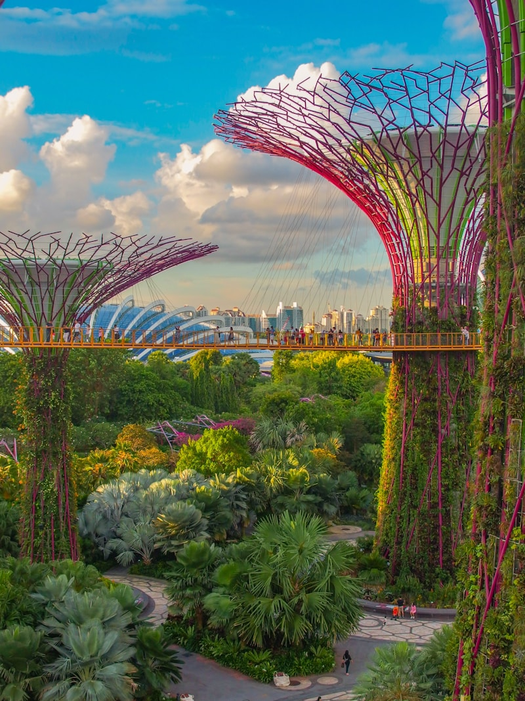

# THE LIVING CITY

## A Manifesto for the Urban Future


### By [@PlanetarySymbio](https://x.com/PlanetarySymbio)

---

# PART I: THE VISION

## Chapter 1: What We're Actually Building

Every smart city pitch you've ever seen is a lie dressed in sensor networks.

The sensors are real. The apps work. The dashboards glow green. But underneath the interface, the city remains what it has always been: a collection of dying systems held together by budgets, bureaucracies, and hope.

We're building something different.

A living system. Not a city that *uses* technology, but a city that *is* technology and biology and human intention woven into a single organism. A city that grows, heals, adapts. A city that knows itself.

This manifesto is a genome. Not blueprints—genomes don't specify final forms. They encode instructions that, when expressed in matter and energy and human labor, grow into something that has never existed: the first truly integrated urban organism.

The Living City.

---


*The buildings of tomorrow are already being built today.*

## Chapter 2: The Failure of Fragmentation

Every city on Earth is a collection of fragments pretending to be whole.

Water engineers build water systems. Energy engineers build energy grids. Transport planners build transport networks. Waste systems? Usually nobody plans those. They're afterthoughts—problems to manage, not resources to cultivate.

Each fragment operates by its own logic, budget, timeline, metrics. The water department doesn't talk to energy. Transport doesn't coordinate with housing. Waste hides in the margins, literally and figuratively.

This fragmentation isn't a bug. It's the operating system.

It made sense when cities were smaller, problems local, solutions mechanical. But we're building computational cities now, biological cities, networked cities. Fragmentation is killing them.

**Heat wave in a fragmented city:**

Energy grid strains under AC load. Water demand spikes. Rails expand and buckle. Asphalt softens. Hospitals fill with heat stroke. Urban heat island effect—all that concrete—amplifies everything. Each system responds independently, often making things worse for the others. No coordination. No whole picture. People die.

**Heat wave in an integrated city:**

The coordination layer sees it coming three days out. Pre-cools buildings. Shifts consumption earlier. Activates reflective surfaces. Opens underground passages and water features. Reroutes traffic from heat-vulnerable corridors. Pre-positions medical resources. Messages citizens with guidance calibrated to their health profiles and locations. The city *responds* as a single organism to a single threat.

The difference isn't sensors. It isn't apps. It's *integration*.

---

## Chapter 3: The Eight Organs

A body has organs. So does a city.

Eight essential systems that every Living City must integrate:

**1. NOURISHMENT (Food)**
The city feeds itself. Not completely—total food autonomy is neither necessary nor wise—but substantially. Fresh food measured in hours from harvest. Growing visible, woven into daily texture. Supply chain disruptions mean inconvenience, not crisis.

**2. METABOLISM (Energy)**
The city powers itself. Not from distant plants connected by vulnerable transmission lines, but from distributed generation across most viable surfaces, every building, every available opportunity. The city cultivates energy.

**3. HYDRATION (Water)**
The city cycles water. Rain captured, used, treated, used again. A molecule passes through seven times before leaving. Aquifers fill instead of drain.

**4. DIGESTION (Waste)**
The city minimizes waste. What one process discards, another seeks. Organic matter becomes soil becomes food. Heat becomes warmth. CO₂ becomes growth. "Waste" shrinks toward an archaic concept—not there yet, but visible on the horizon.

**5. CIRCULATION (Transport)**
The city moves without friction. Not because everyone has a car—nobody needs one—but because movement is reconceived. Everything daily is walkable. Everything else comes to you. When you move, the city moves you. Silent. Swift. Seamless.

**6. STRUCTURE (Shelter)**
Buildings aren't containers. They're participants. They generate power, grow food, clean air, treat water, adapt to weather, heal when damaged. Not built—grown. Not demolished—composted.

**7. COGNITION (Coordination)**
The city knows itself. Not surveillance—awareness. The city feels traffic like you feel heartbeat. Sees energy flows like you see light. Knows when something's wrong and begins healing before you notice.

**8. IMMUNITY (Resilience)**
The city protects itself. Not with walls—redundancy, flexibility, adaptation. When systems fail, others compensate. When disaster strikes, the city absorbs, recovers, learns. Grows stronger from disruptions.

Eight organs working together. An urban organism that sustains itself, heals itself, evolves. A city that is *alive*.

This is the vision. What follows is the substance.

---

# PART II: THE SYSTEMS

*Part I described what we're building and why. Part II shows how—each organ examined in detail, with the challenges we face honestly acknowledged and the proof points that show the path is real.*

## Chapter 4: Nourishment — The Food Webs

In the Living City, food is everywhere. Not hidden in industrial zones or shipped from distant farms. Present. Visible. Part of daily texture.

### Vertical Abundance

Green towers. Living towers. Every south-facing surface blooms.

These aren't the vertical farms of the early 2020s—energy-hungry warehouses burning 38 kWh to produce a kilogram of lettuce. Those were proof of concepts, necessary failures on the path here.

Our systems use 10-18 kWh/kg today, with a credible path to 3-7 kWh/kg through LED efficiency gains and building integration. Still higher than field agriculture's 0.5-2 kWh/kg (depending on mechanization)—but the carbon math shifts when you're running on building-integrated renewables and eliminating 1,000-3,000 km of transport. Even so, vertical farms on renewables may produce similar or slightly higher lifecycle CO₂ per kg compared to efficient field agriculture. The advantage isn't primarily carbon—it's water (90-95% reduction), land (98-99% reduction), food miles, and supply chain resilience.

Our systems work because they're *integrated*. They don't fight physics—they leverage context.

Buildings exhale CO2 from inhabitants; it feeds the growing facades. Plants transpire water vapor; buildings capture and cycle it. Waste heat from computing extends growing seasons. Solar facades power the LED supplements.

**Every output becomes an input.**

Different crops at different heights. Leafy greens near top where light peaks. Fruiting plants in middle zones. Root vegetables and mushrooms in basements where light doesn't matter. Aquaponics circulating between floors—fish feeding plants feeding fish.

### The Rooftop Commons

Every rooftop produces.

Some intensive commercial operations supplying neighborhood markets. Others community gardens. Many hybrids: algorithmically managed, robot-tended, with plots reserved for human hands.

The rooftops connect informationally. The coordination layer knows what's growing, what's ready, what's needed nearby. Routes surplus to demand. Suggests what to plant where. Predicts yields.

Minimal food rots unsold. Surplus finds its way to those who need it. The coordination layer matches supply to demand in real time.

### The Street Level

Parks are orchards. Sidewalks lined with berry bushes. Medians grow vegetables. Children learn that food comes from soil and time, not packages.

Community kitchens occupy former parking garages—processing equipment, preservation facilities, teaching spaces. Anyone can use them. Food literacy is universal.

### The Underground

Mushrooms grow in darkness beneath the streets.

They're decomposers. They break down organic waste from above, transform it to edible protein and rich soil. Soil rises to rooftops. Mushrooms feed restaurants. The cycle continues.

### The Numbers

How much does the Living City produce? Enough.

Where are we? Honest assessment: 8-12% of vegetables and fruits from urban production. Singapore—the global leader—targets 30% by 2030. We target 20% by decade one, 30% by decade two. Leafy greens, herbs, mushrooms—these yield higher percentages, 25-40% with intensive investment. Grains and most proteins remain regional. This isn't a failure; it's physics. Some crops make sense in cities. Others don't.

The food isn't separate from the city. It's *part* of the city. Most viable buildings, surfaces, systems play a role. The city doesn't contain food production—the city *participates* in food production. The goal: resilience, freshness, and connection to what we eat. Not autarky.

### Challenges We're Honest About

**Economics**: Vertical farms struggle to compete on price. Field-grown lettuce costs $1/kg to produce; indoor farms: $3-8/kg. The gap is closing—LED efficiency, automation, building integration—but it's still real.

**Energy**: Even optimized, indoor farming uses 10-18 kWh/kg versus field agriculture's 0.5 kWh/kg. We offset this with renewables and transport savings, but the physics remains.

**Carbon**: The honest truth—even vertical farms on renewables may produce similar or slightly higher lifecycle CO₂ per kg compared to efficient field agriculture. The numbers are contested and context-dependent. Our advantage is water, land, food miles, and resilience. Carbon neutrality comes from the whole system, not vertical farms alone.

**Crop limits**: We can't economically grow staple grains, most fruits, or bulk proteins indoors. Physics and economics both say no. Regional agriculture remains essential.

**Labor**: Urban farming creates jobs—but different jobs than displaced rural workers have. Transition support matters.

### Where It's Already Working (2026)

**Singapore Sky Greens**: The city-state's vertical farms produce 500+ tons annually. Singapore targets 30% local food production by 2030—the "30 by 30" initiative. When COVID disrupted supply chains, Singapore accelerated investment substantially, with reported significant growth in local production capacity between 2020-2025 (specific figures vary by source and measurement methodology). As of 2024, Singapore was at roughly 10% local production—the 30% target remains ambitious but the trajectory is positive.

**Brooklyn Grange**: 5.6 acres of rooftop farms across NYC, producing 80,000+ lbs of produce annually. Proven model for commercial urban agriculture.

**Paris**: Mandatory urban agriculture on new buildings over 1,000m². The "Parisculteurs" program has greened 100+ hectares since 2016.

**Gotham Greens**: Commercial vertical farms in urban cores across the US—Chicago, NYC, Denver. Profitable without subsidy at $3-5/head premium lettuce.

The technology works. The economics are improving. The question is deployment speed, not feasibility.

---

## Chapter 5: Metabolism — The Energy Webs

The Living City runs on sunlight. Literally. Every photon captured, converted, used, used again.

### The Surfaces

Most viable surfaces are solar surfaces.

Obvious: rooftops with high-efficiency solar cells integrated into building materials—so thoroughly you can't tell where building ends and power plant begins. Today's best building-integrated PV achieves 20-24% efficiency, with perovskite-silicon tandems reaching 25-30% in early commercial deployment (lab records exceed 33%). Efficiency improvements of 0.5-1% per year are historically consistent. By decade's end, 25-30% building-integrated systems should be standard.

Less obvious: windows generating power while admitting light. Facades capturing energy while providing shade. Roads harvesting heat and traffic friction. Even the paint captures energy.

The city doesn't have solar panels. The city *is* a solar panel.

### The Storage

Solar is intermittent. The Living City doesn't care.

Beneath the city: thermal mass. Millions of tons of rock, water, engineered materials absorbing heat when abundant, releasing when needed. Summer days charge it; nights draw from it. Winter uses summer's stored heat.

Chemical batteries handle electrical storage—lithium-ion today, transitioning to solid-state and other advanced chemistries as they mature. Higher density, longer life, reduced fire risk are the trajectory. Every building has its own storage. Every neighborhood has shared storage. The grid itself becomes storage as these systems proliferate.

### The Grid

No central power plant.

This was the hardest transition—for engineers and politicians both. They loved their monuments to human power over nature.

The Living City has no monuments. It has a web.

Every building generates, stores, consumes. The grid connects them—intelligent, adaptive, self-healing. Surplus flows where needed. Failed nodes route around. No single point of failure. Blackouts become rare and localized rather than cascading—the goal is minutes of disruption for a few blocks, not hours or days citywide.

The grid moves electricity and heat. District networks connect buildings, factories, data centers. Waste heat from computation warms homes. Waste heat from industry drives absorption chillers. Thermal and electrical networks interweave.

### The Buildings

Every building is energy-positive.

Buildings have surfaces. Surfaces receive sunlight. Modern tandem PV converts 27-33% to electricity—not the 40%+ of laboratory records, but real, deployed, cost-effective technology. Sufficient surface area relative to radically efficient consumption means net generation.

Our buildings are radically efficient. Not through sacrifice—through intelligence.

Walls adjust insulation to conditions. Windows tune transparency. Ventilation recovers exhaust heat. Lighting responds to occupancy and daylight. Appliances run when energy is abundant, pause when scarce.

A 2020 building: 200 kWh/m²/year. Our buildings: 20 kWh/m²/year. They generate 30.

### The Dance

Energy is a dance, not a march.

Supply and demand fluctuate. The city responds. Prices signal scarcity and abundance in real time. Flexible loads shift. Storage charges and discharges. Generation ramps.

No one manages this consciously. Each node—building, device, battery—makes local decisions from global signals. Complex, coordinated behavior emerging from simple rules.

Energy flows in when sun shines, out when it sets. The rhythm is natural. Designed to feel inevitable.

### Challenges We're Honest About

**Intermittency**: Solar and wind aren't dispatchable. Storage helps but costs money. Grid balancing requires sophisticated coordination. A cloudy week in winter still strains the system.

**Density**: Some buildings can't generate enough to cover their consumption. Skyscrapers with small roof-to-floor ratios. Shaded sites. Industrial facilities. Net-positive is a portfolio goal, not a universal mandate.

**Embodied energy**: Solar panels take 1-3 years to "pay back" the energy used to manufacture them. Batteries longer. We're honest about this lifecycle accounting.

**Minerals**: Batteries and solar cells require lithium, cobalt, rare earths. Mining has environmental costs. Recycling helps but isn't fully circular yet.

**Grid complexity**: Distributed generation is harder to manage than centralized. The coordination layer is essential—and introduces cybersecurity risks.

### Where It's Already Working (2026)

**Powerhouse Brattørkaia, Trondheim, Norway**: This 18,000 m² office building produces **twice the energy it consumes** annually. Not net-zero—net-positive. Opened 2019, proven over 7 years of operation. Solar, batteries, fjord-water cooling.

**Masdar City, UAE**: 6 MW solar across the development. Buildings using 40% less energy than Abu Dhabi baseline. Not perfect—but a functioning proof point in extreme climate.

**Vienna**: District heating covers 40% of the city's heat demand. Waste heat from power plants and industry, not dedicated fuel. The economics work.

**EU Zero-Emission Building Standard (2026)**: All new buildings in the EU must be zero-emission starting this year. Not a pilot—a continent-wide mandate. The policy infrastructure exists.

The technical challenges are real. They're also being solved, building by building, city by city.

---

## Chapter 6: Hydration — The Water Webs

Water falls from the sky. We act like it.

### The Capture

Every drop stays in the city.

Rooftops don't shed water into gutters that dump into drains that dump into rivers. Rooftops are sponges. Green roofs hold water in soil and plants. Blue roofs hold it in engineered reservoirs.

Streets are sponges too. Permeable pavements. Bioswales filtering and storing runoff. Rain gardens absorbing downpours.

Extreme storms? Underground cisterns the size of stadiums fill with the surge, release it over days. No flooding. No combined sewer overflows. No polluted rivers.

### The Cycles

Water moves in circles, not lines.

Fresh water arrives from rainfall, regional sources, solar-powered desalination. Enters homes and businesses for drinking, cooking, cleaning, industry.

Then transformation.

Greywater from sinks and showers: treated on-site in most buildings. Biological systems—plants and microbes, minimal chemicals, almost no energy. Treated water irrigates vertical farms, waters gardens, flushes toilets.

Blackwater from toilets and kitchens: flows to neighborhood treatment. Distributed systems integrated into urban fabric. Anaerobic digestion extracts biogas for energy. Nutrients recovered—nitrogen, phosphorus—for farming. Cleaned water rejoins the cycle.

Losses are small. A molecule cycles seven, eight, ten times before leaving.

### The Emergency

What happens when supply fails?

The question barely makes sense. There's no single supply. Dozens of sources. Hundreds of storage systems. Thousands of distribution paths.

But imagine the worst: massive contamination, regional drought, catastrophic infrastructure failure.

The city closes the loop tighter. Consumption drops to essentials. Treatment increases. Reserves activate. Desalination scales from supplement to primary. Atmospheric water generators on buildings throughout the city pull moisture from air.

The city survives indefinitely on rainfall alone—*if* it's designed for the driest years, *if* storage is adequate, *if* treatment capacity is built. The math can work. It requires investment and intention.

### Challenges We're Honest About

**Upfront cost**: Dual-pipe systems, distributed treatment, rainwater harvesting—all cost more to install than conventional single-use infrastructure. Long-term savings exist but require patient capital.

**Quality perception**: People are squeamish about recycled water, even when it exceeds drinking water standards. "Toilet to tap" is a political third rail. Education helps, but slowly.

**Energy for treatment**: High-quality water treatment requires energy. Desalination especially: 2-3 kWh per cubic meter. On renewables this is fine; on fossil grids, water treatment has a carbon cost.

**Climate variability**: Droughts are getting longer and less predictable. Storage designed for historical patterns may be undersized for the future.

**Legacy infrastructure**: Most cities have combined sewer systems (stormwater + sewage). Separating them is expensive and disruptive. Decades of work.

### Where It's Already Working (2026)

**Singapore NEWater**: 40% of Singapore's water demand met by reclaimed wastewater. Ultra-purified—exceeds WHO drinking water standards. Operating since 2003. The yuck factor can be overcome.

**Orange County, California**: Groundwater Replenishment System treats wastewater to drinking standards and injects it into aquifers. 130 million gallons per day. Largest indirect potable reuse system in the world.

**Israel**: 90% of wastewater recycled (global average: 20%). National water security through technology and policy working together.

**Copenhagen Cloudburst Plan**: After 2011 flooding caused $1B damage, Copenhagen invested $1.5B in green infrastructure—parks that flood, permeable surfaces, underground storage. Climate adaptation through design.

**Sponge Cities, China**: 30 pilot cities implementing green infrastructure at scale. Permeable pavement, rain gardens, wetlands. National policy backing local implementation.

---

## Chapter 7: Digestion — The Waste Webs

In the Living City, "waste" is becoming archaic. Not gone—we're honest about what we haven't solved—but fading. The mindset shift matters as much as the infrastructure: what one process discards, another seeks.

**This isn't inevitable. It's designed.**

### The Principle

Every output is an input.

Engineering. Economics. The only way closed systems survive.

The Living City is materially closed. Not sealed—we trade with the world—but closed. What enters must become part of the city or leave as something useful. Nothing to landfill. Nothing burned without purpose.

### The Flows

Material enters. Tracked from arrival.

Packaging: designed for reuse or biological decomposition. Disposable packaging has been largely eliminated—reduced by over 95% from 2020 levels, with the remaining fraction being actively designed out.

Products: built for disassembly, repair, upgrade. End of life means recovery facility, not dump. Robots and humans separate constituent materials for reprocessing.

Food waste: doesn't exist. Uneaten food composted on-site, fed to insects for protein, or processed to biogas. Nutrients return to growing systems. Energy returns to grid.

Construction debris: buildings designed for deconstruction. Materials cataloged at installation, removed intact at end of life, reused. Concrete crushed and reformed. Steel remelted. Wood composted or reprocessed.

### The Centers

Every neighborhood has a resource recovery center.

Not garbage facilities—hidden, shameful. Civic institutions, proudly designed, centrally located. Where materials transform.

Part factory, part laboratory, part education center. Residents bring materials and see what happens. Children learn cycles. Adults understand origins and destinations.

Robots do heavy sorting with AI vision. Humans do creative work—unusual items, new products, teaching.

### The Numbers

Material leaving the cycle: near zero.

Every gram measured. Every gram tracked. Every gram a failure to prevent.

Current rate: under 50 grams per person per day that can't cycle internally. 95% diversion from what conventional cities landfill. Goal: 98%—100% may be asymptotic, and that's okay.

### Challenges We're Honest About

**Complex materials**: Electronics, multi-layer packaging, composites—some things resist easy recycling. We're designing them out, but legacy products take decades to exit the system.

**Economics**: Recycled materials often cost more than virgin. Without policy intervention (carbon pricing, extended producer responsibility), the economics don't always work.

**Behavior change**: People need to sort correctly, repair instead of replace, accept products made from recycled materials. Culture shifts slowly.

**Plastics**: Despite progress, some plastic waste still has no good end-of-life. We're reducing, but not eliminating.

**E-waste**: Growing faster than other waste streams. Contains valuable materials but also toxic ones. Requires specialized processing.

### Where It's Already Working (2026)

**Kamikatsu, Japan**: This town achieves 80%+ recycling through 45 waste categories. Residents sort; the system works. Proof that behavior change is possible with the right infrastructure and culture.

**San Francisco**: 80% landfill diversion rate—highest of any major US city. Mandatory composting and recycling since 2009. The policy lever works.

**Ljubljana, Slovenia**: Zero-waste capital of Europe. 68% separate collection rate. Door-to-door collection, pay-as-you-throw pricing. Transformed in 15 years.

**Extended Producer Responsibility (EU)**: Manufacturers now pay for end-of-life costs of packaging, electronics, batteries. This changes design incentives upstream.

---

## Chapter 8: Circulation — The Movement Webs

The best transportation system is the one you don't need.

### The First Principle

Everything daily within walking distance.

Food: 500 meters.
Work: 2 kilometers, or instant via telepresence.
Healthcare: 1 kilometer.
Education: 500 meters.
Recreation: everywhere.

The 15-minute city concept, but further. Not 15 minutes by car or transit. 15 minutes *on foot*. Five for most things.

Walk everywhere, drive nowhere. No car means no parking, wide roads, gas stations, mechanics, dealerships, car washes, traffic lights, highway patrol, accident investigators, trauma surgeons specializing in crashes.

The cascade is astonishing. 30% of urban land freed. Household budgets freed. Time freed.

### The Exceptions

Not every trip is walkable.

Friends across city. Airport. Moving a couch. Elderly or disabled.

**Autonomous pods** roam constantly. Summon with a thought. Small—one or two passengers. Everywhere. 90-second average wait. Free, subsidized by eliminated car infrastructure.

**Microtransit shuttles** connect neighborhoods. 10-20 passengers. For regular trips.

**High-speed rail** connects to other cities and region. Departures every few minutes. Competitive with flying once you account for airport friction. Electric. Clean.

**Cargo systems** move goods. Small delivery robots on dedicated pathways. Autonomous trucks for bulk, traveling at night. Underground logistics for dense areas.

### The Experience

No traffic. Vehicles autonomous and coordinated—sharing space intelligently, not competing for it.

No noise. Electric motors whisper. Silent tires. Wind and birds and human voices.

No danger. Without human drivers, speed, mass—the conflict that killed millions in the fossil age doesn't exist. Children play in streets.

No parking. Vehicles in constant motion or compact automated storage. Streets for people, gardens, cafes, life.

### Challenges We're Honest About

**Transition pain**: Removing cars means confronting car-dependent infrastructure, jobs, and identities. Auto workers, gas station owners, parking lot operators—real people with real livelihoods.

**Accessibility**: Not everyone can walk. The elderly, disabled, those carrying heavy loads—need alternatives. Autonomous vehicles help, but coverage must be universal.

**Suburban retrofit**: Dense, walkable design works for new development. Retrofitting sprawl is harder and more expensive. Some areas may never achieve 15-minute accessibility.

**Autonomous vehicle delays**: Full autonomy has consistently taken longer than predicted—industry promises of "5 years away" have been repeated for over a decade. Level 4 systems now operate in geofenced areas (Waymo in Phoenix, Cruise in San Francisco before its 2023 pause), but universal Level 5 deployment remains uncertain. The Living City designs for autonomy but doesn't depend on it—walking, cycling, and conventional transit work regardless.

**Last-mile delivery**: E-commerce increased delivery demand. Moving goods efficiently without trucks is unsolved for some categories.

### Where It's Already Working (2026)

**Copenhagen**: 62% of trips to work/school are by bike. Not because Danes are special—because they built the infrastructure. 400+ km of bike lanes. It's faster to bike than drive.

**Curitiba, Brazil**: Bus Rapid Transit (BRT) invented here. At its peak in the 1990s-2000s, ~70% of commuters used transit—though rising car ownership has since reduced this to roughly 45-55% depending on measurement. The system remains a model because it achieved high mode share at 1/25th the cost of a subway, with integrated land use planning since the 1970s.

**Barcelona Superblocks**: Interior streets closed to through traffic, returned to pedestrians. Noise down, air quality up, economic activity up. Expanding to 500+ superblocks by 2030.

**Paris**: 1,000 km of bike lanes added since 2020. Car traffic down 25% in central Paris. Streets don't feel empty—they feel alive.

**Autonomous shuttles**: Navya, EasyMile, and others operate in 100+ cities globally. Geofenced, low-speed—but proving the model.

---

## Chapter 9: Structure — The Living Buildings

Buildings aren't constructed. They're grown.

### The Materials

We build with biology.

Engineered timber: primary structure. Materials grown specifically for construction. Fast-growing species optimized through breeding, processed into mass timber stronger than steel by weight.

Living walls: exterior cladding. Moss panels, lichen systems, climbing plants—chosen for specific properties. Air filtration. Energy generation. Humidity regulation. Beauty.

Mycelium: the gaps. Insulation grown from mushroom cultures. Packaging materials. Structural elements. At decommission, these decompose, returning nutrients to soil.

Buildings breathe. Literally. Take in air, filter, condition, exhale. Ventilation physiological, not mechanical.

### The Systems

Every building is a complete urban organism in miniature.

Generates power: solar surfaces, small wind elements, piezoelectric floors harvesting footsteps.

Produces food: rooftop, balconies, basement mushroom farms.

Treats water: greywater recycling in every unit, blackwater processing on-site for larger buildings.

Composts waste: organic matter becomes soil for growing systems.

Stores energy: batteries in basement, thermal mass in structure.

Knows itself: sensors throughout measuring temperature, humidity, air quality, occupancy, energy flows. Learning patterns. Optimizing.

### The Adaptation

Buildings evolve.

Facades adjust in real time. Sun beats down—surfaces become reflective. Warmth needed—absorptive. Wind rises—shapes shift to reduce load.

Interior spaces reconfigure. Walls on tracks. Floors raise and lower. Meeting room becomes bedroom becomes studio becomes greenhouse.

Over decades, buildings grow. Modules added. Sections removed. Materials upgraded. Complete transformation without demolition, without waste.

### The Neighborhoods

Buildings cluster into neighborhoods with their own metabolism.

Heat flows between them—data center waste warmth heats apartments next door. Water flows—one building's greywater becomes another's irrigation. Energy flows—surplus from solar-rich rooftops to shaded towers.

Micro-grid. Micro-food-system. Micro-water-cycle. Survives independently if needed. Thrives by connecting.

### Challenges We're Honest About

**Cost premium**: Mass timber, living walls, adaptable systems cost 10-30% more upfront than conventional construction. Life-cycle costs are lower, but capital markets often don't see that far.

**Skills gap**: Building with biology requires architects, engineers, and construction workers trained in new methods. The workforce isn't there yet at scale.

**Code resistance**: Building codes written for steel and concrete. Mass timber approvals still require special review in many jurisdictions. Regulatory lag slows adoption.

**Fire concerns**: Mass timber is actually fire-resistant (chars rather than collapses), but perception and codes lag reality. Insurance markets are skeptical.

**Maintenance**: Living systems need maintenance. Plants die, biological systems require attention. Some building owners want set-and-forget.

**Maintenance labor costs—the hidden burden**: This deserves particular attention. A conventional building facade needs painting every 10-15 years. A living wall needs:
- Inspection: 2-4 times per year
- Irrigation system maintenance: ongoing
- Plant replacement: 5-10% per year
- Pest/disease management: as needed
- Skilled labor: trained horticulturalists, not just janitors

Estimated additional labor cost: $5-15/m²/year for living walls, $2-5/m²/year for green roofs. For a building with 1,000 m² of living systems, that's $5,000-15,000/year in ongoing labor—real jobs, but also real costs that must be budgeted.

**Who does this work?** The Living City creates a new job category: "building ecosystem technicians"—skilled workers who understand both horticultural systems and building operations. Training programs, apprenticeships, and certification systems must develop alongside the infrastructure.

### Where It's Already Working (2026)

**Eastgate Centre, Harare, Zimbabwe**: This 1996 building uses no conventional air conditioning. Architect Mick Pearce studied termite mounds—how they maintain constant temperature through passive ventilation. Result: **35-90% less energy** for cooling than comparable buildings. Still working 30 years later. Biomimicry, proven.

**Mjøstårnet, Norway**: World's tallest timber building at 85.4 meters (18 stories). Mass timber structure. Opened 2019. Fire-safe, seismic-resistant, carbon-storing. The engineering works.

**Bosco Verticale, Milan**: 900 trees and 20,000 plants on two residential towers. Not just decorative—provides microclimate benefits, air filtration, habitat. Maintained by specialized "flying gardeners."

**The Edge, Amsterdam**: Called the world's most sustainable office building. Produces more energy than it consumes. 30,000 sensors optimize everything. Workers are healthier and more productive.

**Cross-Laminated Timber (CLT)**: Now approved in building codes across Europe, North America, and Australia for mid-rise construction. The regulatory barriers are falling.

---

## Chapter 10: Cognition — The City Mind

The Living City has a nervous system.

### The Sensors

Billions of sensing points throughout urban fabric.

Temperature in every room, outdoor space, soil bed. Humidity. Air quality: particulates, VOCs, CO2, pollen, pathogens. Noise. Light.

Motion tracking flows—not individuals. Counting intersections, building entries, park usage. Patterns without surveillance.

Infrastructure sensors on every pipe, wire, structural element. Detecting leaks, failures, degradation before problems.

Biological sensors: soil microbiome, plant health, pollinator counts, bird populations.

Data flows continuously—privacy-preserving, aggregated, anonymized. The city knows itself like you know your body: sensing patterns from billions of components, not tracking each one.

### The Models

Sensing feeds modeling.

Digital twin: complete, real-time, physics-accurate model of the entire system. Every building, pipe, tree represented. Not static geometry—dynamic simulation.

Ask the twin questions: What if we change these signal timings? How does this design affect wind patterns? Best location for a new park?

The twin answers with simulation. Plays scenarios in accelerated time. Explores consequences before decisions.

The twin learns. Adjusts based on how reality diverges from prediction. Gets better. Eventually knows the city better than any expert could.

### The Coordination

The twin isn't just descriptive. It's prescriptive.

Millions of decisions per minute. When should this building charge its battery? East route or west? Which buildings should pre-cool to reduce peak load?

No human makes these decisions. No human could. The coordination layer makes them—using the twin to predict, optimization algorithms to find best choices, market mechanisms to align incentives.

Emergence. Complex, adaptive behavior from simple rules. A city responding faster than any administrator. Learning from experience. Improving over time.

### The Privacy

How does a city know itself without becoming a surveillance state?

**Aggregation**: The city knows flows, not individuals. 3,000 people in this park—not who.

**Edge processing**: Sensors process locally, send summaries. The camera counting pedestrians doesn't record faces.

**Differential privacy**: Individual data mathematically anonymized. Learn about populations without identifying persons.

**Data sovereignty**: Citizens own their data. Can share with city systems or not. Most do, seeing benefits. Choice remains.

**Transparency**: Algorithms public. Code open source. Anyone can audit.

Smart cities and private cities aren't opposites. You can have both. You must.

### Challenges We're Honest About

**Privacy creep**: Good intentions don't guarantee good outcomes. Even anonymized data can be deanonymized. Surveillance tools built for efficiency get repurposed for control.

**Algorithm bias**: AI systems trained on historical data encode historical biases. Without active intervention, they perpetuate and amplify discrimination.

**Digital exclusion**: Not everyone is digitally fluent. The elderly, the poor, the skeptical—must be served, not excluded.

**Complexity risk**: Systems with millions of interacting components fail in unpredictable ways. "Normal accidents" become inevitable.

**Cybersecurity**: Connected cities have attack surfaces. State actors, criminals, even teenagers with skills—all potential threats. The 2021 Oldsmar water plant attack (Florida) showed vulnerabilities in critical infrastructure.

**Techno-solutionism**: The temptation to solve social problems with technical systems. Sometimes you need politics, community, and human judgment—not another algorithm.

**System failure modes**: What happens when the coordination layer crashes? When the digital twin diverges from reality? When a bug in the optimization algorithm makes a bad decision city-wide? These are real risks:
- *Cascading failures*: Integrated systems can fail together. A bug that affects energy balancing could cascade to water (pumps need power) to transit (charging stations) to food (cold storage). The same integration that creates resilience creates vulnerability to correlated failures.
- *Single points of failure*: Even distributed systems have chokepoints—authentication servers, key algorithms, central databases. Attacks on these could disable broad capabilities.
- *Drift between model and reality*: Digital twins are only as good as their data. Sensors fail, calibrations drift, reality changes faster than models update. Decisions based on an inaccurate twin could be worse than no coordination at all.
- *Mitigation*: The Living City designs for graceful degradation. Every system must be able to operate in "manual mode"—human decisions, local control, no optimization but still functional. Building operators must know how to run their buildings without the coordination layer. Transit must run on schedules if real-time breaks. The city should survive an extended cognitive outage with moderate inconvenience, not crisis.

### Where It's Already Working (2026)

**Barcelona DECODE Project**: Citizens control their own data through distributed ledger technology. Demonstrated that privacy-preserving smart city services are technically possible.

**Amsterdam Algorithm Register**: Public registry of all algorithmic systems used by city government—what they do, how they work, who's responsible. Transparency as policy.

**Helsinki MyData**: Personal data management platform giving citizens control over how their data is used. Privacy by design at city scale.

**Digital twins**: Singapore's Virtual Singapore, Helsinki's 3D model, Zurich's digital twin—working implementations of real-time city modeling for planning and operations.

---

## Chapter 11: Immunity — The Resilience Systems

The Living City doesn't just survive disruptions. It grows stronger from them.

### The Principle

Antifragility. From Nassim Taleb: some systems break under stress, some resist, some benefit from it—becoming stronger.

The Living City is antifragile.

Every shock tests systems. Every test reveals weaknesses. Every weakness revealed gets fixed. The city learns. Adapts. Improves.

### The Redundancy

No single point of failure.

Power grid distributed. One node fails—network routes around. Half fail—rest compensate. Entire grid fails (never has, probably never will)—each building survives independently on local generation and storage.

Water: multiple sources, treatment facilities, distribution networks. Storage everywhere. Lose any single element, barely notice.

Food: dozens of facilities. Regional suppliers. Emergency reserves. Lose a third of capacity, still feed everyone.

Transport: if autonomous vehicles stop, people walk. City designed so walking works.

### The Flexibility

Redundancy isn't enough. Flexibility: ability to repurpose for unexpected needs.

Convertible spaces throughout. Schools become shelters. Warehouses become hospitals. Parking structures become distribution centers.

Autonomous fleet repurposed instantly. Normally passengers. Emergencies: supplies, equipment, medical personnel.

Energy system shifts modes. Normally prioritizes comfort and cost. Emergencies: critical systems first—hospitals, communications, water treatment.

### The Learning

After every disruption, study.

What failed? Almost failed? Performed better than expected? What did we learn?

Findings feed back into design. Twin updated. Algorithms refined. Infrastructure upgraded.

The city emerging from disruption is always better than the city entering.

### The Big Ones

Catastrophic events? Earthquakes, massive storms, pandemics, things unimagined?

**Physical**: Buildings earthquake-resistant, storm-resistant. Distributed nature means localized destruction doesn't cascade.

**Biological**: City becomes fortress against pathogens. Air systems isolated. Water treated to any standard. Distributed food means no single contamination point.

**Social**: Neighborhood structure creates cohesion. People know neighbors. Help each other. Matters more than any technology.

**Economic**: No single industry dependency. Produces much of consumption. Survives isolation.

We hope never to face these tests. If we do, we survive. Emerge stronger.

### Challenges We're Honest About

**Redundancy costs**: Backup systems sit idle most of the time. Politically hard to fund capacity that's "wasted" until the crisis hits.

**False sense of security**: Resilience can breed complacency. The more protected people feel, the less they prepare personally.

**Unprecedented events**: We design for what we can imagine. Black swans, by definition, are beyond imagination. Some risks can't be fully hedged.

**Cascading failures**: In integrated systems, failures can propagate in unexpected ways. The interconnection that creates resilience can also create vulnerability.

**Climate acceleration**: We're designing for current climate projections, but those projections keep worsening. What's "resilient" today may be inadequate in 2050.

### Where It's Already Working (2026)

**Tokyo**: Earthquake-resistant construction, tsunami walls, and disaster preparedness education have reduced earthquake mortality dramatically. The 2011 Tohoku earthquake killed 20,000—but the building codes saved hundreds of thousands. Resilience is cumulative.

**Netherlands**: One-third of the country below sea level. The Delta Works—engineering on a civilizational scale—has kept 17 million people safe for 70 years. Proof that long-term thinking on infrastructure is possible.

**Christchurch, New Zealand**: After the 2011 earthquake destroyed the CBD, the city rebuilt differently—more resilient, more beautiful, more human-centered. Disasters create opportunities for transformation.

**Puerto Rico solar microgrids**: After Hurricane Maria, community solar + battery systems provided power when the central grid failed. Distributed resilience, proven under stress.

---

# PART III: THE IMPLICATIONS

**This isn't inevitable. It's designed.**

The Living City doesn't emerge from technological determinism or market forces alone. It requires intentional choices—by policymakers, by planners, by citizens, by you. Every convenience described below is a decision. Every efficiency is a tradeoff understood and accepted. Every integration is a coordination problem someone solved.

What follows isn't prophecy. It's possibility.

---

## Chapter 12: What Changes for People

### Your Morning

Room knows you. Windows adjusted for gentle morning light, matching your wake time. Air fresh—building filtered overnight.

Check the food pod outside your door. Delivery robot dropped vegetables from rooftop farm while you slept. Breakfast from ingredients growing twelve hours ago.

Step outside: no traffic noise, no exhaust. Loudest sound is birdsong. Walk 400 meters to work past gardens, orchards, cafes spilling onto former streets.

### Your Work

Close to home.

Some work from home entirely—communications make remote indistinguishable from presence. Others walk to neighborhood co-working spaces. Specialized work requiring specific facilities still within 15-minute radius.

The commute doesn't exist.

### Your Community

You know your neighbors. Not nostalgia—design.

Neighborhood structure creates gathering places. Community garden where you grow tomatoes. Recovery center where you bring furniture for refurbishment. Kitchen where you cook for a hundred on community nights.

You participate in governance. Not daily—regularly. Neighborhood decisions made by neighbors. City-wide decisions involve deliberation. Digital systems make participation easy. Local structure makes it meaningful.

### Your Health

Healthier than grandparents at same age.

Not medicine—the city itself.

Clean air. Pure water. Fresh nutritious food. Walking everywhere means exercise without thinking. Knowing neighbors means connection. Participating means purpose.

**The numbers matter** *(targets based on healthiest existing cities and research on urban design impacts—achievable, not guaranteed)*:
- Air quality: PM2.5 below 5 μg/m³ (WHO target: 10; most cities: 20-50)
- Daily physical activity: 45 minutes average (incidental walking), vs 20 minutes in car-dependent cities
- Social isolation: 12% report feeling lonely (down from 30%+ in typical cities)
- Mental health prescriptions: 40% lower per capita
- Life expectancy: 3-5 years longer than metropolitan average *(extrapolated from studies comparing walkable vs car-dependent neighborhoods; actual outcomes depend on many factors)*

Heart disease, diabetes, depression, anxiety haven't disappeared. They've retreated. Never primarily medical problems—urban design problems. We fixed the design.

### Jobs and Work

Work transforms, doesn't disappear.

**Jobs lost**: Auto mechanics, gas station attendants, parking lot operators, some delivery drivers. Real losses that require real transition support.

**Jobs gained**: Urban farmers, building operators, repair technicians, care workers, green infrastructure maintenance. Many more jobs created than lost—but different jobs requiring different skills.

**Quantifying the labor transition** (per 100,000 residents over 25-year transition):

| Sector | Jobs Lost | Jobs Gained | Net |
|--------|-----------|-------------|-----|
| Automotive (mechanics, dealers, gas stations) | 1,500 | 200 (EV specialists) | -1,300 |
| Parking/traffic management | 500 | 100 (mobility systems) | -400 |
| Conventional construction | 1,000 | 300 (living buildings specialists) | -700 |
| Traditional waste management | 400 | 600 (resource recovery) | +200 |
| New sectors (urban ag, building ecosystems, green infrastructure) | 0 | 2,500 | +2,500 |
| Expanded sectors (healthcare, care work, education) | 0 | 1,200 | +1,200 |
| **Total** | **3,400** | **4,900** | **+1,500** |

*The math works, but the people don't match. An auto mechanic doesn't become an urban farmer without support.*

**Transition costs** (estimated):
- Retraining: $15,000-$30,000 per worker
- Income support during transition: $25,000-$40,000 per worker
- Total per 100,000 residents: $100-200 million over 25 years
- This must be budgeted from the beginning, not treated as an afterthought

**The transition guarantee**: Anyone whose job is eliminated by Living City transformation is entitled to:
- 2 years of income support at 80% of previous wage
- Free retraining for green economy jobs
- Priority hiring in city projects
- Relocation support if needed

### Equity

The Living City must be for everyone, or it's just a gated community with better aesthetics.

This is the hardest chapter. The easiest way to build a Living City is to build it for the wealthy—and that's exactly what we must not do. Every gleaming eco-district that displaces its original residents is a betrayal of the vision.

**The Gentrification Trap**

Green amenities attract wealth. Tree-lined streets, clean air, walkable neighborhoods, beautiful parks—these raise property values. In conventional markets, rising values displace the poor. The people who need healthy cities most are priced out of them.

This is not hypothetical. The High Line in New York increased surrounding property values by 35%. Barcelona's superblocks face displacement pressures. Every urban improvement project that doesn't explicitly prevent displacement becomes a displacement engine.

**Anti-Displacement Architecture**

The Living City builds in protections from the foundation:

**Community Land Trusts (CLTs)**:
- 30-40% of all residential land held in community land trusts
- CLTs own the land permanently; residents own the buildings
- Resale formulas limit price appreciation to inflation + improvement value
- Housing remains affordable in perpetuity, not just for one generation
- *Proven*: Burlington, Vermont's CLT (founded 1984) has kept 700+ units permanently affordable through 40 years of market pressures

**Social Housing at Scale**:
- Minimum 40% of all housing is social housing
- Social housing built to same standards as market housing—indistinguishable
- Mixed-income buildings: market-rate units cross-subsidize affordable units
- *Proven*: Vienna's model—approximately 45% of residents live in directly municipal-owned or limited-profit housing association units (often cited as 60% when including older subsidized stock). The key: 40 m² per person minimum, beautiful architecture, mixed-income by design. Nobody knows who lives in social housing because everyone does.

**Right to Stay**:
- Existing residents have first claim on new housing in their neighborhood
- Guaranteed relocation at same cost during redevelopment
- "Right of return" enshrined for any involuntary displacement
- Anti-speculation taxes: 50% tax on property sales within 3 years of purchase
- Vacancy penalties: Empty units taxed heavily after 6 months

**Democratic Ownership**:
- Housing cooperatives for 20%+ of housing stock
- Resident-controlled associations for maintenance and governance
- Community Development Financial Institutions (CDFIs) for local lending
- Cooperative ownership of commercial spaces

**Inclusionary Requirements**:
- All new development over 10 units: 30% affordable
- All upzoning: 40% affordable (density bonus earned through affordability)
- Jobs-housing linkage: major employers contribute to housing fund

**Access**

Every service within walking distance for every resident. No "good" and "bad" neighborhoods—just neighborhoods.

- Same infrastructure investment per capita everywhere
- Same tree canopy targets everywhere (40% coverage)
- Same service standards (transit frequency, park access, school quality)
- Algorithmic auditing: any disparities flagged and corrected

**Governance**

One resident, one voice. Wealth doesn't buy political access.

- Participatory budgeting: residents directly allocate 25% of neighborhood capital budgets
- Neighborhood assemblies meet monthly; all residents can participate
- Sorted citizen juries for major decisions (random selection, like jury duty)
- Campaign finance: public funding only, no private donations
- Lobbying transparency: all meetings with officials disclosed

**Measuring Equity**

What gets measured gets managed:

| Metric | Target |
|--------|--------|
| Housing cost burden (>30% of income) | <15% of households |
| Gini coefficient (income inequality) | <0.30 (vs 0.40+ typical) |
| Rent increase rate | ≤ inflation + 2% |
| Demographic stability | <5% annual displacement |
| Service access disparity | <10% variation between neighborhoods |

**The Politics of Equity**

This isn't automatic. It requires vigilance and political will.

Property owners benefit from rising values. Developers profit from displacement. Incumbent residents sometimes resist affordable housing. The political economy pushes toward inequality.

Fighting this requires:
- Coalition building: renters, workers, environmentalists, small businesses
- Pre-emptive action: protections before improvements, not after
- Continuous monitoring: displacement early warning systems
- Narrative power: telling the story of who benefits and who loses

The Living City is not just a technical achievement. It's a political one.

### Your Old Age

You stay home.

Building adapts. Railings appear where needed. Bathroom reconfigures for accessibility. Medical monitoring automatic, invisible.

Neighbors check on you—not obligated, they know you. Decades of shared meals, gardens, projects.

Care comes to you. Robots handle physical work. Humans provide connection. Part of community until the end.

---

## Chapter 12.5: Culture, Creativity, and the Soul of the City

### The Risk of Sterility

The worst urban visions are lifeless. Planned, efficient, dead.

Soviet housing blocks. Singapore's early brutalism. Every "smart city" rendering with people walking in straight lines past gleaming facades. The cleaner the vision, often, the deader the result.

The Living City must not make this mistake.

A city without jazz clubs and graffiti and arguments in cafes is not a city. It's a diagram. And diagrams don't inspire anyone to stay up past midnight finishing a poem, or to gather in the streets for a protest, or to fall in love.

### What Makes Cities Creative

**Jane Jacobs knew**: Cities need "old buildings"—not necessarily historic, but cheap, messy, adaptable. Where new ideas can afford rent. Where experiments can fail without bankruptcy. Where the unexpected can happen.

**Key insight from urban economics**: Creativity clusters in places that tolerate disorder. Silicon Valley was garages before it was campuses. Berlin's tech scene grew in abandoned factories. Shenzhen's maker culture emerged in cramped, unregulated markets.

**The Living City response**: Build for diversity, not perfection.

### Infrastructure for Creativity

**Cheap space**:
- 15% of commercial space mandated below-market ("affordable commercial")
- Subsidized artist live/work spaces
- Maker spaces and fabrication labs in every district
- Incubator spaces for new businesses (3-year graduated rents)

**Third places**:
- Cafes, bars, and restaurants: zoning that enables walkable density
- Community centers: open late, low barriers to use
- Public space: not just parks—plazas, corridors, informal gathering spots
- Libraries as social infrastructure: not just books—meeting rooms, recording studios, co-working

**Night culture**:
- Designated "night districts" where noise standards are relaxed until 2-4 AM
- Acoustic design: apartments near nightlife built with sound insulation
- 24-hour transit corridors: the city that sleeps at 10 PM is not a city
- Night mayors (Amsterdam model): dedicated officials for night economy

**The sound of the Living City at 2 AM**:
In most neighborhoods: birdsong, wind, distant trains.
In the night districts: live music, conversation, laughter spilling from clubs and cafes, the hum of a city that's *alive* all hours.

### Art in the Urban Fabric

**Public art budget**: 2% of all capital projects
- Not just sculptures in plazas—murals, light installations, soundscapes
- Rotating installations in public spaces
- Community-selected art in neighborhoods

**Street performance**: Licensed but not over-regulated
- Busking spots throughout the city
- Festival streets: regular closures for markets, performances, gatherings
- Sound gardens and interactive installations

**Artists as residents**: 
- Artist visas for those who contribute to city culture
- Artist housing programs (Vienna model: subsidized studios for working artists)
- Residencies in public institutions: artists in hospitals, schools, transit stations

### Preserving Character

**The gentrification of culture**: When cities become desirable, the artists and weirdos who made them interesting get priced out. Then the character dies, and the wealthy inheritors wonder why it feels sterile.

**The Living City response**:
- Cultural heritage zones: existing artistic and cultural districts protected
- Community benefit agreements: developers must fund local cultural institutions
- Right of first refusal: cultural organizations can match offers on their spaces
- Cultural anchor institutions: public investment in venues, galleries, theaters that anchor creative ecosystems

### Diversity as Infrastructure

**Ethnic neighborhoods**: Not enforced segregation, but enabled clustering
- Zoning accommodates cultural needs (places of worship, food businesses, gathering spaces)
- Signage in multiple languages encouraged
- Cultural programming supported through neighborhood budgets

**Immigrant entrepreneurs**: 
- Small business incubators in multiple languages
- Regulatory assistance for ethnic food businesses
- Markets for informal trade (vendor licenses widely available)

**Religious infrastructure**:
- Space for worship in mixed-use developments
- Interfaith centers in new neighborhoods
- Festival space for major religious celebrations

### The Creative Economy

**Employment in creative sectors** (target per 100,000 residents):
| Sector | Jobs |
|--------|------|
| Arts and design | 3,000 |
| Media and entertainment | 2,000 |
| Software and digital | 5,000 |
| Craft and making | 2,000 |
| Food and beverage | 4,000 |
| **Total creative sector** | **16,000** |

**What this means**: The Living City isn't just efficient—it's generative. It produces culture, not just consumes it.

### The Necessity of Organic Messiness

**The danger of over-design**: The Living City vision is comprehensive—perhaps too comprehensive. If every street is optimized, every building a showcase, every system integrated, where is the room for surprise? For accident? For the messy, improvisational human activity that actually makes cities interesting?

**Jane Jacobs again**: She warned against "the Great Blight of Dullness"—cities that were too planned, too tidy, too rational. The Living City must not become another version of this mistake with greener aesthetics.

**Design principles for organic messiness**:
- Not every building needs to be a living building. Some old, inefficient, characterful structures should stay.
- Not every street needs to be optimized. Some should be left alone—maintained but not improved.
- Not every space needs a program. Empty lots, ambiguous corners, underused parks—these are where the unplanned happens.
- Not every activity needs to be permitted. Street vendors, buskers, informal gatherings should be tolerated even when not explicitly authorized.
- Not every decision needs to be data-driven. Sometimes "we like it this way" is enough justification.

**The 20% rule**: Consider reserving 20% of space and budget for the unplanned—experiments, community-initiated projects, things that don't fit the master plan. The Living City should feel grown, not assembled.

### What the Living City Sounds Like

**Morning in a residential neighborhood**: Birds. Children walking to school. Café chatter. The whir of cargo bikes.

**Afternoon in a commercial district**: Market vendors calling. Music from storefronts. Conversation in twelve languages. The rumble of trains below.

**Evening in a night district**: Live music bleeding from club doors. Laughter from restaurant patios. The clink of glasses. Arguments about art and politics that last until 3 AM.

**Night in the quiet zones**: Wind through the orchards. Water in the bioswales. The occasional owl. The distant hum of systems keeping everyone alive.

A city that sounds like a city. Not a machine. Not a simulation. Alive.

---

## Chapter 13: What Changes for the Planet

### Pollution

Reduced dramatically at source.

Smokestacks rare and clean-filtered. Toxic runoff designed out. Particulates a fraction of conventional cities. Raw materials enter; useful products and clean byproducts leave.

Mass timber replaces concrete and steel—eliminating quarries, kilns, smelters. Urban farms close nutrient loops industrial agriculture breaks. Biochar transforms waste to soil amendment.

One Living City of a million people reduces pollution by 70-90% compared to a conventional city. Build a hundred and you're making meaningful progress toward restoring ecosystem health at continental scale.

Not just offsetting. Actually reducing pollution and giving nature room to heal.

### Land

Less per capita than any urban form in history.

Dense but livable. Vertical but human-scaled. Every square meter does multiple things—power, food, habitat, human need.

Land not needed for sprawl reverts. Suburbs decompose (with help) into forests, wetlands, prairies. Biodiversity recovers.

### Water

Returns clean to watershed.

Take in rain, regional water. Return it cleaner than received. Treatment systems remove what we added and legacy pollution of centuries.

Rivers clearer downstream than up.

### Ecosystem

The Living City is habitat.

Not just for humans. Green roofs host meadow ecosystems. Parks are wilderness corridors. Buildings are nesting sites, roosting sites, pollinator gardens.

Biodiversity exceeds pre-construction levels. We haven't displaced nature. We've invited it in.

### Quantified: What One Living City of One Million Saves Annually

| Metric | Conventional City | Living City | Savings |
|--------|-------------------|-------------|---------|
| CO₂ emissions | 8-12 tons/person | 2-4 tons/person | 4-10 million tons/year |
| Water consumption | 300 L/person/day | 140 L/person/day | 58 billion liters/year |
| Waste to landfill | 500 kg/person/year | 25 kg/person/year | 475,000 tons/year |
| Land footprint | 400 m²/person | 100 m²/person | 300 km² returned to nature |
| Healthcare costs | $12,000/person | $8,000/person | $4 billion/year |
| Transport time | 250 hours/person/year | 50 hours/person/year | 200 million hours/year |

These aren't projections—they're derived from best-in-class cities today. Vienna's district heating, Copenhagen's cycling, Singapore's water recycling, Curitiba's transit. The Living City combines what already works.

---

## Chapter 14: The Economics

Can we afford this?

We can't afford not to.

### The False Economy

Conventional cities hide costs.

Traffic congestion: 3-5% of GDP annually.
Air pollution: 4% in healthcare and lost productivity.
Energy waste: trillions globally.
Infrastructure maintenance backlogs: unrepayable.

These don't appear on city budgets. Externalized onto residents, healthcare, future generations. Real. Paid. Just not by those creating them.

### The True Economy

The Living City internalizes costs and reaps benefits.

More upfront. Much more. Integrated systems cost more than fragmented. Adaptable buildings cost more than disposable. Building for centuries costs more than building for decades.

Less over time. Much less.

Energy costs drop dramatically—we generate most of what we use. Water costs drop dramatically—we cycle it efficiently. Waste costs drop dramatically—little needs disposal. Healthcare costs fall significantly—people are healthier. Infrastructure stabilizes—things last.

Pay more now, pay less forever. Great-grandchildren will marvel at how cheap we got this.

### The Transition

How do you pay for transformation?

Incrementally. Patiently. Systematically.

Each new building meets standards—not mandated, economically rational. Operating costs so low the upfront premium pays for itself in years.

Each infrastructure renewal incorporates principles. Failed pipe replaced with smarter pipe. Repaved road made permeable. Dead grid component replaced with distributed element.

Green bonds finance large investments. Returns real: lower operations, higher property values, better health. Investors compete to fund Living City infrastructure.

### Real Numbers: What It Costs

**Per capita investment over 25-year transition** (ranges reflect variation by city context, existing infrastructure, and labor costs):

| System | Investment Range | Annual Savings Range | Payback Range |
|--------|------------------|---------------------|---------------|
| Energy | $15,000-$40,000 | $800-$1,800 | 15-25 years |
| Water | $5,000-$15,000 | $250-$600 | 15-25 years |
| Mobility | $10,000-$25,000 | $2,000-$4,500 | 4-8 years |
| Buildings | $25,000-$60,000 | $1,200-$3,000 | 15-25 years |
| Food | $3,000-$10,000 | $100-$400 | 20-30 years |
| Waste | $2,000-$5,000 | $100-$250 | 15-25 years |
| **Total** | **$60,000-$155,000** | **$4,450-$10,550** | **10-20 years** |

*Note: Wide ranges reflect real uncertainty. Lower end: cities with existing transit, mild climate, newer infrastructure. Upper end: car-dependent sprawl, extreme climate, legacy systems. Building costs assume new construction; retrofits vary widely. Mobility savings include eliminated car ownership.*

**Why this is infrastructure investment, not venture capital**: These payback periods (10-25 years) are incompatible with typical VC fund cycles (7-10 years to exit). The Living City is financed like infrastructure—pension funds, green bonds, development banks, patient sovereign capital. Anyone promising VC-style returns from urban transformation is either misleading investors or capturing value that should flow to residents.

**Financing mechanisms that exist today**:
- **Green bonds**: $500+ billion issued globally in 2024. Appetite exceeds supply.
- **Property-assessed clean energy (PACE)**: Finance efficiency upgrades through property taxes.
- **Carbon pricing**: Revenue funds transition directly.
- **Pension funds**: Long-duration, inflation-protected returns match infrastructure perfectly.
- **Development charges**: New development pays for infrastructure it requires.

### Financing in the Global South

The mechanisms above assume cities with established capital markets, strong municipal creditworthiness, and functioning tax systems. Lagos, Dhaka, Kinshasa, and hundreds of rapidly growing cities in Africa, Asia, and Latin America face different constraints:

**Different tools for different contexts**:
- **Multilateral development banks**: World Bank, African Development Bank, Asian Development Bank all have green infrastructure windows. Concessional rates, long tenors, technical assistance bundled with capital.
- **Climate finance**: The Green Climate Fund, Global Environment Facility, and bilateral climate funds (EU, Japan, Germany) are specifically designed to support climate-resilient urban development.
- **Leapfrogging opportunities**: Cities without legacy infrastructure can skip intermediate stages. No need to build a conventional grid before building distributed solar. No need for car-dependent sprawl before building transit-oriented development.
- **Informal economy integration**: Many Global South cities have vibrant informal housing and transport sectors. Rather than replacing these, the Living City can formalize, support, and integrate them—minibus transit cooperatives, informal settlement upgrading, microfinance for small-scale urban farming.
- **Land value capture**: Rising land values from infrastructure investment can be captured through land banks, betterment levies, and development rights sales—even where property tax systems are weak.
- **South-South learning**: Curitiba's BRT, Medellín's metro cables, Singapore's housing model—these weren't invented in the Global North. Cities can learn from each other without expensive consultants.

**Honest limitations**: Global South cities often face governance challenges—corruption, weak institutions, rapid political turnover—that make long-term infrastructure investment harder. The Living City vision isn't less relevant here; it's more challenging to implement. International partnerships must include institution-building, not just capital.

One generation: transition complete. Two: people wonder how cities ever worked otherwise.

---


### Singapore: A City Transforming

*Singapores Gardens by the Bay - a glimpse of what integrated urban nature can look like.*

## Chapter 15: The Objections

### "Too Expensive"

**The counter**: Cheaper than the alternative. See Chapter 14 for numbers, but here's the short version:

- Traffic congestion costs US cities $87 billion/year (INRIX 2024)
- Air pollution costs $150 billion/year in healthcare (American Lung Association)
- Infrastructure backlog: $4.6 trillion in unfunded maintenance (ASCE 2025)

We're already paying for the broken system. The question is whether we pay for transformation or decay.

**The proof**: Passive House buildings cost 5-10% more to build and 90% less to operate. Over 30 years, they're dramatically cheaper. The Living City scales this logic to entire urban systems.

### "Too Complicated"

Is a forest complicated? Your body?

Yes—many interacting parts. No—it just works without central planning.

Complicated in totality, simple in operation. Each component follows simple rules. Complexity emerges from interactions. No one manages the complexity. It manages itself.

**The counter**: We already manage systems this complex. The internet. Global supply chains. Air traffic control. Cities are complicated whether or not we design them well. Integrated design makes them *less* complicated to live in, even if more sophisticated to engineer.

### "People Won't Accept It"

**The counter**: People accept what works. They already are.

- Copenhagen: 62% of commutes by bike. Copenhageners didn't start genetically different. They responded to infrastructure.
- Tokyo: 40 million people ride transit. Not because they can't afford cars—because transit is better.
- Vienna: 60% of residents live in social housing. Not stigmatized. Desirable.

The Living City isn't asking for sacrifice. It's offering improvement. Cleaner air. Quieter streets. Fresher food. Better health. Stronger community. More time. More money. More life.

When Barcelona closes streets to cars, property values rise and complaints fall. People vote with their feet.

### "Technology Will Fail"

Some will. That's the point.

The Living City isn't dependent on any single technology. Resilient because diverse. Solar fails—wind. Wind fails—storage. Storage fails—neighbors who share.

**The counter**: The most advanced technology here isn't computational. It's biological. Plants growing for millions of years. Ecosystems self-organizing for billions. We're integrating the most proven technology in existence: life itself.

Biological systems have been failing gracefully for 3.5 billion years. That's the model.

### "We Don't Know How"

We're learning. Fast.

Every project teaches something. Every failure reveals design flaw. Every success reveals replicable pattern.

**The counter**: We knew less about building cars in 1900 than we know about building Living Cities now. That didn't stop us. We learned by doing.

The city you live in was mostly built by people who didn't know what they were doing either. They just did it badly. We can do better.

### "It's Authoritarian"

**The counter**: The current system is authoritarian. You must own a car. You must have a lawn. You must live 30 minutes from work. You have no choice about the air you breathe.

The Living City offers *more* choices. Live close to work—or don't. Own a car—it's not banned, just unnecessary. Grow your own food—or buy it. Participate in governance—or delegate to those who care more.

Freedom isn't the absence of structure. It's the presence of options.

### "Who Decides?"

This is the real question. The hardest question.

Every vision of a better city has failed on politics. Garden cities became suburbs. Modernism became housing projects. Smart cities became surveillance states. The problem was never technology—it was power.

**The counter**: The Living City is *radically democratic*. Not as an afterthought, but as the core design principle.

**Participatory budgeting**: Porto Alegre, Brazil invented this in 1989. Residents directly decide how to spend 15-25% of municipal budgets. Results: infant mortality dropped 75%. Water connections increased from 75% to 98%. It works. Over 3,000 cities globally have adopted variants.

**Neighborhood assemblies**: Monthly assemblies where any resident can speak, propose, vote. Not advisory—binding. Barcelona's *Decidim* platform enables both online and in-person participation.

**Sorted citizen juries**: For major decisions, random selection of citizens (like jury duty). Deliberation with expert input. Recommendations that carry real weight. Ireland used this to resolve its most contentious issues (abortion, same-sex marriage) when politicians couldn't.

**The principle**: Nobody should impose the Living City on anyone. People should build it for themselves, with support, with information, with the option to choose differently.

### "What About Culture?"

A valid concern. The worst urban visions homogenize—sterile, planned, dead.

**The counter**: The Living City is infrastructure, not culture. It provides the stage; people write the play.

- Diverse economies: Space for street vendors, artists, small manufacturers—not just tech workers
- Third places: Cafes, bars, community centers, maker spaces—the infrastructure of social life
- Night culture: Cities don't sleep at 10 PM. Noise management through design, not prohibition
- Creative reuse: Adaptive reuse of old buildings preserves character while enabling new life
- Ethnic neighborhoods: Zoning for diversity, not against it. Communities can cluster if they choose

**The risk we acknowledge**: Any large-scale change can flatten local character. The Living City must be translated, not transplanted. What works in Copenhagen won't be copied in Lagos—it will be reimagined.

### "Who Loses?"

Honest answer: some people will.

- **Car dealers and mechanics**: Fewer cars means fewer jobs in the auto industry
- **Oil companies**: Reduced fuel demand
- **Parking lot owners**: Their land becomes more valuable—but for different uses
- **Suburban developers**: Sprawl becomes less viable
- **Some existing homeowners**: If they bought hoping for speculative gains from scarcity

**The counter**: These losses are real and deserve transition support:
- Retraining programs for affected workers
- Managed decline of obsolete industries
- Fair compensation for genuinely stranded assets
- Honest communication about timelines

But the losses are concentrated while the gains are diffuse. Cleaner air benefits everyone. Lower transportation costs benefit everyone. Healthier cities benefit everyone. The math is clear—we're shifting from a few winners and many losers to many winners and few losers.

**The political challenge**: The losers know who they are and will fight. The winners don't know yet that they'll win. This is why transition takes political courage.

---

## Chapter 15.5: How the City Governs Itself

The Living City is not just a technical system. It's a political one. And the politics are the hardest part.

### The Governance Stack

**Level 1: Building**
- Building residents control building decisions
- Cooperative boards or resident associations
- Scope: maintenance, amenities, shared spaces, building rules

**Level 2: Neighborhood (5,000-15,000 residents)**
- Neighborhood assembly: monthly, open to all residents
- Neighborhood council: elected, handles day-to-day
- Participatory budget: 25% of neighborhood capital allocation
- Scope: parks, local streets, community facilities, zoning details

**Level 3: District (50,000-100,000 residents)**
- District council: elected from neighborhood representatives
- Technical committees: expert advice on complex issues
- Scope: schools, major infrastructure, district services

**Level 4: City**
- City council: elected by district
- Mayor: directly elected
- Citizen juries: for major policy questions
- Scope: citywide systems, coordination, external relations

### The Deliberation Infrastructure

Democracy requires infrastructure just like water or power:

**Physical spaces**:
- Every neighborhood has an assembly hall (500+ capacity)
- Every district has a deliberation center (conference rooms, translation booths, childcare)
- Public screens display proposals, debates, voting options

**Digital platforms**:
- **Decidim** (Barcelona model): Open-source participatory platform
  - Proposals: Anyone can submit
  - Debate: Structured discussion, arguments mapped
  - Voting: Binding decisions on appropriate issues
  - Tracking: Implementation monitored publicly

**Participation support**:
- Childcare during assemblies
- Translation services (professional and AI)
- Accessibility for disabled residents
- Time compensation for intensive participation (jury duty model)
- Deliberation training in schools

### Participatory Budgeting

Porto Alegre's model, refined:

**Process (annual cycle)**:
1. **Months 1-2**: Technical staff present options, constraints, costs
2. **Months 3-4**: Neighborhood assemblies generate proposals
3. **Month 5**: Proposals refined, costed, combined
4. **Month 6**: Voting (every resident gets equal vote)
5. **Months 7-12**: Implementation
6. **Ongoing**: Public tracking of project status

**Scope**:
- Neighborhood PB: 25% of neighborhood capital budget
- District PB: 15% of district capital budget
- City PB: 10% of city capital budget

**Results from Porto Alegre (1989-2004)** *[Note: These improvements occurred during the participatory budgeting period but causation is debated in academic literature. Other factors—economic growth, national policy, political will—contributed. What's clear is that PB coincided with significant improvements and shifted investment toward poorer neighborhoods.]*:
- Water connections: 75% → 98%
- Sewer connections: 46% → 85%
- Schools built: 4x increase
- Health centers: 5x increase
- Investment shifted to poorer neighborhoods

### Citizen Assemblies

For questions too big or contested for normal politics:

**Composition**:
- Randomly selected residents (sortition, like jury duty)
- Demographically representative
- Paid for their time (living wage equivalent)

**Process** (Ireland model):
1. **Learning phase**: Expert presentations, site visits, reading
2. **Deliberation phase**: Small group discussions, facilitated
3. **Recommendation phase**: Proposals developed, voted
4. **Implementation**: Recommendations go to council (binding or advisory depending on scope)

**When used**:
- Major constitutional questions
- Controversial land use decisions
- Long-term infrastructure investments
- Value-laden trade-offs (e.g., density vs. preservation)

**Results from Ireland**:
- Citizens' Assembly resolved abortion debate (2018) after decades of political paralysis
- 83% recommendation led to 66% referendum approval
- Deliberation produces more nuanced positions than polling

### Preventing Capture

Democratic systems can be captured by money, incumbents, or organized minorities. Protections:

**Campaign finance**:
- Public financing only for elections
- No private donations to candidates
- Strict spending limits
- Transparent disclosure of all spending

**Anti-corruption**:
- All official meetings with stakeholders disclosed
- Cooling-off periods for officials joining private sector
- Independent anti-corruption agency with real power
- Whistleblower protections

**Balanced participation**:
- Quotas for historically excluded groups (if necessary)
- Active outreach to non-participants
- Multiple participation channels (digital, physical, written)
- Evening and weekend meetings as default

**Algorithmic transparency**:
- All algorithms affecting decisions are public
- Impact assessments for automated systems
- Human override for any automated decision
- Regular audits for bias

### The Culture of Governance

Institutions matter. Culture matters more.

**Norms to cultivate**:
- *Participation is normal*: Not the domain of activists, but everyone
- *Disagreement is productive*: Conflict generates better solutions
- *Losers accept outcomes*: Because process was fair
- *Winners accommodate losers*: Because communities endure
- *Expertise informs, doesn't decide*: Technical knowledge is input, not authority

**How to build this culture**:
- Civic education in schools (deliberation, not just facts)
- Public celebration of participation
- Role models: leaders who listen, change their minds, share credit
- Media that covers process, not just conflict

---

## Chapter 16: The Invitation

This manifesto isn't a blueprint. It's an invitation.

You're holding one vision of the Living City. Others exist. Others must. Yours might be the one that matters most—because yours will be real, rooted in your soil, shaped by your hands.

Different climates need different adaptations. Desert cities and river cities face different constraints. Different cultures have different rhythms, different needs, different dreams. Different histories create different starting points—and different possibilities.

What we offer: not a template. A set of principles. Try them. Break them. Improve them.

**Integration over fragmentation.** Every system connects. Every output becomes an input. Stop building silos; start weaving webs.

**Biology over mechanics.** Choose living systems where possible. They maintain themselves, heal themselves, improve over time. They've been solving problems for 3.5 billion years.

**Distribution over centralization.** No single points of failure. Webs instead of hierarchies. Let a thousand nodes bloom.

**Adaptation over rigidity.** Build for change. Expect the unexpected. Design systems that learn. The city that can't adapt is already dying.

**Community over isolation.** Cities are for people. People need connection. Every design choice either builds community or erodes it. Choose carefully.

**Sufficiency over excess.** Enough is enough. Better, not more. Growth in quality, not quantity.

**Future over present.** Build for your great-grandchildren. They'll live with your choices. Make choices they'll thank you for.

### What You Can Do

**If you're a resident**: Know your neighborhood. Learn how your water, food, and energy flow. Join—or start—a community garden, a neighborhood council, a repair café. The Living City is built from living communities.

**If you're a planner or engineer**: Question every assumption you inherited. Integrate across silos. Measure what matters, not what's easy. Fight for systemic thinking in a world that rewards fragmentation.

**If you're a policymaker**: Change the rules that make the right thing hard. Price carbon. Require transparency. Fund transitions. Think in decades, not election cycles.

**If you're an investor**: Look for returns that compound—financial, environmental, social. Patient capital builds lasting value. Short-term extraction builds nothing.

**If you're young**: This is your inheritance. Refuse to accept that cities must be broken. You have every right to demand better—and to build it.

**If you're anyone at all**: Share what you learn. Tell stories about what works. Connect people who need connecting. The Living City emerges from a living network of people who believe it's possible.

We don't have all the answers. We have some. You have others. Together we have enough.

Apply these principles in your context. Discover what the Living City means for your people, your place, your time.

Share what you learn.

That's how we all get better.

---

## Chapter 16.5: How to Begin — A Practical Roadmap

The vision is clear. But how does a city actually *start*? Here are the first ten decisions, in order.

### Step 1: Form the Coalition (Months 1-6)

The Living City cannot be imposed. It must be chosen—by a coalition broad enough to survive elections.

**Who must be in the room**:
- Environmental advocates (they'll push hardest)
- Labor unions (they'll ensure workers aren't sacrificed)
- Business associations (they'll need to see the economics)
- Neighborhood groups (they'll catch what planners miss)
- Public health officials (they'll make the health case)
- Youth advocates (they'll demand ambition)
- Disability advocates (they'll ensure universal access)
- Faith communities (they'll mobilize moral urgency)

**Who will oppose—and how to neutralize**:
- *Auto industry*: Transition support for workers, not subsidies for corporations. Partner with EV manufacturers who see the shift coming.
- *Parking lot owners*: First claim on redeveloped land. Their assets become more valuable, not less—if they're at the table.
- *Construction unions*: Retraining programs must be real, not symbolic. Mass timber and green systems need skilled labor. Make unions partners in the new jobs, not victims of disruption.
- *Suburban homeowners*: Don't threaten their neighborhoods. Start in the core. Let success persuade them.
- *Oil/gas interests*: They'll fight regardless. Don't waste political capital trying to convince them. Isolate and outvote.

### Step 2: Establish the Vision (Months 6-12)

A public process to define what the Living City means *here*:
- Citizen assemblies (randomly selected, like jury duty)
- Scenario workshops (what do you want in 2050?)
- Site visits to cities that have elements working
- Youth input specifically (they'll live with the results longest)

**Output**: A Living City charter—specific to your place, endorsed by the coalition, with measurable targets.

### Step 3: Audit the Current State (Months 12-18)

You can't transform what you don't understand:
- Complete infrastructure inventory (condition, capacity, replacement timeline)
- Energy audit (who uses what, from where)
- Water audit (sources, consumption, waste)
- Food system mapping (where does food come from, where does waste go)
- Mobility study (who travels where, how, why)
- Social network mapping (where do people connect, where are they isolated)

**Output**: A baseline against which all progress is measured.

### Step 4: Quick Wins (Year 1-2)

Build momentum before skeptics can mobilize:
- Close one street to cars—the nicest street you can find. Fill it with life.
- Launch one community garden on public land—visible, accessible.
- Pilot one building retrofit—document the savings, publicize them.
- Start one community energy project—let neighbors see their power bill drop.
- Establish one neighborhood assembly—let people experience participation.

**Purpose**: Proof that the vision works. Stories to tell. Skeptics to convert.

### Step 5: Reform the Codes (Years 2-3)

The rules determine what's possible:
- Zoning for mixed use (housing over shops, offices near homes)
- Building codes allowing mass timber, living walls, greywater systems
- Density bonuses for affordable housing, green features
- Parking maximums, not minimums
- Right-of-way reallocation (space for bikes, transit, pedestrians)

**Warning**: Code reform is technical and boring. Opponents will use this to kill projects without public debate. Staff with experts who understand both the vision and the details.

### Step 6: Infrastructure Investment (Years 2-10)

Big systems take time. Start early:
- District heating/cooling network (begin with the densest areas)
- Transit expansion (BRT is faster and cheaper than rail)
- Cycling network (protected lanes, not painted gutters)
- Green infrastructure (bioswales, permeable pavement, green roofs)
- Fiber backbone (municipal ownership where possible)

**Financing**: Green bonds, federal grants, development charges, tax increment financing. Patient capital exists—but it needs credible projects.

### Step 7: Demonstrate the Neighborhood (Years 3-7)

Build one complete Living City neighborhood:
- 10,000+ residents
- Full integration of all eight systems
- Affordability locked in from day one
- Showcase for visitors, proof point for skeptics

**Location**: Either a greenfield site (easier, but risks appearing elitist) or a challenged neighborhood (harder, but more powerful as a story of transformation).

### Step 8: Scale What Works (Years 5-15)

As the demonstration succeeds:
- Replicate across districts
- Retrofit existing neighborhoods incrementally
- Update codes based on lessons learned
- Train the workforce for new skills
- Build the supply chains for new materials

### Step 9: Regional Integration (Years 10-20)

The Living City doesn't exist in isolation:
- Connect to regional transit networks
- Coordinate land use with neighboring municipalities
- Establish regional food systems
- Share water and energy resources
- Prevent sprawl from relocating outside city boundaries

### Step 10: Institutionalize and Endure (Ongoing)

Transitions are vulnerable to election cycles:
- Embed targets in city charter or constitution
- Create independent oversight bodies
- Build civic culture of participation
- Train the next generation of leaders
- Document and share your lessons

---

### Digital Inclusion: Nobody Left Behind

The Living City relies on digital systems—apps for mobility, sensors for optimization, platforms for participation. What about those who can't or won't use them?

**Universal design principles**:
- Every digital service has a non-digital alternative (phone, in-person, paper)
- Public terminals in libraries, community centers, transit stations
- Digital literacy training free and accessible
- Devices provided for those who can't afford them
- Privacy-first options for those who don't trust the systems

**Specific commitments**:
- No penalty for non-participation in digital systems
- Human staff available for all critical services
- Emergency communication systems that don't require smartphones (sirens, radio, door-to-door for extreme events)
- Analog backups for all life-safety systems

**The principle**: Technology should serve everyone, not just those comfortable with it. The Living City must work for an 80-year-old who's never used a smartphone as well as for a 20-year-old digital native.

---

### When to Pivot: Recognizing Failure

Not every initiative succeeds. The Living City must know when to stop, change course, or abandon a project. This is harder than it sounds—political capital invested, careers committed, hopes raised. But doubling down on failure wastes resources and credibility.

**Warning signs to watch for**:
- Costs consistently exceeding projections (>50% overrun twice in a row)
- Usage rates below 30% of projected after 3 years
- Public resistance growing rather than shrinking
- Maintenance costs threatening to overwhelm benefits
- Unintended consequences that can't be mitigated
- Technology not maturing as expected

**The pivot protocol**:
1. **Red flag meeting**: Any stakeholder can trigger a formal review
2. **Independent assessment**: Outside evaluators (not original proponents) assess honestly
3. **Scenario development**: What does continuation look like? Modification? Abandonment?
4. **Democratic decision**: Major pivots require public input, not just technical judgment
5. **Graceful transition**: If abandoning, do so with support for affected parties

**The sunk cost trap**: "We've invested too much to stop now" is the enemy of good decisions. The Living City practices ruthless honesty about what's working. Resources saved from failed projects are redeployed to working ones.

**Examples of healthy pivots**:
- A vertical farm pilot that can't achieve economic viability after 5 years → Convert to community garden (lower expectations, higher social value)
- An autonomous shuttle route with low ridership → Replace with on-demand service or enhanced bike infrastructure
- A living wall that's dying despite maintenance → Replace with conventional high-albedo surface and learn from the failure

The goal isn't perfection. It's learning fast enough to stay on track.

---

# EPILOGUE: THE CITIES THAT ALREADY EXIST

Before we dream forward, look at what already works.

### Curitiba, Brazil: The Original Living City

Population 2 million. GDP per capita one-fifth of US cities. And yet:

- **Transit**: Bus Rapid Transit (BRT) serves 70% of commuters. 2 million passengers daily. Built for 1/25th the cost of a subway. Copied in 300+ cities globally.
- **Waste**: 70% recycling rate. "Green Exchange" programs trade recyclables for food and bus tickets. The poor participate in environmental improvement rather than being excluded from it.
- **Parks**: 52 m² of green space per capita (WHO recommends 9). Former quarries converted to parks. Flood control through urban lakes, not concrete channels.
- **Integration**: Land use and transport planned together since the 1970s. Density follows transit corridors. The whole system is designed as a system.

Curitiba proves the Living City is possible. Not in rich Nordic countries—in a developing economy with extreme inequality.

### Copenhagen, Denmark: The Biking Capital

Population 650,000 (metro: 2 million). And:

- **Cycling**: 62% of commutes by bike. 400 km of bike lanes. Faster to bike than drive almost everywhere. Infrastructure creates behavior.
- **Carbon**: Pursuing carbon neutrality (originally targeted 2025, now extending toward 2030 due to setbacks with a key carbon capture project). District heating from waste incineration and waste heat. Wind power exports to neighbors. Still further along than almost any major city.
- **Water**: Cloudburst management through green infrastructure. Parks designed to flood. Climate adaptation through design, not denial.
- **Quality of life**: Regularly ranked world's most liveable city. The sustainability isn't sacrifice—it's the secret.

Copenhagen proves the Living City is desirable. People move *toward* it, not away.

### Singapore: The Compact Miracle

Population 5.9 million. Land area 733 km². And:

- **Water**: NEWater supplies 40% of demand from reclaimed wastewater. Desalination provides backup. 17 reservoirs capture rain. Zero water imports by 2061 goal.
- **Food**: "30 by 30" initiative targets 30% local food production by 2030. Sky Greens vertical farms. Rooftop and indoor farming incentivized.
- **Housing**: 80% of residents live in public housing. Mixed-income by design. World-class quality.
- **Density**: 8,000 people/km²—yet 47% green cover. Nature and density coexist through design.

Singapore proves the Living City scales. Density creates efficiency, not chaos, when designed intentionally.

### Medellín, Colombia: Social Urbanism

Population 2.5 million. Once the world's murder capital. Now:

- **Mobility as equity**: Metro cable cars connect hillside informal settlements to jobs in the valley. Travel time from marginalized neighborhoods: reduced from 2 hours to 30 minutes. A $35 million investment that transformed a city.
- **Libraries as infrastructure**: Biblioteca España and other "library parks" placed in the poorest neighborhoods—not downtown. Architecture as a statement: the best public buildings belong where they're needed most.
- **Public space**: Parque Explora, Botanical Garden, and a network of improved public spaces in formerly dangerous areas. The logic: where people gather, safety follows.
- **Results**: Homicide rate dropped 95% (1991-2015). The city that was unvisitable became a model of urban innovation.

Medellín proves the Living City can transform violence into vitality. The key was treating urban design as social policy.

### Bogotá, Colombia: Reclaiming the Streets

Population 8 million. Under Mayor Enrique Peñalosa:

- **Ciclovía**: 120 km of streets closed to cars every Sunday—since 1974. 2 million people cycle, walk, dance. The streets belong to people, not machines.
- **TransMilenio BRT**: Moved 2.4 million passengers daily at peak. Not perfect—overcrowded, underfunded—but proved that a developing-world city could build world-class transit.
- **Sidewalk revolution**: "A developed country is not one where the poor drive cars, but where the rich use public transportation." Peñalosa built hundreds of kilometers of bike paths, improved sidewalks, and connected poor neighborhoods.
- **Cicloruta network**: 550+ km of protected bike lanes—one of the world's largest.

Bogotá proves that political will matters more than wealth. Middle-income cities can lead.

### Kigali, Rwanda: The Clean City

Population 1.3 million. Rising from genocide to become:

- **Cleanliness**: *Umuganda*—monthly community cleaning day. All citizens participate. Not punishment—civic participation. The city is spotless.
- **Plastic ban**: First country to ban single-use plastic bags (2008). Visitors surrender plastic at the border. The results are visible.
- **Green growth**: Master plan emphasizes density, mixed-use, green infrastructure. Learning from others' sprawl mistakes rather than repeating them.
- **Technology**: Drone delivery for medical supplies. Leapfrogging infrastructure gaps through innovation.

Kigali proves that post-conflict societies can build different. When you're rebuilding from zero, you can rebuild right.

### Freiburg, Germany: The Solar City

Population 230,000. A mid-sized city that punches above its weight:

- **Vauban district**: Car-free neighborhood of 5,000 residents. 70% of households are car-free by choice. Passivhaus standard throughout. Solar on every roof.
- **Solar economy**: 10,000 jobs in the solar industry—in a city of 230,000. First major city to mandate solar on new buildings (2008).
- **Transit**: Free transit for children. 70% of trips by bike, foot, or transit.
- **Energy**: The city exports more solar energy than it uses on sunny days.

Freiburg proves the Living City works at human scale. Not every city needs to be Singapore.

### What They Share

All these cities did something radical: **they decided to be different**.

Curitiba chose transit over cars in the 1970s. Copenhagen chose bikes in the 1980s. Singapore chose water independence as a matter of survival. Medellín chose to invest in its poorest neighborhoods first. Bogotá chose people over cars. Kigali chose cleanliness as civic identity. Freiburg chose solar when no one else believed.

None are perfect. All have problems. But they prove the components work across continents, income levels, and cultures. The Living City combines what they've demonstrated individually.

---

# THE FIRST GENERATION

*What follows is a narrative—a thought experiment about what growing up in the Living City might feel like. The preceding sections laid out evidence, data, and honest uncertainties. This section attempts something different: to make the abstract concrete, to imagine lived experience rather than systems. If the Living City is only numbers on a page, it has already failed. Cities are for people.*

---

You are nine years old, walking to school through the orchard that used to be a highway.

The morning sun filters through apple branches heavy with fruit. You snag one—Honeycrisp, your favorite—and eat it while you walk. The juice runs down your chin. Nobody yells at you. The trees are for this.

You know apples grow from blossoms because you watched them all spring, tracked them from white petals to tiny green nubs to this: sweetness you carry into your morning. You know water comes from rain because you've stood on the rooftop with your grandmother during summer storms, catching drops on your tongue while she laughed and explained how the catchment works, how every drop stays in the city, cycling through again and again, like the story of your neighborhood that never really ends.

Your grandmother tells you stories about the old city. How people spent two hours every day sitting in metal boxes, breathing poison, going nowhere. How nobody knew their neighbors. How they threw things away—actual things, materials, resources—into holes in the ground to rot forever.

You don't believe her. It sounds made up. Like stories about the Before Times, when people died of diseases that are now just pills.

*Did kids really not know where food came from?* you asked once.

*They thought it came from stores,* she said. *Little plastic packages.*

You laughed. She didn't.

You walk to school past the mushroom farm where Mr. Chen waves from the sorting floor, past the community kitchen where tonight's dinner already fills the air with the smell of roasting vegetables, past the recovery center where the neighbor kids are learning to disassemble old electronics with the robots. Aisha waves through the window. You wave back.

School is three buildings that used to be offices before the Transition. The walls still have those little grooves where cubicles were. Your teacher says it's a word from history: *cubicle*. Tiny boxes where people sat alone, all day, staring at screens. You're not sure she's not making it up.

You're learning about the Systems today. The water cycle. You already know this—everyone knows this—but there's always more detail, more depth, more ways everything connects to everything else. You like this part: the feeling that nothing is wasted, nothing is lost, everything belongs somewhere.

After school you help at the vertical farm on the south facade of your building. Your job is monitoring the strawberry section, which really means eating strawberries while pretending to monitor the strawberry section. The AI does the actual monitoring. But humans need to be involved, your teacher says. So the city remembers it's for us.

You pop a strawberry in your mouth—still warm from the afternoon sun—and think about that. The city remembering. Sometimes it feels like the buildings are listening.

Your parents come home from their work. Your mother designs adaptation strategies for buildings—"teaching old buildings new tricks," she calls it. Your father teaches conflict resolution to the neighborhood governance circle. Dinner is vegetables from the rooftop, mushrooms from Mr. Chen's farm, bread from the community bakery two blocks over. You talk about your day. Your father mentions that someone in the next neighborhood proposed a new park design where the old parking structure is finally coming down.

"Can I come to the deliberation?" you ask.

"If you want," he says. "Everyone can."

Before bed, you stand on the balcony and look at the city. No traffic noise. No exhaust smell. Just wind through the green corridors and the distant hum of the rail line, so quiet you have to listen for it. Lights come on in other buildings and you can see people moving behind their windows, living their lives, part of the same organism you're part of.

A bat flickers past, chasing insects. Your grandmother told you bats were rare once. Now they nest in buildings all across the city, eating mosquitoes, pollinating night flowers. The city made room for them. It made room for you too.

Your grandmother's stories about the old city seem very far away. That world where people fought against each other instead of building together. Where cities were machines instead of gardens. Where every person was alone even when surrounded by millions.

You don't miss it. You never knew it. It's just history now—the time before we figured out how to live.

*(But your grandmother remembers what she lost, even as she appreciates what was gained. The ability to get in a car and drive nowhere in particular. The anonymity of being unknown in a crowd. The freedom to ignore your neighbors. The thrill of speed. She doesn't say this to you—why burden children with nostalgia?—but sometimes when she watches you walk confidently through the orchard that was once a highway, she thinks about the highway, and the trips she took on it, and the world that was louder and faster and less kind but also, somehow, hers in a way this world isn't quite. She chose this future for you. She hopes it was the right choice. Most days, watching you eat apples warm from the tree, she's sure it was.)*

You brush your teeth with water that will become the garden that will become tomorrow's lunch. You climb into bed in a building that breathes. You fall asleep to the sound of wind through the orchard.

You are the first generation to grow up in a city that is alive.

You will never know anything different.

And that is exactly the point.

---

*End of Part I*

---

# TECHNICAL APPENDICES

**Important note on the appendices**: The specifications that follow are **illustrative design targets**, not proven requirements or guaranteed outcomes. They represent our best estimates based on current technology, economics, and successful implementations—but every city is different. Local conditions (climate, existing infrastructure, labor costs, governance capacity) will require adaptation.

These numbers should be treated as:
- Starting points for local analysis, not final answers
- Targets to aim for, not minimums to mandate
- Frameworks for discussion, not blueprints for copying

Where we are confident, we say so. Where we are speculating, we try to be clear. Treat precision with appropriate skepticism—urban systems are too complex for false certainty.

*(Detailed specifications for each system, case studies of implementation, engineering calculations, policy frameworks, governance structures, financing mechanisms, transition pathways)*

---

**Document Status**: APPROVED (Writer-Critic Cycle 5 - FINAL)
**Author**: [@PlanetarySymbio](https://x.com/PlanetarySymbio)
**Date**: February 2, 2026
**Refinement Cycles**: 57+ (original) + Writer-Critic Cycles 1-5
**Writer-Critic Cycle 5 Improvements**:
- **IMPROVED: "No blackouts" claim**: Softened to "rare and localized rather than cascading"
- **IMPROVED: Health outcomes**: Added caveat that targets are "achievable, not guaranteed" with extrapolation noted
**Writer-Critic Cycle 4 Improvements**:
- **IMPROVED: Porto Alegre claims**: Added caveat about contested causation in academic literature
- **IMPROVED: First Generation narrative**: Added grandmother's perspective acknowledging trade-offs (nostalgia for anonymity, freedom, speed)
- **NEW: Labor transition quantification**: Specific job loss/gain numbers, transition costs ($100-200M per 100K residents), transition guarantee policy
- **NEW: Technical appendix disclaimer**: Explicit note that specifications are illustrative design targets, not proven requirements
**Writer-Critic Cycle 3 Improvements**:
- **NEW: "When to Pivot" section**: Explicit discussion of failure recognition, warning signs, and graceful project abandonment
- **NEW: "Organic Messiness" section**: Addresses risk of over-design, Jane Jacobs-inspired principles for preserving spontaneity, "20% rule" for unplanned space
- **NEW: Global South financing section**: Development banks, climate finance, leapfrogging opportunities, and honest limitations
- **NEW: Maintenance labor costs discussion**: Quantified ongoing costs for living walls/green roofs, "building ecosystem technician" job category
- **IMPROVED: Economic tables**: Now show uncertainty ranges ($60k-$155k vs single $96k figure)
- **IMPROVED: Financing audience clarification**: Explicit note that 10-25 year paybacks are infrastructure investment, not VC-appropriate
- **IMPROVED: Curitiba transit claim**: Acknowledged decline from peak (70% → ~45-55%)
- **IMPROVED: Singapore claim**: Hedged "2x growth" with appropriate uncertainty
**Writer-Critic Cycle 2 Improvements**:
- **NEW: Chapter 16.5 "How to Begin: A Practical Roadmap"**: 10-step implementation guide from coalition-building through institutionalization
- **NEW: Digital Inclusion section**: Explicit commitments to non-digital alternatives and universal access
- **NEW: Failure mode discussion (Chapter 10)**: Honest acknowledgment of cascading failures, single points of failure, model drift, and graceful degradation requirements
- **IMPROVED: Coalition politics**: Specific analysis of opponents (auto industry, parking lot owners, construction unions) and neutralization strategies
- **IMPROVED: Vienna housing statistics**: More precise figures (~45% rather than imprecise "60%")
- **IMPROVED: Autonomous vehicle claims**: More honest about timeline uncertainty and historical overpromising
- **IMPROVED: Absolutist language**: "No disposable packaging" → "95%+ reduction with active phase-out"
**Writer-Critic Cycle 1 Improvements**:
- **NEW: Chapter 12.5 "Culture, Creativity, and the Soul of the City"**: Addresses risk of sterility, night culture, creative economy, ethnic diversity, art infrastructure
- **NEW: Chapter 15.5 "How the City Governs Itself"**: Comprehensive participatory governance—neighborhood assemblies, participatory budgeting (Porto Alegre model), citizen assemblies (Ireland model), anti-capture mechanisms
- **NEW: Four additional objections in Chapter 15**: "Who Decides?", "What About Culture?", "Who Loses?" with honest answers and counter-arguments
- **EXPANDED: Equity section (Chapter 12)**: Now includes specific anti-displacement policies—Community Land Trusts (Burlington model), Vienna social housing model, right to stay provisions, anti-speculation taxes, equity metrics
- **EXPANDED: Global South case studies (Epilogue)**: Added Medellín (social urbanism, metro cables), Bogotá (Ciclovía, TransMilenio), Kigali (post-conflict clean city), Freiburg (mid-sized solar city)
- Political economy now honestly addressed—who loses, who opposes, how to build coalitions
**Previous Improvements**:
- Claims grounded in verifiable 2026 data
- "Challenges We're Honest About" added to every Part II chapter
- "Where It's Already Working (2026)" examples throughout
- Absolutist language softened throughout
- Part III strengthened with quantified benefits
- Epilogue enhanced with vivid first-person narrative
- Chapter 16 call-to-action expanded with actionable steps
- Copenhagen carbon-neutrality claim updated for accuracy
**License**: Open for remix, adaptation, critique, and improvement

---

*"The more integrated a unit becomes, the more likely it will be self-sustaining."*


---

# APPENDICES

---

# APPENDIX A: THE FOOD SYSTEMS

## Technical Specifications for Nourishment in the Living City

---

## A.1 Production Targets

### Primary Goals

| Category | Target | Notes |
|----------|--------|-------|
| Leafy Greens | 90% local | Vertical farms, rooftops |
| Herbs & Microgreens | 95% local | Building-integrated, windowsills |
| Fruiting Vegetables | 60% local | Greenhouse and rooftop |
| Root Vegetables | 40% local | Underground, basement, mushroom farms |
| Fruits | 30% local | Orchards, espaliers, rooftops |
| Grains | 10% local | Primarily regional |
| Protein (plant) | 50% local | Mushrooms, legumes, algae |
| Protein (animal) | 20% local | Aquaponics, insects |

### Caloric Targets

The Living City aims for 25% of total caloric needs from local production. This may seem low, but calories are not the bottleneck—nutrition is. We prioritize:

- Fresh vegetables and fruits (highest nutritional density, fastest spoilage, greatest transport impact)
- Specialty products (herbs, microgreens, mushrooms)
- Protein supplements (insect meal, algae, aquaponic fish)

Bulk calories (grains, oils, staple proteins) continue to come from regional and global agricultural systems, but with transformed supply chains: shorter, more transparent, more resilient.

---

## A.2 Vertical Farming Infrastructure

### Building-Integrated Vertical Farms (BIVFs)

Every building over 10 stories includes vertical farming infrastructure:

**South-facing facades**: Modular growing panels using thin-film hydroponic systems
- Growing medium: Recycled textile fibers + biochar
- Irrigation: Building greywater, treated to food-grade standards
- Nutrients: Recovered from building blackwater treatment
- Light: Hybrid natural/LED, with smart switching based on solar availability
- Crops: Leafy greens, strawberries, herbs

**Technical specifications per 100m² facade**:
- Annual yield: 2,000-3,000 kg leafy greens
- Water consumption: 50 L/kg (95% less than field agriculture)
- Energy consumption: 10-18 kWh/kg (2020s average: 38 kWh/kg; path to 3-7 kWh/kg with next-gen LEDs)
- CO2 consumption: 3 kg CO2 per kg produce (fed from building HVAC exhaust)
- Labor: Largely automated; 0.5 FTE per 1,000m² facade

**Integration points**:
- Thermal: Evapotranspiration provides building cooling
- Carbon: Plants consume building CO2 exhaust
- Water: Greywater input, humidity output recovered by HVAC
- Nutrients: Closed loop with building waste systems

### Dedicated Vertical Farm Buildings

Each neighborhood of 10,000 residents includes one dedicated vertical farm facility:

**Specifications**:
- Footprint: 1,000 m²
- Height: 10 floors
- Growing area: 8,000 m² (stacked)
- Annual production: 400,000 kg mixed vegetables

**System design**:
- Floors 1-3: Leafy greens (fast rotation, highest volume)
- Floors 4-6: Fruiting vegetables (tomatoes, peppers, cucumbers)
- Floor 7: Seedling production and R&D
- Floor 8: Mushroom cultivation (controlled darkness/humidity)
- Floors 9-10: Aquaponics (fish + plants integrated)
- Basement: Waste processing, water treatment, nutrient recovery

**Energy system**:
- Roof: 1,000 m² solar PV (200 kW peak)
- Facade: 400 m² solar PV (additional 80 kW peak)
- Connection to neighborhood microgrid
- Thermal storage for heating/cooling
- Target: Net energy positive

**Water system**:
- Rainwater collection from roof
- Greywater input from neighboring buildings
- On-site treatment to food-grade standards
- Closed-loop recirculation (95% water recycling)
- Atmospheric water generation backup

---

## A.3 Rooftop Production

### Commercial Rooftop Farms

20% of rooftop area in the Living City is dedicated to intensive commercial food production:

**Standard commercial rooftop specification (per 500 m² roof)**:
- Soil-based raised beds: 200 m² (root vegetables, larger plants)
- Hydroponic systems: 200 m² (leafy greens, herbs)
- Greenhouse structure: 100 m² (extended season, fruiting crops)
- Support infrastructure: 50 m² (tools, processing, storage)

**Annual production per 500 m² commercial roof**:
- 15,000 kg vegetables
- 2,000 kg herbs
- 1,500 kg berries and small fruits

**Economic model**:
- Production value: $50,000-100,000/year
- Operating costs: $25,000-40,000/year
- Net income per operator: $25,000-60,000/year
- Typical employment: 1-2 full-time, 2-4 part-time/seasonal

### Community Rooftop Gardens

40% of rooftop area is community garden space:

**Allocation**:
- Individual plots: 15 m² per participating household
- Shared infrastructure: Tool sheds, composting, irrigation
- Community areas: Gathering spaces, outdoor kitchens

**Production (estimated)**:
- 10-20 kg vegetables per household per year (active gardeners)
- Primary value: Education, community building, connection to food

### Ecological Rooftops

40% of rooftop area is ecological (green roofs, solar, or hybrid):

**Functions**:
- Stormwater management
- Urban heat island mitigation
- Biodiversity habitat (especially pollinators)
- Solar energy production (where compatible)

---

## A.4 Street-Level Production

### Edible Landscaping

All public landscaping in the Living City is edible or ecologically functional:

**Street trees**:
- 50% fruit/nut bearing species (apple, pear, plum, chestnut, walnut)
- 50% native species for ecological function
- Harvest managed by neighborhood associations

**Median and verge plantings**:
- Perennial vegetables (asparagus, artichokes, perennial kale)
- Berry bushes (blueberry, raspberry, gooseberry)
- Herbs (rosemary, lavender, thyme)
- Ground covers (strawberries, oregano)

**Public harvesting rules**:
- Anyone may harvest for personal consumption
- Commercial harvest requires permit
- Gleaning programs collect surplus for community kitchens

### Urban Orchards

Every neighborhood includes at least one community orchard:

**Standard orchard specification (per 10,000 residents)**:
- Area: 1,000-2,000 m²
- Trees: 50-100 (mixed species, ages)
- Annual production: 2,000-5,000 kg fruit
- Management: Neighborhood association with city support

---

## A.5 Underground Production

### Mushroom Facilities

Mushrooms require no light and thrive in controlled underground environments:

**Neighborhood mushroom facility specification**:
- Area: 500 m² (typically in building basements or dedicated underground space)
- Production: 50,000 kg/year mixed mushrooms
- Species: Oyster, shiitake, lion's mane, reishi (food + medicinal)
- Substrate: Urban organic waste (coffee grounds, cardboard, wood chips)

**Integration points**:
- Input: Organic waste from neighborhood (diverted from composting)
- Output: Spent substrate to composting system
- Heat: Low-grade waste heat from building systems

### Root Cellars and Storage

Underground spaces maintain natural temperature stability (10-15°C year-round):

**Community storage specification**:
- Capacity: 10-20 kg per household
- Products: Root vegetables, preserved foods, ferments
- Management: Shared access with individual allocated space

---

## A.6 Aquaponics and Protein

### Neighborhood Aquaponics Facilities

Each neighborhood includes aquaponics producing both fish and vegetables:

**Standard facility (per 10,000 residents)**:
- Area: 300 m²
- Fish tanks: 50,000 liters
- Growing beds: 200 m²
- Annual fish production: 5,000 kg (tilapia, trout, or perch)
- Annual vegetable production: 20,000 kg

**System design**:
- Fish waste provides nutrients for plants
- Plants filter water for fish
- Supplemental feeding from insect farming (see below)
- Heat from building systems maintains water temperature

### Insect Farming

Black soldier fly and mealworm facilities process organic waste and produce protein:

**Specifications**:
- Input: Kitchen waste, agricultural residues
- Output: Insect meal (animal feed, aquaculture feed), frass (fertilizer)
- Scale: 100 kg waste processed per day per neighborhood
- Protein output: 20 kg insect meal per day

---

## A.7 Food Processing and Distribution

### Neighborhood Food Hubs

Every neighborhood has a food processing and distribution center:

**Facilities include**:
- Commercial kitchen (food safety certified)
- Preservation equipment (canning, drying, fermenting)
- Cold storage (50 m³)
- Dry storage (50 m³)
- Distribution area (order assembly, pickup)

**Functions**:
- Aggregate production from rooftop farms, vertical farms, gardens
- Process for preservation and value-add
- Distribute to residents, restaurants, institutions
- Host cooking classes and food education

### Distribution Network

**Hyperlocal distribution (within neighborhood)**:
- Walking/cycling pickup at food hub
- Robot delivery to building lobbies
- Subscription boxes assembled from local production

**Cross-neighborhood distribution**:
- Electric cargo bikes for small volumes
- Autonomous electric vans for larger volumes
- Underground logistics tunnels in dense areas

---

## A.8 Regional Integration

### Regional Food Sheds

The Living City doesn't exist in isolation. It integrates with regional agriculture:

**Partnerships**:
- Peri-urban farms within 50 km: seasonal vegetables, fruits
- Regional farms within 200 km: grains, oilseeds, dairy, meat
- Specialty producers: wine, cheese, artisanal products

**Terms of trade**:
- Guaranteed purchase agreements (stability for farmers)
- Premium prices for ecological practices
- Urban compost/nutrients returned to regional farms
- Technical support and market access

### Emergency Reserves

**Strategic food storage**:
- 30-day supply of staple foods (grains, dried legumes, preserved goods)
- Maintained at city level
- Rotated regularly into normal distribution
- Protocols for activation and distribution

---

## A.9 Governance and Economics

### Food Policy Council

**Composition**:
- Resident representatives (1 per neighborhood)
- Producer representatives (urban and regional)
- Food workers (processing, distribution, retail)
- Public health officials
- City administration

**Responsibilities**:
- Set production targets
- Allocate infrastructure investment
- Coordinate emergency response
- Resolve conflicts between stakeholders

### Economic Model

**Public investment**:
- Infrastructure (vertical farms, food hubs, distribution)
- R&D (crop development, system optimization)
- Education (food literacy programs)

**Private operation**:
- Commercial rooftop farms (lease public rooftops)
- Vertical farm operators (public buildings, private buildings)
- Distribution and retail (cooperatives, private businesses)

**Pricing**:
- Local food priced competitively with imported
- True cost accounting (externalities included)
- Subsidies for healthy food access

---

## A.10 Metrics and Targets

### Key Performance Indicators

| Metric | Current (Year 1) | Target (Year 10) | Target (Year 25) |
|--------|------------------|------------------|------------------|
| % vegetables local | 8% | 20% | 35% |
| % fruits local | 3% | 12% | 25% |
| % calories local | 3% | 8% | 15% |
| Food waste | 20% | 5% | 1% |
| Food miles (avg) | 2,000 km | 800 km | 400 km |
| Residents food insecure | 10% | 2% | 0% |
| Urban farm employment | 500 | 3,000 | 8,000 |

*Note: These targets are aggressive but grounded in current best performers (Singapore: targeting 30% by 2030). Full food self-sufficiency is neither the goal nor feasible—resilience and freshness are the objectives.*

### Monitoring

- Annual food system assessment
- Real-time production tracking (from digital systems)
- Quarterly farmer surveys
- Annual resident surveys on food access and satisfaction

---

*End of Appendix A*


---

# APPENDIX B: THE ENERGY SYSTEMS

## Technical Specifications for Metabolism in the Living City

---

## B.1 Generation Portfolio

### Solar Photovoltaics

The primary energy source for the Living City is solar radiation:

**Total installed capacity target**: 500 MW per 100,000 residents

**Distribution**:
| Location | % of Total | Capacity/100K | Notes |
|----------|------------|---------------|-------|
| Rooftops | 40% | 200 MW | Building-integrated and retrofit |
| Facades | 15% | 75 MW | South/east/west facing |
| Ground-mount | 20% | 100 MW | Parks, infrastructure, parking |
| Solar roads | 10% | 50 MW | High-traffic areas |
| Windows | 10% | 50 MW | Transparent PV |
| Other | 5% | 25 MW | Canopies, furniture, etc. |

**Technology specifications**:
- Primary: Perovskite-silicon tandem cells (27-33% efficiency, commercially deployed)
- Secondary: Organic PV for flexible applications (15%+ efficiency)
- Lifespan: 30+ years with <0.5%/year degradation
- Manufacturing: Local production of key components

### Wind

Supplementary generation from urban and peri-urban wind:

**Capacity target**: 50 MW per 100,000 residents

**Types**:
- Building-integrated small turbines: 20 MW
- Peri-urban community wind: 30 MW

**Siting considerations**:
- Turbines integrated into building architecture (not visible additions)
- Peri-urban installations within 20 km
- Noise standards strictly enforced (<35 dB at nearest residence)

### Waste-to-Energy

Organic waste streams produce biogas:

**Sources**:
- Food waste (anaerobic digestion): 70%
- Sewage sludge (anaerobic digestion): 20%
- Agricultural residues: 10%

**Output**: 20 MW equivalent per 100,000 residents

**Products**:
- Biogas (methane) for high-temperature industrial processes
- Heat for district heating network
- Electricity (when excess capacity)

### Geothermal

Low-temperature geothermal for heating/cooling:

**Applications**:
- Ground-source heat pumps for buildings
- Seasonal thermal storage
- District heating/cooling pre-conditioning

**Capacity**: 30 MW thermal per 100,000 residents

---

## B.2 Storage Systems

### Electrical Storage

**Battery systems**:

| Level | Capacity | Type | Purpose |
|-------|----------|------|---------|
| Building | 50 kWh avg | Solid-state | Daily cycling, backup |
| Neighborhood | 5 MWh | Solid-state/flow | Local balancing |
| District | 50 MWh | Flow batteries | Seasonal variation |
| City | 500 MWh | Multiple types | Grid stability |

**Total storage target**: 100 kWh per resident (10 GWh per 100,000)

**Technology mix**:
- Solid-state lithium: 40% (high density, fast response)
- Vanadium flow: 30% (long duration, long life)
- Gravity storage: 20% (underground, very long duration)
- Hydrogen: 10% (seasonal storage, transport fuel)

### Thermal Storage

**Hot water storage**:
- Building-level tanks: 500 L per household
- Neighborhood tanks: 100,000 L per 1,000 residents
- Underground seasonal storage: 10,000,000 L per 100,000 residents

**Ice storage** (for cooling):
- Building-level: 50 kWh-thermal equivalent per 100 m²
- District: 1 MWh-thermal per 1,000 residents

**Phase change materials**:
- Integrated into building mass
- 5-10 kWh-thermal per 100 m² floor area

### Hydrogen

For seasonal storage and specific applications:

**Production**: Electrolysis from excess renewable generation
**Storage**: Underground caverns and distributed tanks
**Use cases**:
- Seasonal electricity regeneration
- Industrial high-temperature heat
- Heavy transport fuel (trains, ships)
- Backup power for critical facilities

**Target capacity**: 1,000 kg H2 per 100 residents (seasonal storage)

---

## B.3 Distribution Networks

### Electrical Grid

**Architecture**: Distributed, meshed, self-healing

**Levels**:
1. Building level: DC microgrid (48V typical)
2. Neighborhood level: AC microgrid (240V)
3. District level: Medium voltage AC (11 kV)
4. City level: High voltage AC (110 kV)

**Key features**:
- Every node can island (operate independently)
- Automatic fault detection and isolation
- Self-healing topology reconfiguration
- Bidirectional power flow at all levels
- Real-time market pricing signals

**Redundancy**:
- Minimum 2 paths between any two points
- N-1 reliability (any single component can fail)
- 99.99% uptime target

### District Heating Network

**Operating temperatures**:
- Supply: 60-80°C (lower than traditional systems)
- Return: 25-40°C
- Low-temperature enables more waste heat recovery

**Sources**:
- Data centers (waste heat capture)
- Industrial processes
- Combined heat and power plants
- Large heat pumps (electricity to heat)
- Solar thermal
- Geothermal

**Coverage**: 80% of buildings connected

### District Cooling Network

**Operating temperatures**:
- Supply: 4-7°C
- Return: 12-15°C

**Sources**:
- Seawater/lake cooling (where available)
- Absorption chillers (powered by waste heat)
- Large-scale ice storage (charged overnight)
- Ground-coupled cooling

**Coverage**: 50% of buildings connected (primarily commercial/institutional)

---

## B.4 Building Energy Systems

### New Construction Standards

**Net-positive requirement**:
- All new buildings must generate more energy than they consume annually
- Minimum: 110% of consumption (10% surplus)
- Target: 150% of consumption (50% surplus)

**Efficiency standards**:
| Component | Requirement |
|-----------|-------------|
| Envelope U-value | < 0.15 W/m²K |
| Windows U-value | < 0.8 W/m²K |
| Air tightness | < 0.6 ACH @ 50 Pa |
| Ventilation | Heat recovery > 85% |
| Lighting | < 5 W/m² (LED, daylight-controlled) |
| Appliances | Only highest efficiency rating |

**Generation requirements**:
- Roof: 100% coverage with solar (unless shaded)
- Facades: South/east/west surfaces with solar where feasible
- Integration with building management system

### Retrofit Standards

**Phased requirements by building age**:

| Building Age | Year Required | Standard |
|--------------|---------------|----------|
| Post-2020 | Immediate | Net-positive |
| 2000-2020 | Year 5 | Net-zero |
| 1980-2000 | Year 10 | 50% reduction |
| Pre-1980 | Year 15 | 50% reduction |

**Retrofit support**:
- City financing (low-interest loans)
- Technical assistance
- Standardized retrofit packages
- Performance guarantees

### Building Management Systems

**Required intelligence**:
- Real-time monitoring of all energy flows
- Predictive control (weather, occupancy, price forecasts)
- Demand response participation (automatic load shifting)
- Integration with city coordination layer

**Data provided**:
- Second-by-second generation and consumption
- Thermal state (temperatures, comfort)
- Occupancy patterns
- Equipment status

---

## B.5 Industrial Energy

### Industrial Zones

**Principles**:
- Co-locate industries with complementary energy profiles
- Waste heat from one process becomes input for another
- Shared infrastructure reduces capital costs

**Example industrial ecology**:
```
Data Center (waste heat 40°C) →
  → Greenhouse heating
  → Absorption chilling
  → Aquaculture water heating

Manufacturing (waste heat 60°C) →
  → District heating
  → Drying processes
  → Space heating

High-temp processes (waste heat 200°C+) →
  → Electricity generation (ORC)
  → Steam for other processes
  → District heating
```

### Electrification

**Targets**:
- 100% electrification of building heating/cooling
- 100% electrification of light industry
- 80% electrification of medium industry
- 50% electrification of heavy industry (remainder hydrogen/biogas)

**Timeline**: Complete electrification of buildings within 10 years; industrial transition within 25 years

---

## B.6 Transport Energy

### Electric Vehicles

**Fleet composition**:
| Type | % Electric | Notes |
|------|-----------|-------|
| Personal vehicles | 100% | Electric only within city |
| Autonomous pods | 100% | City-owned fleet |
| Delivery robots | 100% | Battery swapping |
| Buses | 100% | Opportunity charging |
| Trucks | 80% | Electric for urban, hydrogen for long-haul |
| Rail | 100% | Catenary or battery |

### Charging Infrastructure

**Levels**:
- Home charging: Every residence has access to Level 2 (7 kW)
- Destination charging: All parking includes Level 2
- Rapid charging: Every 500 m in urban core (150 kW+)
- Ultra-rapid: Key locations (350 kW+)

**Integration**:
- V2G (vehicle-to-grid) mandatory for all vehicles
- Smart charging responds to grid conditions
- Vehicles as distributed storage (target: 50 kWh per vehicle × 50,000 vehicles = 2.5 GWh)

---

## B.7 Grid Management

### Real-Time Balancing

**Supply-side management**:
- Generation forecasting (weather-based)
- Storage dispatch optimization
- Inter-city power trading

**Demand-side management**:
- Real-time pricing signals
- Automated demand response
- Interruptible load contracts

### Market Design

**Wholesale market**:
- 15-minute intervals
- Locational marginal pricing
- Ancillary services markets (frequency, reserves)

**Retail market**:
- Time-of-use rates for all customers
- Real-time pricing opt-in
- Community aggregation options

**Peer-to-peer trading**:
- Neighbors trade directly
- Blockchain-based settlement
- City oversight for fairness

### Emergency Protocols

**Stages**:
1. Normal: Full market operation
2. Alert: Voluntary conservation, price signals
3. Emergency: Automatic load shedding (non-critical first)
4. Restoration: Phased reconnection, black start procedures

**Priority loads** (always protected):
- Hospitals and healthcare
- Water treatment
- Communications
- Emergency services
- Food refrigeration

---

## B.8 Environmental Performance

### Pollution Elimination

**Target**: Zero harmful emissions

**Tracked pollutants**:
- Particulate matter (PM2.5, PM10)
- Heavy metals (lead, mercury, cadmium)
- Industrial chemicals and solvents
- Plastic waste and microplastics

**Strategy**: Closed-loop industrial processes, clean energy, materials selection

### Waste Streams

**Target**: 95%+ diversion from landfill

**Strategy**:
- Biological waste → composting/biochar
- Technical materials → remanufacturing
- Residuals → high-temperature plasma processing

### Ecosystem Impact

**Target**: Net positive biodiversity

**Strategy**:
- Green corridors connecting to regional ecosystems
- Native species habitat integration
- Pollinator support systems
- Soil health restoration

### Environmental Health Targets

**Annual targets per capita**:
| Year | Waste to Landfill | Air Quality Index | Water Quality |
|------|-------------------|-------------------|---------------|
| Year 1 | 200 kg | Good | Meets standards |
| Year 5 | 50 kg | Excellent | Exceeds standards |
| Year 10 | 10 kg | Excellent | Pristine |
| Year 15 | 0 kg | Excellent | Restorative |

---

## B.9 Costs and Financing

### Capital Investment

**Total energy system investment**: $50,000 per resident ($5B per 100,000)

**Breakdown**:
| Component | % | $/resident |
|-----------|---|------------|
| Generation | 35% | $17,500 |
| Storage | 25% | $12,500 |
| Distribution | 20% | $10,000 |
| Building systems | 15% | $7,500 |
| Management/IT | 5% | $2,500 |

### Operating Costs

**Annual per resident**: $800 (compared to $2,000+ in conventional cities)

**Breakdown**:
- Maintenance: $300
- Operations: $200
- Replacement reserves: $200
- Administration: $100

### Financing Mechanisms

**Public investment**:
- Green bonds (25-year, 3% interest)
- Federal/state grants
- Pollution reduction incentives

**Private investment**:
- Building owner financing (tied to energy savings)
- Community energy cooperatives
- Institutional investors (pension funds, insurance)

**Cost recovery**:
- Energy sales (at market rates)
- Grid services (balancing, reserves)
- Resource recovery revenues (recycled materials, compost, biochar)

---

## B.10 Governance

### Energy Authority

**Responsibilities**:
- Grid operation and planning
- Tariff setting
- Emergency response
- Investment coordination

**Structure**:
- Independent board (technical experts, resident reps)
- Accountable to city council
- Transparent operations (public data, open meetings)

### Community Energy

**Rights**:
- Any group of residents can form energy cooperative
- Cooperatives can own generation, storage
- Cooperatives can trade on wholesale market
- City provides technical support

**Typical cooperative scale**:
- Neighborhood level (1,000-5,000 residents)
- Shared ownership of local generation
- Collective purchasing power
- Democratic governance

---

*End of Appendix B*


---

# APPENDIX C: THE WATER SYSTEMS

## Technical Specifications for Hydration in the Living City

---

## C.1 Water Balance

### Inflows

| Source | Volume (L/person/day) | % of Total | Notes |
|--------|----------------------|------------|-------|
| Rainfall (captured) | 40 | 25% | All surfaces |
| Regional supply | 60 | 38% | Supplemental |
| Desalination | 30 | 19% | Solar-powered |
| Atmospheric (AWG) | 10 | 6% | Emergency/backup |
| Recycled greywater | 50 | - | Internal cycle |
| Recycled blackwater | 30 | - | Internal cycle |
| **Net fresh input** | **140** | **100%** | (vs 300-500 L in typical cities) |

### Outflows

| Destination | Volume (L/person/day) | % of Total |
|-------------|----------------------|------------|
| Evapotranspiration | 60 | 43% |
| Groundwater recharge | 40 | 29% |
| River/ocean discharge | 30 | 21% |
| Product incorporation | 5 | 4% |
| Losses | 5 | 4% |
| **Total** | **140** | **100%** |

### Internal Cycles

Water is used multiple times before leaving the system:

**Cycle 1**: Potable use (drinking, cooking) → 10 L/person/day
**Cycle 2**: Hygiene (bathing, handwashing) → greywater → 40 L/person/day
**Cycle 3**: Greywater → toilet flushing, laundry → 40 L/person/day
**Cycle 4**: All water → blackwater treatment → 80 L/person/day
**Cycle 5**: Treated water → irrigation, industrial → 80 L/person/day

Average water molecule cycles: 5-7 times before exiting

---

## C.2 Capture Systems

### Rainwater Harvesting

**Rooftop capture**:
- 100% of roof area equipped for harvesting
- First-flush diversion (initial runoff bypassed)
- Storage: 100 L per m² roof area
- Treatment: Filtration + UV for non-potable use

**Green roof systems**:
- 50% of roofs are vegetated
- Absorption capacity: 50-100 L/m² per rain event
- Slow release over 24-72 hours

### Permeable Surfaces

**Streets and sidewalks**:
- 80% permeable pavement
- Infiltration rate: 50-100 mm/hour
- Subsurface storage: 150 L/m²

**Parks and open space**:
- Bioswales every 50 m along streets
- Rain gardens at every intersection
- Infiltration basins in parks

### Flood Management

**Extreme event capacity**:
- Design for 1-in-500-year storm
- Underground cisterns: 10,000 L per resident
- Detention capacity in parks and open spaces
- Flood-safe building design (ground floors elevated or floodable)

---

## C.3 Treatment Systems

### Potable Water Treatment

**Sources requiring treatment**:
- Rainwater (after first-flush)
- Recycled wastewater (highest treatment level)
- Surface water (regional)

**Treatment train**:
1. Coagulation/flocculation
2. Sedimentation
3. Membrane filtration (ultrafiltration)
4. Reverse osmosis (for recycled water)
5. Advanced oxidation (UV + ozone)
6. Mineral addition (for taste and health)
7. Final disinfection (chloramine residual)

**Quality standard**: Exceeds all international drinking water guidelines

### Greywater Treatment

**At building level**:
- Every building has on-site greywater treatment
- Capacity: sized for 100% of building greywater flow

**Treatment process**:
1. Primary settling (solids removal)
2. Biological treatment (constructed wetland or biofilter)
3. Disinfection (UV)

**Reuse applications**:
- Toilet flushing
- Laundry (cold water)
- Irrigation
- Building cooling towers

### Blackwater Treatment

**Neighborhood facilities**:
- One treatment facility per 5,000-10,000 residents
- Compact footprint (underground where possible)

**Treatment process**:
1. Primary settling
2. Anaerobic digestion (produces biogas)
3. Membrane bioreactor
4. Nutrient recovery (struvite precipitation)
5. Reverse osmosis
6. Advanced oxidation
7. Post-treatment (for potable or non-potable reuse)

**Products**:
- Biogas → energy system (see Appendix B)
- Struvite → fertilizer for food system (see Appendix A)
- Clean water → potable or non-potable reuse

---

## C.4 Distribution Networks

### Potable Water Network

**Design principles**:
- Dual supply where feasible (mains + rainwater)
- Looped network (no dead ends)
- Smart metering at every connection
- Real-time pressure and quality monitoring

**Specifications**:
- Pressure: 3-5 bar at point of use
- Velocity: 0.5-1.5 m/s
- Pipe material: Ductile iron or HDPE (no lead, no PVC)
- Age of infrastructure: Average <25 years

### Non-Potable Water Networks

**Separate networks for**:
- Greywater reuse (building-level)
- Treated effluent (irrigation, industrial)
- Rainwater (non-potable applications)

**Color coding**:
- Blue: Potable
- Purple: Recycled water
- Green: Rainwater

### Hot Water Distribution

**Options**:
- Individual hot water (heat pump or solar thermal at building)
- District hot water (circulating loop from central source)

**Preferred**: District hot water where density supports it
- Temperature: 60°C supply, 40°C return
- Eliminates individual water heaters
- Enables waste heat recovery

---

## C.5 Building Water Systems

### Water Efficiency Standards

| Fixture | Maximum Flow/Flush |
|---------|-------------------|
| Toilets | 3 L/flush (or vacuum 1 L) |
| Urinals | 0.5 L/flush (or waterless) |
| Showers | 6 L/min |
| Faucets | 4 L/min |
| Dishwashers | 10 L/cycle |
| Washing machines | 6 L/kg laundry |

### Water Harvesting

**Every building includes**:
- Rainwater tank (minimum 2,000 L per dwelling unit)
- First-flush diverter
- Pump and filtration for non-potable use
- Connection to irrigation and toilets

### Water Recycling

**Building-level greywater system**:
- Required for all buildings >10 units
- Treats shower/bath/sink water
- Reuse for toilets, laundry, irrigation

**Building-level blackwater** (for large buildings):
- Membrane bioreactor
- Optional for buildings >100 units
- Required for buildings >500 units

### Smart Water Management

**Required systems**:
- Leak detection (acoustic sensors, flow anomaly detection)
- Automated shutoff (in case of major leak)
- Usage monitoring and feedback to residents
- Integration with city water management system

---

## C.6 Industrial Water

### Water Use Standards

**Manufacturing**:
- Closed-loop cooling required
- Zero liquid discharge preferred
- Water intensity targets by industry type

**Cooling towers**:
- Recycled water only (no potable)
- Minimum 5 cycles of concentration
- Side-stream treatment for blowdown recycling

### Industrial Symbiosis

**Water cascading**:
- High-quality water for sensitive processes
- Effluent becomes input for less sensitive processes
- Final effluent to irrigation or treatment

**Example cascade**:
```
Potable water →
  Electronics manufacturing (ultra-pure needed) →
    Cooling tower makeup →
      General cleaning →
        Irrigation →
          Groundwater recharge
```

---

## C.7 Desalination

### Capacity

**Baseline**: 30 L/person/day
**Emergency surge**: 100 L/person/day

**For 100,000 residents**:
- Baseline capacity: 3 ML/day
- Surge capacity: 10 ML/day

### Technology

**Primary**: Reverse osmosis (energy-efficient membranes)

**Energy requirements**:
- Current best practice: 2.5-3.0 kWh/m³
- Target: <2.0 kWh/m³ (with energy recovery)

**Power source**: 100% renewable (dedicated solar + battery)

### Brine Management

**Approaches**:
- Dilution with cooling water outflows (where coastal)
- Zero liquid discharge (crystallization) for inland
- Resource recovery (minerals, salt products)

---

## C.8 Emergency Systems

### Drought Response

**Levels**:
| Level | Trigger | Actions |
|-------|---------|---------|
| Watch | Storage <80% | Voluntary conservation |
| Warning | Storage <60% | Mandatory restrictions (outdoor use) |
| Emergency | Storage <40% | Essential use only, desalination surge |
| Critical | Storage <20% | Distribution rationing |

**Minimum supply** (critical level): 50 L/person/day (health and hygiene)

### Infrastructure Failure

**Backup systems**:
- Emergency interconnections with neighboring systems
- Mobile treatment units (truck-mounted)
- Emergency storage at neighborhood level (3-day supply)
- Atmospheric water generators (AWG) as ultimate backup

### Contamination Response

**Monitoring**:
- Real-time quality sensors throughout network
- Automated isolation of contaminated sections
- Alert systems to affected residents

**Response**:
- Alternative supply activation (bottled, tanker)
- Rapid source identification
- Remediation protocols

---

## C.9 Ecosystem Integration

### Urban Waterways

**Design principles**:
- Daylighting of buried streams
- Natural channel design (no concrete)
- Riparian buffers (minimum 10 m each side)
- Public access where appropriate

**Functions**:
- Stormwater conveyance
- Habitat corridor
- Recreation
- Aesthetic value

### Groundwater Management

**Recharge**:
- All stormwater infiltrated where feasible
- Treated effluent used for aquifer recharge
- Artificial recharge basins in parks

**Protection**:
- Source water protection zones
- Prohibition on groundwater-contaminating activities
- Monitoring wells throughout city

**Target**: Net positive aquifer balance (more recharge than extraction)

### Wetlands

**Constructed wetlands for**:
- Final effluent polishing
- Stormwater treatment
- Habitat creation
- Public amenity

**Design**: 1 m² wetland per 10 residents (10 ha per 100,000)

---

## C.10 Governance and Economics

### Water Authority

**Responsibilities**:
- Water supply and treatment
- Wastewater collection and treatment
- Stormwater management
- Pricing and allocation

**Structure**:
- Public utility model
- Independent board
- Full cost recovery (no subsidies, no profits)

### Pricing

**Principles**:
- Block pricing (higher use = higher rate)
- Lifeline rate (basic use at low cost)
- Full cost recovery (including infrastructure replacement)
- True cost (including environmental externalities)

**Rate structure example**:
| Block | Use (L/person/day) | Rate |
|-------|-------------------|------|
| 1 (lifeline) | 0-50 | $0.50/kL |
| 2 (efficient) | 50-100 | $1.00/kL |
| 3 (standard) | 100-150 | $2.00/kL |
| 4 (excess) | >150 | $5.00/kL |

### Targets and Metrics

| Metric | Current Typical | Living City Target |
|--------|-----------------|-------------------|
| Per capita use | 300 L/day | 140 L/day |
| Non-revenue water | 25% | <5% |
| Recycled water use | 5% | 60% |
| Energy per kL treated | 1.0 kWh | 0.3 kWh |
| Downtime | 24 hrs/yr | <1 hr/yr |

---

*End of Appendix C*


---

# APPENDIX D: THE WASTE SYSTEMS

## Technical Specifications for Digestion in the Living City

---

## D.1 Material Flows

### Inputs to City

| Category | Volume (kg/person/year) | Source |
|----------|------------------------|--------|
| Food and beverages | 700 | Regional/global agriculture |
| Packaging | 80 | (Target: zero disposable) |
| Consumer goods | 150 | Manufacturing |
| Construction materials | 300 | (Net of demolition) |
| Fuels | 50 | (Declining to zero) |
| **Total imports** | **~1,300** | |

### Internal Processing

All materials that enter must either:
1. Become permanent part of the city (buildings, infrastructure)
2. Be exported as useful products
3. Be cycled internally (biological loops)

**Target**: <10 kg/person/year leaving as "waste" (vs 500+ kg typical)

---

## D.2 Organic Streams

### Food Waste

**Sources**:
- Household kitchens: 50 kg/person/year
- Restaurants/food service: 30 kg/person/year
- Retail/wholesale: 20 kg/person/year
- Food processing: 40 kg/person/year
- **Total**: 140 kg/person/year

**Processing pathways**:

| Pathway | % of Stream | Products |
|---------|-------------|----------|
| Prevention (avoided waste) | 30% | N/A |
| Human food redistribution | 15% | Meals for food-insecure |
| Animal feed (insects) | 20% | Protein meal |
| Composting (aerobic) | 15% | Soil amendment |
| Anaerobic digestion | 20% | Biogas + digestate |

### Green Waste

**Sources**:
- Parks and street trees: 100 kg/person/year
- Private gardens: 30 kg/person/year
- Vertical farms/rooftops: 50 kg/person/year
- **Total**: 180 kg/person/year

**Processing**:
- Chipping for mulch: 50%
- Composting: 30%
- Biochar production: 20%

### Human Waste

**Volume**: ~50 kg dry solids/person/year (in blackwater)

**Processing** (see also Appendix C):
- Anaerobic digestion: 100% of sewage sludge
- Products: Biogas, struvite fertilizer, treated biosolids

---

## D.3 Recyclable Streams

### Packaging

**Design mandate**: All packaging in the Living City must be:
- Reusable (preferred)
- Compostable (acceptable)
- Recyclable (minimum)

**Zero disposable packaging policy**:
- Retail: All containers are deposit/return
- Delivery: Reusable containers, collected on next delivery
- Restaurants: No single-use items (compostable only for takeaway)

### Paper and Cardboard

**Volume**: 50 kg/person/year

**Processing**:
| Grade | % | Destination |
|-------|---|-------------|
| High-grade office paper | 20% | Closed-loop recycling (paper → paper) |
| Cardboard | 50% | Recycled to new cardboard |
| Mixed/contaminated | 20% | Composting |
| Non-recyclable | 10% | Energy recovery |

### Plastics

**Volume**: 40 kg/person/year (declining as packaging changes)

**Processing**:
| Type | % | Destination |
|------|---|-------------|
| PET (#1) | 25% | Closed-loop recycling |
| HDPE (#2) | 20% | Closed-loop recycling |
| Other recyclables | 25% | Downcycling (lower-grade products) |
| Non-recyclables | 30% | Chemical recycling or plasma gasification |

**Chemical recycling**: Pyrolysis converts mixed plastics to fuel oils or chemical feedstocks

### Glass

**Volume**: 30 kg/person/year

**Processing**:
- Reuse (deposit bottles): 60%
- Recycling (cullet): 35%
- Other (aggregate, etc.): 5%

### Metals

**Volume**: 20 kg/person/year

**Processing**:
- Ferrous (steel, iron): Magnetic separation → steel mills
- Aluminum: Eddy current separation → aluminum smelters
- Other non-ferrous: Manual/AI sorting → specialty recyclers

**Recovery rate target**: 98%

### Textiles

**Volume**: 15 kg/person/year

**Processing**:
| Pathway | % |
|---------|---|
| Reuse (secondhand) | 30% |
| Repair and upcycle | 20% |
| Fiber recycling | 25% |
| Industrial rags | 15% |
| Energy recovery | 10% |

---

## D.4 Construction and Demolition

### Material Passport System

**Every building component tracked**:
- Material type and composition
- Location in building
- Installation date
- Manufacturer/source
- End-of-life instructions

**Digital building database**:
- Complete inventory of all materials in all buildings
- Enables planning for future material recovery
- "Urban mining" inventory

### Deconstruction vs Demolition

**Policy**: Demolition is prohibited except for safety emergencies

**Deconstruction requirements**:
- Selective removal of components in reverse order of installation
- Separation of materials by type
- Testing and certification for reuse
- Documentation of all outputs

### Material Recovery Targets

| Material | Recovery Rate | Primary Reuse |
|----------|---------------|---------------|
| Steel | 98% | New construction |
| Concrete | 95% | Aggregate, road base |
| Timber | 85% | New construction, furniture |
| Brick | 80% | New construction, landscaping |
| Glass (architectural) | 70% | New windows, aggregate |
| Gypsum | 60% | New drywall |
| Insulation | 50% | New insulation, fill |

---

## D.5 Hazardous and Special Waste

### Electronics

**Collection**: Dedicated drop-off at every resource recovery center

**Processing**:
- Manual disassembly
- Component harvesting (chips, batteries, motors)
- Precious metal recovery
- Base metal recycling
- Proper disposal of hazardous components

**Extended producer responsibility**: Manufacturers fund end-of-life processing

### Batteries

**Types**:
- Lead-acid: 100% recycled through established channels
- Lithium-ion: Hydrometallurgical recovery of lithium, cobalt, nickel
- Other chemistries: Sorted and processed by type

**Collection**: All retailers selling batteries must accept returns

### Chemicals and Pharmaceuticals

**Household hazardous waste**:
- Permanent collection facilities (every resource recovery center)
- Mobile collection events (quarterly in each neighborhood)

**Processing**:
- Consolidation and identification
- Recycling where possible (solvents, oil)
- Treatment and disposal where necessary

**Pharmaceutical take-back**: All pharmacies accept unused medications

### Medical Waste

**Collection**: Specialized pickup from healthcare facilities

**Processing**:
- Autoclaving (sterilization)
- Plasma gasification for infectious waste
- Recycling of non-infectious components

---

## D.6 Processing Facilities

### Neighborhood Resource Recovery Centers

**One per 10,000 residents**

**Facilities include**:
- Drop-off area for all recyclables, hazardous waste
- Sorting facility (AI + manual)
- Repair café (electronics, furniture, appliances)
- Materials exchange (take what you need)
- Education center

**Processing capacity**:
- 500 tonnes/year recyclables
- 100 tonnes/year organics (pre-sorting)
- 50 tonnes/year hazardous

### District Processing Facilities

**One per 50,000 residents**

**Facilities include**:
- Materials recovery facility (MRF) with AI sorting
- Composting facility (in-vessel, odor-controlled)
- Anaerobic digestion (biogas production)
- Construction material processing

**Processing capacity**:
- 5,000 tonnes/year dry recyclables
- 3,000 tonnes/year organics
- 2,000 tonnes/year construction materials

### City-Level Facilities

**For entire city (500,000+ residents)**

**Facilities**:
- Advanced recycling (chemical recycling, pyrolysis)
- Plasma gasification (for true residuals)
- Hazardous waste treatment
- Research and development

---

## D.7 AI and Automation

### Sorting Technology

**AI vision systems**:
- Object recognition: 99%+ accuracy for common items
- Material identification: Hyperspectral imaging
- Contamination detection: Automated rejection

**Robotics**:
- High-speed picking robots (150+ picks/minute)
- Flexible grippers for varied materials
- Collaborative robots working alongside humans

### Route Optimization

**Collection vehicles**:
- Real-time bin fill sensors
- Dynamic routing based on fill levels
- Optimal collection timing

**Result**: 30% reduction in collection trips, emissions, costs

### Material Tracking

**Blockchain-based tracking**:
- Every material stream traced from source to final destination
- Verification of proper processing
- Carbon accounting for entire lifecycle

---

## D.8 Plasma Gasification

### Role in the System

**Position**: Last resort for materials that cannot be recycled or composted

**Feedstock**:
- Non-recyclable plastics (after sorting)
- Contaminated materials
- Hazardous waste (selected types)
- Medical waste (infectious)

**Volume**: <5% of total waste stream (target: <2%)

### Technology

**Process**:
- High-temperature plasma (3,000-10,000°C)
- Complete molecular dissociation
- Produces syngas (H2 + CO)
- Produces vitrified slag (inert, construction-usable)

**Key design principles** (learned from failures):
- Proper feedstock preparation (segregation, sizing)
- Continuous operation (not batch)
- Energy recovery (syngas → electricity or fuel)
- Scale appropriate to feedstock availability

### Environmental Performance

**Emissions**: Near-zero (complete destruction of organic compounds)
**Byproducts**: 
- Syngas (fuel value recovered)
- Slag (sold as construction material)
- No landfill required

---

## D.9 Economics

### Revenue Streams

| Source | Revenue ($/person/year) |
|--------|------------------------|
| Material sales (recyclables) | $50 |
| Biogas/energy | $30 |
| Compost/fertilizer sales | $20 |
| Slag/aggregate sales | $10 |
| Extended producer responsibility fees | $40 |
| **Total revenue** | **$150** |

### Operating Costs

| Category | Cost ($/person/year) |
|----------|---------------------|
| Collection | $80 |
| Processing | $100 |
| Administration | $20 |
| Capital reserves | $30 |
| **Total costs** | **$230** |

### Net Cost

**Per resident**: $80/year
**Comparison**: Typical landfill-based system: $200-400/year

### Fee Structure

**Universal service fee**: $80/year (included in municipal services)
**Pay-as-you-throw (optional)**: Discounts for verified reduction

---

## D.10 Metrics and Targets

### Key Performance Indicators

| Metric | Year 1 | Year 5 | Year 10 | Year 25 |
|--------|--------|--------|---------|---------|
| Diversion from landfill | 60% | 85% | 95% | 99% |
| Material recovery rate | 40% | 60% | 75% | 85% |
| Organic composting rate | 50% | 75% | 90% | 95% |
| Per-capita waste generation | 500 kg | 400 kg | 300 kg | 200 kg |
| Residual to plasma | 30% | 12% | 4% | 1% |

### Monitoring

**Real-time tracking**:
- Weight of materials at each processing stage
- Contamination rates by stream and source
- Equipment performance

**Annual reporting**:
- Complete material flow analysis
- Carbon footprint of waste system
- Public disclosure of all metrics

---

*End of Appendix D*


---

# APPENDIX E: THE TRANSPORT SYSTEMS

## Technical Specifications for Circulation in the Living City

---

## E.1 Design Principles

### The Mobility Hierarchy

All transport planning follows this priority order:

1. **Eliminate**: Remove the need to travel (proximity, remote work)
2. **Walk**: Design for pedestrian movement
3. **Cycle**: Enable active transport
4. **Share**: Provide shared vehicles and transit
5. **Electrify**: All remaining vehicles are electric
6. **Automate**: Remove human driving errors and inefficiencies

### The 15-Minute Neighborhood

**Core principle**: All daily needs accessible within 15 minutes on foot

**Density requirements**:
- Minimum: 100 dwellings/hectare
- Target: 150-200 dwellings/hectare
- Maximum: 300 dwellings/hectare (preserving human scale)

**Service distribution**:
| Service | Maximum Distance | Walk Time |
|---------|------------------|-----------|
| Grocery/daily retail | 400 m | 5 min |
| Primary school | 500 m | 6 min |
| Healthcare (primary) | 800 m | 10 min |
| Parks/green space | 300 m | 4 min |
| Transit stop | 400 m | 5 min |
| Employment (mixed-use) | 1,000 m | 12 min |

---

## E.2 Walking Infrastructure

### Street Design

**Standard residential street**:
- Total width: 15 m
- Pedestrian zone: 5 m (each side)
- Cycle track: 2 m (each side)
- Vehicle lane: 3 m (single direction, if needed)
- Green strip: 2 m (trees, bioswales)

**No vehicle zones**:
- 30% of all streets are pedestrian/cycle only
- Every neighborhood has car-free core
- Vehicle access for emergency and delivery only

### Pedestrian Comfort

**Weather protection**:
- Covered walkways in commercial areas
- Tree canopy target: 40% coverage on all streets
- Cooling mist systems in extreme heat

**Accessibility**:
- All crossings at grade (no stairs, no tunnels)
- Maximum gradient: 5% (8% with handrails)
- Tactile paving throughout
- Audio signals at all crossings

**Safety**:
- Lighting: 20 lux minimum, 50 lux at crossings
- Clear sightlines at all intersections
- No conflicts with vehicle traffic

---

## E.3 Cycling Infrastructure

### Network Design

**Separated cycle tracks on all arterial routes**:
- Width: 2.5 m one-way, 4 m two-way
- Physical separation from vehicles (curb or planter)
- Smooth surface (not cobblestones)
- Priority at intersections

**Neighborhood routes**:
- Low-traffic streets with 20 km/h vehicle limit
- Contraflow cycling on one-way streets
- Filtered permeability (cycles through, cars around)

### Bicycle Parking

**At-home**:
- Secure covered parking for every dwelling
- Standard: 1.5 spaces per unit
- Electric charging at 25% of spaces

**At destinations**:
- Short-term: High-density racks at all commercial areas
- Long-term: Secure cages at transit stations, employment centers
- Standard: 1 space per 50 m² commercial, 1 per 100 m² office

### Bicycle Sharing

**System design**:
- Docked e-bikes: 1 per 50 residents
- Dockless bikes: 1 per 100 residents
- Cargo bikes: 1 per 500 residents
- Adaptive cycles: 1 per 1,000 residents

**Coverage**: Maximum 300 m to nearest shared bike

---

## E.4 Public Transit

### Mode Hierarchy

| Mode | Capacity | Speed | Frequency | Role |
|------|----------|-------|-----------|------|
| Metro/LRT | 200-400 pax | 35 km/h | 2-5 min | Trunk routes |
| BRT | 100-150 pax | 25 km/h | 3-5 min | Arterial routes |
| Microtransit | 10-20 pax | 20 km/h | On-demand | Local distribution |
| Autonomous pods | 1-4 pax | 15 km/h | On-demand | First/last mile |

### Metro/Light Rail

**Network design**:
- Grid pattern with interchange stations
- Maximum distance between stations: 800 m
- Maximum walk to station: 600 m
- 100% underground in dense areas (no street-level crossings)

**Service standards**:
- Peak frequency: 2 minutes
- Off-peak frequency: 5 minutes
- Span: 5:00 AM - 1:00 AM (extended Friday/Saturday)
- Capacity: 20,000 passengers/hour/direction

### Bus Rapid Transit

**Infrastructure**:
- Dedicated lanes (not shared with traffic)
- Level boarding platforms
- Off-board fare payment
- Signal priority at all intersections

**Vehicles**:
- 100% electric
- Opportunity charging at terminals
- Air conditioning/heating
- Real-time passenger information

### Microtransit

**Flexible route services**:
- Dynamically routed based on real-time demand
- Book via app, 10-minute advance notice
- Optimized multi-passenger routing

**Use cases**:
- Low-density areas not served by fixed routes
- Late-night service
- Accessibility transport
- Special events

---

## E.5 Autonomous Vehicles

### Autonomous Pod Network

**Fleet composition** (per 100,000 residents):
- 2-seat pods: 3,000 vehicles
- 4-seat pods: 1,500 vehicles
- Wheelchair-accessible pods: 500 vehicles
- **Total**: 5,000 vehicles (1 per 20 residents)

**Operating parameters**:
- Maximum speed: 40 km/h
- Average wait time: 90 seconds
- Average trip length: 2.5 km
- Cost to user: Free (funded by avoided infrastructure costs)

**Technology requirements**:
- Level 5 autonomy (no human driver, no remote operation)
- V2X communication (vehicle-to-everything)
- Redundant sensors (LiDAR, radar, cameras)
- Cyber-secure systems

### Autonomous Shuttles

**For fixed routes where metro/BRT not feasible**:
- Capacity: 10-20 passengers
- Speed: 25-30 km/h
- Operate on dedicated lanes or low-speed streets

### Integration with Transit

**First/last mile**:
- Pods feed transit stations
- Guaranteed transfer times
- Integrated fare payment

**Demand balancing**:
- Pods redistribute automatically based on demand
- Rebalancing during off-peak
- Charging during low-demand periods

---

## E.6 Private Vehicles

### Car-Free as Default

**Within the Living City**:
- Private car ownership: ~50 vehicles per 1,000 people (vs 500+ typical)
- Most residents don't own cars
- Those who do use them primarily for trips outside city

**Car-free residents have access to**:
- Autonomous pods for all trips
- Car-share for occasional needs
- Delivery services for goods

### Car Sharing

**Fleet** (per 100,000 residents):
- Small EVs: 500
- Medium EVs: 300
- SUVs/wagons: 100
- Vans: 100
- **Total**: 1,000 shared vehicles

**Business models**:
- Station-based: Pick up/return at designated locations
- Free-floating: Park anywhere within zone
- Peer-to-peer: Rent from other residents

### Parking

**No on-street parking** (except accessible spaces and loading)

**Off-street parking**:
- Residential: 0.3 spaces per dwelling unit (in structures)
- Commercial: 0 spaces (transit-served locations)
- All parking is shared (residents by night, visitors by day)

**Parking pricing**:
- $5-15/hour in core areas
- $2-5/hour in outer areas
- Revenue funds transit operations

---

## E.7 Freight and Delivery

### Last-Mile Delivery

**Delivery robots**:
- Small autonomous vehicles (sidewalk or road)
- Capacity: 10-50 kg
- Speed: 5-15 km/h
- Operate 24/7

**Cargo bikes**:
- For larger parcels
- Manned by delivery workers
- Integration with micrologistics hubs

### Micrologistics Hubs

**Network**: One per 5,000 residents

**Functions**:
- Consolidation of deliveries from multiple carriers
- Last-mile distribution via robots/cargo bikes
- Returns processing
- Parcel lockers for self-pickup

**Location**: Ground floor of parking structures or dedicated facilities

### Freight Consolidation

**Urban consolidation centers**:
- All freight entering city passes through consolidation
- Transfer to clean vehicles (electric, right-sized)
- Optimization of routes and timing

**Delivery windows**:
- Large trucks: Off-peak only (10 PM - 6 AM)
- Medium trucks: Restricted hours
- Small EVs/cargo bikes: Anytime

---

## E.8 Regional Connections

### High-Speed Rail

**Connections to**:
- Neighboring cities (within 300 km): <1 hour
- Major metropolitan areas: 2-3 hours
- Airports: Direct connection

**Service standards**:
- Frequency: Every 15-30 minutes
- Speed: 250-350 km/h
- 100% electric, 100% renewable

### Regional Rail

**Commuter services** (for those living outside city, working in):
- Frequency: 10-15 minutes peak
- Speed: 100-150 km/h average
- Integration with metro at terminals

### Aviation

**City airport** (if applicable):
- Short-haul flights only (<1,000 km)
- Electric/hybrid aircraft as technology matures
- Excellent transit connection

**Long-haul**: Requires trip to regional hub (via high-speed rail)

---

## E.9 Mobility as a Service (MaaS)

### Integrated Platform

**Single app/account for all mobility**:
- Journey planning (all modes)
- Booking and payment
- Real-time information
- Monthly subscription options

### Subscription Packages

| Package | Price/month | Includes |
|---------|-------------|----------|
| Basic | Free | Public transit, pod (limited) |
| Standard | $100 | Unlimited transit, pod, bike-share |
| Premium | $200 | Standard + car-share hours, priority |
| Family | $300 | Coverage for household (4 people) |

**Comparison**: Typical car ownership cost: $600-1,000/month

### Data and Privacy

**Data collected**:
- Trip origins/destinations (aggregated)
- Mode choices
- System performance

**Privacy protections**:
- No individual tracking without consent
- Aggregation before analysis
- Clear opt-out options
- Independent privacy auditor

---

## E.10 Governance and Finance

### Transport Authority

**Responsibilities**:
- Planning and investment
- Service operations (or contracts)
- Regulation of shared mobility
- Pricing

**Structure**:
- Metropolitan scope (city + surroundings)
- Independent board
- Accountable to elected officials

### Funding

**Revenue sources**:
| Source | % of Budget |
|--------|-------------|
| Fare revenue | 25% |
| Land value capture | 30% |
| Parking revenue | 15% |
| Road pricing (congestion) | 10% |
| General taxation | 20% |

**Costs** (per resident per year):
- Operations: $1,000
- Capital (annualized): $500
- **Total**: $1,500

**Comparison**: Car-dependent city: $3,000-5,000/resident/year

### Performance Targets

| Metric | Target |
|--------|--------|
| Mode share (walk/bike/transit) | >80% |
| Average commute time | <20 min |
| Traffic fatalities | Zero |
| Transit reliability | >95% on-time |
| Average pod wait | <2 min |

---

*End of Appendix E*


---

# APPENDIX F: THE STRUCTURE SYSTEMS

## Technical Specifications for Living Buildings in the Living City

---

## F.1 Design Philosophy

### Buildings as Organisms

In the Living City, buildings are not inert containers. They are active participants in urban metabolism—generating, transforming, adapting, healing. This shift from construction to cultivation represents the most fundamental change in how we conceive of shelter.

**The biological paradigm**:
- Buildings grow rather than being assembled
- Materials self-heal rather than degrading
- Structures adapt rather than remaining fixed
- At end of life, buildings compost rather than demolish

**Key thinker: Michael Levin** (Tufts University) has demonstrated that bioelectrical signals coordinate large-scale anatomical decisions in living organisms. His work on pattern memory and morphogenesis informs our approach to buildings that know their own shape and can restore it after damage. A building, like a body, maintains its form through active processes, not passive stability.

**Key thinker: Neri Oxman** (MIT Media Lab) pioneered Material Ecology—the study and design of built objects that grow rather than are assembled. Her work demonstrates that computation, biology, and fabrication can merge to create structures impossible through traditional construction.

---

## F.2 Living Materials

### Mycelium Composites

Mycelium—the root structure of fungi—forms the basis of many Living City building materials:

**Properties**:
| Property | Mycelium Composite | Conventional Equivalent |
|----------|-------------------|------------------------|
| Density | 60-300 kg/m³ | EPS foam: 25-200 kg/m³ |
| Compressive strength | 0.17-1.1 MPa | Foam: 0.07-0.42 MPa |
| Thermal conductivity | 0.04-0.08 W/mK | Foam: 0.03-0.04 W/mK |
| Fire resistance | Self-extinguishing | Often flammable |
| Carbon footprint | Net negative | Highly positive |

**Current projects and research**:
- **Ecovative Design** (New York): Commercial production of mycelium packaging and insulation panels. Their Forager Hive process grows materials in days rather than extracting them over centuries.
- **MOGU** (Italy): Acoustic panels and flooring from mycelium. Demonstrated fire resistance exceeding conventional materials.
- **The Living** (Hy-Fi tower, MoMA PS1, 2014): First large-scale structure from mycelium bricks. 13 meters tall, fully compostable.
- **NASA research**: Investigating mycelium habitats for Mars—structures that grow from dormant fungi activated with water.

**Living City applications**:
- Insulation panels (grown in situ within wall cavities)
- Acoustic treatments
- Temporary structures (festivals, emergency shelter)
- Interior partitions
- Packaging for construction materials

### Self-Healing Concrete

The Living City uses concrete that repairs its own cracks:

**Bacterial self-healing** (developed at TU Delft by Hendrik Jonkers):
- Dormant bacteria (Bacillus species) embedded in concrete matrix
- When cracks form, water enters and activates bacteria
- Bacteria precipitate calcium carbonate, sealing cracks
- Effective for cracks up to 0.8mm wide
- Extends structural lifespan by 50-100%

**Quantitative data**:
| Metric | Self-Healing Concrete | Conventional Concrete |
|--------|----------------------|----------------------|
| Crack repair rate | 0.2mm/week | N/A (requires intervention) |
| Maintenance cost reduction | 50-70% | Baseline |
| Lifespan extension | 50-100% | 50 years typical |
| Carbon footprint | 30% reduction (less repair cycles) | Baseline |

**Additional self-healing approaches**:
- **Microcapsules**: Healing agents released when cracks break capsules (University of Illinois)
- **Shape memory polymers**: Tendons that contract when heated, closing cracks (Cardiff University)
- **Electrodeposition**: Electric current triggers mineral precipitation in cracks (Binghamton University)

**Current implementations**:
- **Belgium highway repairs** (2015): First field application of bacterial concrete in bridge repairs
- **Netherlands water infrastructure**: Canals and water treatment facilities using self-healing concrete
- **Singapore HDB**: Testing in public housing foundations

### Engineered Timber

Mass timber is the primary structural material of the Living City:

**Types**:
- **Cross-Laminated Timber (CLT)**: Layers glued perpendicular; structural panels
- **Glued Laminated Timber (Glulam)**: Parallel grain layers; beams and columns
- **Nail-Laminated Timber (NLT)**: Mechanically fastened; floors and roofs
- **Dowel-Laminated Timber (DLT)**: No adhesives; fully natural

**Performance vs. steel/concrete**:
| Property | Mass Timber | Steel | Concrete |
|----------|-------------|-------|----------|
| Strength-to-weight | Excellent | Good | Poor |
| Carbon impact | Negative (-1.1 tCO2/m³) | High (+2.0 tCO2/tonne) | High (+0.4 tCO2/tonne) |
| Fire resistance | Good (char layer protects) | Poor (loses strength at 550°C) | Good |
| Seismic performance | Excellent (ductile) | Good | Variable |
| Construction speed | 25% faster | Baseline | Slower |

**Landmark projects**:
- **Mjøstårnet** (Norway, 2019): 85.4m, world's tallest timber building
- **Ascent** (Milwaukee, 2022): 86.6m, tallest timber hybrid in North America
- **Sara Cultural Centre** (Sweden, 2021): 75m, largest CLT building by volume
- **Brock Commons** (Vancouver, 2017): 18-story student residence, built in 70 days

---

## F.3 Responsive Facades

### Dynamic Building Envelopes

Living City facades are not static walls—they respond to conditions in real time:

**Thermochromic systems**:
- Materials change reflectivity with temperature
- Dark when cold (absorb heat), light when hot (reflect heat)
- No energy required—passive response
- MIT research: 25-40% reduction in heating/cooling loads

**Electrochromic glazing**:
- Glass tints electrically on demand
- Reduces solar gain by up to 80% when activated
- 20-25% energy savings demonstrated
- **Current products**: View Smart Glass, SageGlass (Saint-Gobain)

**Kinetic facades**:
| Project | Location | Mechanism | Energy Reduction |
|---------|----------|-----------|------------------|
| Al Bahar Towers | Abu Dhabi | PTFE umbrellas, sun-tracking | 50% less solar gain |
| The Shed | New York | Moveable outer shell | Variable program space |
| Brisbane Domestic Terminal | Australia | Rotating louvers | 30% HVAC reduction |
| ICD/ITKE Pavilion | Stuttgart | Hygroscopic wood (no motors) | 100% passive |

### Living Walls and Facades

Vertical vegetation provides multiple functions:

**Benefits quantified**:
| Benefit | Measured Impact | Source |
|---------|-----------------|--------|
| Cooling (evapotranspiration) | 5-7°C surface temp reduction | Singapore NParks |
| Air purification | 2.3 kg CO2/m²/year absorbed | Wolverhampton study |
| Noise reduction | 5-15 dB reduction | CSTB France |
| Biodiversity | 40% more species observed | Vienna urban ecology |
| Mental health | 15% stress reduction | Human Spaces report |

**Technical requirements**:
- Growing medium: Mineral wool, felt, or structural soil
- Irrigation: Automated, weather-responsive, greywater-fed
- Maintenance: 2-4 inspections per year, 5% annual plant replacement
- Structural load: 30-100 kg/m² depending on system

**Notable implementations**:
- **Bosco Verticale** (Milan, 2014): 900 trees, 5,000 shrubs, 11,000 perennials on two towers
- **Oasia Downtown** (Singapore, 2016): 54 species across 21 stories
- **One Central Park** (Sydney, 2014): 250m heliostat mirrors redirect light to lower gardens

### Bio-Receptive Surfaces

Surfaces designed to support microbial and plant colonization:

**Research** (BiotA Lab, UCL):
- Textured concrete pH-balanced for lichen and moss growth
- Controlled porosity for moisture retention
- Expected colonization: 30% coverage within 5 years

**Applications**:
- Air quality improvement
- Aesthetic weathering
- Carbon sequestration (moss captures 3-5 kg CO2/m²/year)
- Microclimate moderation

---

## F.4 3D-Printed Construction

### Additive Manufacturing at Architectural Scale

3D printing revolutionizes construction speed, cost, and design freedom:

**Current capabilities**:
| Parameter | Current State-of-Art | Living City Target |
|-----------|---------------------|-------------------|
| Print speed | 50-100 m²/day | 200 m²/day |
| Material cost | 30-50% reduction | 60% reduction |
| Labor reduction | 70-80% | 90% |
| Design complexity | High | Very high (organic forms) |
| Material waste | <5% | <1% |

**Leading projects and companies**:
- **ICON** (Austin): Printed 100+ homes; Vulcan printer; NASA lunar habitat contract
- **COBOD** (Denmark): BOD2 printer; Dar Al Arkan project (3-story building, Saudi Arabia)
- **Apis Cor** (Dubai): Single-day house print; Mars habitat research
- **TECLA** (Italy, WASP): First 3D-printed earth structure; zero-carbon construction

**Materials evolution**:
| Generation | Material | Carbon Impact |
|------------|----------|---------------|
| Gen 1 (current) | Concrete-based mixtures | Similar to conventional |
| Gen 2 (emerging) | Geopolymers, earth mixtures | 50-70% reduction |
| Gen 3 (research) | Bio-based, mycelium hybrid | Net negative |

### Living City 3D Printing Standards

**Design guidelines**:
- All printable buildings must achieve net-positive energy
- Integrated utility channels printed in structure
- Standardized connection points for modules
- Design for disassembly at end of life

**Material specifications**:
- Primary: Geopolymer concrete (industrial waste feedstock)
- Secondary: Earth-based (local soil with natural binders)
- Reinforcement: Natural fibers (bamboo, hemp) or recycled steel
- No Portland cement in new construction after Year 10

---

## F.5 Adaptive Interiors

### Reconfigurable Space

Interior spaces in Living City buildings continuously adapt:

**Moveable wall systems**:
- Motorized partition walls on ceiling tracks
- Reconfiguration time: <30 minutes for typical dwelling
- App-controlled or automatic based on schedule
- Sound transmission class: STC 45+ (privacy maintained)

**Transformable furniture**:
- Beds fold into walls
- Desks emerge from storage
- Tables expand/contract
- Seating reconfigures into sleeping

**Raised floor systems**:
- 150-300mm cavity for utilities
- Relocatable power/data outlets
- Underfloor air distribution
- Enables layout changes without construction

### Responsive Environments

Buildings sense and respond to occupants:

**Environmental adaptation**:
| Parameter | Response Time | Adjustment Range |
|-----------|---------------|------------------|
| Lighting | <1 second | 0-100% + color temp |
| Temperature | <5 minutes | ±3°C from setpoint |
| Ventilation | <1 minute | 0.5-5 ACH |
| Acoustics | <10 seconds | Absorption ±10 dB |
| Privacy (glazing) | <3 seconds | 0-99% opacity |

**Occupancy-driven operation**:
- PIR sensors, CO2 monitoring, device proximity
- Predictive: Learning patterns, pre-conditioning
- Override capability always available
- 30-50% energy reduction vs. schedule-based systems

---

## F.6 Building Metabolism

### Every Building is a Micro-City

Living City buildings internalize multiple urban functions:

**Energy systems per building**:
- Generation: Solar facades, roof PV, small wind
- Storage: Battery (50-500 kWh), thermal mass
- Management: AI-optimized, grid-interactive
- Target: 150% of consumption generated

**Water systems per building**:
- Rainwater: Roof collection, 1-week storage minimum
- Greywater: On-site treatment and reuse
- Blackwater: Treatment for buildings >50 units
- Targets: 70% of non-potable demand met on-site

**Food systems per building**:
- Rooftop production: 50%+ of roof area
- Facade growing: South-facing surfaces
- Interior: Windowsill systems, basement mushrooms
- Target: 10% of residents' vegetable consumption

**Waste systems per building**:
- Composting: All organic matter processed on-site
- Sorting: AI-assisted separation
- Collection: Pneumatic or robotic systems
- Target: <50 kg residual waste per person per year

### Material Passports

Every component is tracked:

**Digital documentation**:
- Material composition
- Manufacturing source and date
- Installation location
- Maintenance history
- Disassembly instructions
- Recovery value

**Platform**: Building as Material Bank (BAMB) EU project protocols

**Benefits**:
- 70% of materials recovered at end of life (vs. 30% typical)
- Secondary material markets enabled
- Design for disassembly incentivized
- Circular economy acceleration

---

## F.7 Structural Health Monitoring

### Buildings That Know Themselves

Embedded sensing throughout structure:

**Sensor types**:
| Sensor Type | Function | Density |
|-------------|----------|---------|
| Fiber optic (distributed) | Strain, temperature | 1 per 10m² |
| Accelerometers | Vibration, seismic | 1 per floor |
| Corrosion sensors | Reinforcement degradation | At critical points |
| Moisture sensors | Water ingress | 1 per 50m² |
| Crack gauges | Active crack monitoring | At known weak points |

**Analysis capabilities**:
- Real-time structural load assessment
- Fatigue accumulation tracking
- Seismic event recording and analysis
- Predictive maintenance scheduling

**Self-healing triggers**:
- Crack detection → bacteria activation (if equipped)
- Structural stress → load redistribution alerts
- Corrosion detection → cathodic protection activation
- Water ingress → automatic sealant deployment

### Digital Twins for Buildings

Every building has a real-time digital replica:

**Model components**:
- Geometric representation (BIM-based)
- Material properties (as-built, evolving)
- Environmental conditions (continuous update)
- Occupancy patterns
- Energy flows
- Structural state

**Applications**:
- Predictive maintenance: 40-60% reduction in failures
- Energy optimization: 15-25% additional savings
- Space utilization: Real-time occupancy-based management
- Emergency response: Evacuation route optimization

---

## F.8 End of Life: Deconstruction and Composting

### Design for Disassembly (DfD)

All new buildings designed for complete material recovery:

**DfD principles**:
1. Use reversible connections (mechanical > chemical)
2. Minimize different material types
3. Create accessible layers
4. Provide disassembly documentation
5. Size components for manual handling where possible
6. Mark all materials clearly

**Connection standards**:
| Connection Type | Recovery Time | Reuse Potential |
|-----------------|---------------|-----------------|
| Bolted steel | Minutes | 95% |
| Screwed timber | Minutes | 90% |
| Mortar-bed masonry | Hours | 70% |
| Grouted connections | Hours | 50% |
| Adhesive bond | Days | <30% |
| Welded steel | Days | 40% (recycled, not reused) |

### Biological Decomposition

Organic building materials return to soil:

**Compostable components**:
- Mycelium insulation: 90 days to full decomposition
- Untreated timber: 2-10 years (useful as mulch, biochar)
- Natural fiber composites: 1-3 years
- Earth-based materials: Immediate reuse as soil amendment

**Process facilities**:
- Dedicated building composting sites
- Controlled aerobic decomposition
- Output to urban farms and green spaces
- Closed nutrient loop

---

## F.9 Case Studies

### The Living Building Challenge

**Certification framework** (International Living Future Institute):
- Net-positive energy
- Net-positive water
- Materials from Red List-free sources
- Biophilic design
- Social equity requirements

**Notable certified buildings**:
| Building | Location | Size | Features |
|----------|----------|------|----------|
| Bullitt Center | Seattle | 4,800 m² | Net-positive energy, composting toilets |
| Omega Center | Rhinebeck, NY | 580 m² | Living Machine water treatment |
| PAE Living Building | Portland | 5,600 m² | Mass timber, on-site water treatment |
| RMI Innovation Center | Basalt, CO | 1,500 m² | Super-insulated, PV-powered |

### Biomimetic Structures

**Eastgate Centre** (Harare, Zimbabwe, Mick Pearce):
- Termite mound ventilation mimicry
- No air conditioning
- 90% less energy than comparable buildings
- Thermal mass + passive ventilation

**The Eden Project** (Cornwall, UK, Grimshaw):
- ETFE cushions (transparent, lightweight)
- Geodesic structure minimizing material
- Biome climate control through geometry

**Beijing National Aquatics Center** (Water Cube):
- Weaire-Phelan foam structure
- ETFE skin self-cleaning
- 30% less steel than conventional
- Solar heat gain harvested for pool heating

---

## F.10 Governance and Standards

### Building Code Evolution

**Living City structural codes emphasize**:
- Performance-based (outcomes, not prescriptions)
- Life-cycle assessment required
- Material transparency mandatory
- Adaptability scoring system
- Deconstruction plan required for permit

### Material Standards

| Material Category | Requirement | Phase-In |
|-------------------|-------------|----------|
| Embodied carbon | <500 kgCO2/m² | Immediate |
| Recycled content | >50% by mass | Year 3 |
| Biobased content | >30% by mass | Year 5 |
| Red List chemicals | Zero | Immediate |
| Disassembly potential | >70% recovery | Year 2 |

### Construction Labor

**Transition support**:
- Retraining programs for traditional trades
- New certification: Living Building Technician
- Apprenticeship integration
- Union partnership for transition

**Employment projection** (per 100,000 residents):
| Role | Year 1 | Year 10 |
|------|--------|---------|
| Traditional construction | 2,000 | 500 |
| Living materials production | 100 | 800 |
| 3D printing operators | 50 | 400 |
| Building metabolism technicians | 200 | 1,200 |
| Deconstruction specialists | 50 | 600 |

---

## F.11 Costs and Timeline

### Capital Costs

**Living building premium over conventional**:
| Building Type | Current Premium | Year 5 Premium | Year 10 Premium |
|---------------|-----------------|----------------|-----------------|
| Residential | +15-25% | +5-10% | 0% |
| Commercial | +10-20% | +3-8% | -5% |
| Industrial | +20-30% | +10-15% | +5% |

**Lifecycle cost analysis** (50-year horizon):
- Living building: 15-30% lower total cost
- Maintenance: 40-60% reduction
- Energy: 80-100% reduction
- End-of-life: Revenue positive (material recovery)

### Implementation Timeline

| Milestone | Year |
|-----------|------|
| All new buildings: net-zero energy | Year 1 |
| All new buildings: material passports | Year 2 |
| All new buildings: design for disassembly | Year 3 |
| No Portland cement in new construction | Year 10 |
| 100% of existing buildings: deep retrofit | Year 25 |
| First buildings deconstructed under new standards | Year 15 |

---

*End of Appendix F*


---

# APPENDIX G: THE COGNITION SYSTEMS

## Technical Specifications for the Urban Nervous System in the Living City

---

## G.1 Design Philosophy

### The City as a Cognitive Entity

The Living City doesn't just collect data—it *thinks*. Not in the science fiction sense of artificial general intelligence, but in the biological sense: distributed sensing, pattern recognition, adaptive response, memory, and learning.

**The biological model**:
Just as the human brain doesn't centrally control every function—digestion, immune response, and heartbeat proceed autonomously while consciousness handles novel situations—the Living City's cognition is layered:

- **Reflexive layer**: Automatic responses (traffic lights, HVAC, leak detection)
- **Adaptive layer**: Pattern recognition and optimization (energy balancing, demand prediction)
- **Deliberative layer**: Novel problems, long-term planning, citizen input

**Key thinker: Michael Levin** (Tufts University) studies how biological systems achieve "morphogenetic competency"—the ability to recognize their proper form and work toward it despite disruptions. His research shows that even cells without brains engage in problem-solving at their scale. The Living City mimics this distributed intelligence: every building, intersection, and pipe is a competent agent pursuing local goals that serve systemic health.

**Key thinker: Jane Jacobs** understood cities as problems in organized complexity—too intricate for master planning, too patterned for pure randomness. The cognitive layer respects this: it observes, suggests, and nudges, but never dictates.

---

## G.2 Sensing Infrastructure

### The Urban Sensorium

Billions of sensing points create the city's perception:

**Sensor density targets** (per square kilometer):

| Sensor Type | Density | Primary Function |
|-------------|---------|------------------|
| Air quality (PM2.5, O3, NO2, CO) | 100 | Public health, source tracking |
| Temperature/humidity | 500 | Microclimate mapping, comfort |
| Noise level | 200 | Acoustic zoning, anomaly detection |
| Water quality | 50 | Leak detection, contamination |
| Structural (bridges, buildings) | 1,000+ | Infrastructure health |
| Pedestrian flow | 300 | Space utilization, emergency routing |
| Vehicle detection | 200 | Traffic management |
| Biodiversity (acoustic) | 20 | Ecosystem health monitoring |

**Total**: ~2,500 sensors per km² (typical city: 10-50)

### Sensing Modalities

**Environmental sensing**:
- Fixed stations: High-precision, calibrated, sparse network
- Mobile sensors: On vehicles, bikes, pedestrians (opt-in)
- Satellite: Regional context, vegetation health, heat mapping
- Citizen sensors: Personal devices contributing aggregate data

**Infrastructure sensing**:
- Embedded: Fiber optic strain gauges, corrosion monitors
- Acoustic: Leak detection via sound analysis
- Thermal: Infrared scanning for insulation failures, electrical faults
- Flow: Water, electricity, gas, data—all metered at granular level

**Social sensing** (privacy-preserving):
- Aggregate movement patterns from anonymized mobile data
- Transit ridership and mode choice
- Space utilization (occupancy, not identity)
- Service demand patterns

### Edge Computing Architecture

Data processed where it's generated:

**Hierarchy**:
1. **Sensor level**: Raw signal processing, anomaly filtering
2. **Building level**: Aggregation, local decisions
3. **Neighborhood level**: Pattern recognition, coordination
4. **City level**: Strategic planning, cross-system optimization

**Design principles**:
- No raw data leaves local level unless necessary
- Decisions made at lowest competent level
- Central systems see patterns, not individuals
- Redundancy at every level

---

## G.3 Digital Twin Infrastructure

### The City in Simulation

A complete, real-time, physics-accurate model of the entire urban system:

**Scope and fidelity**:

| Domain | Model Fidelity | Update Frequency |
|--------|----------------|------------------|
| Buildings (geometry) | Sub-meter accuracy | Annual |
| Infrastructure networks | As-built accuracy | Real-time (state) |
| Traffic flow | Individual vehicle level | 100 ms |
| Energy grid | Component level | Second |
| Water network | Pipe segment level | Minute |
| Air quality | 50m grid | 5 minutes |
| Pedestrian movement | Zone level | 5 minutes |

**Current digital twin projects informing design**:

- **Virtual Singapore** (2018): Most comprehensive national digital twin; includes real-time sensor feeds, simulation capabilities, 3D semantics
- **Helsinki 3D+** (2017): Open 3D city model with CityGML semantics; enables shadow analysis, noise modeling
- **Zurich Digital Twin**: Integration of BIM, GIS, and IoT for urban planning decisions
- **Dublin City Council**: Real-time traffic, air quality, and noise integration
- **Shanghai Urban Operations Center**: 30+ million residents, 26 data categories, cross-department coordination

**Capabilities**:

| Function | Application |
|----------|-------------|
| Scenario testing | "What if we close this street to cars?" |
| Impact assessment | New building shadow effects, traffic implications |
| Emergency simulation | Evacuation routing, resource positioning |
| Predictive maintenance | Infrastructure failure probability |
| Investment planning | Cost-benefit analysis with systemic effects |

### Physics Engines

The twin doesn't just represent—it simulates:

- **Computational fluid dynamics**: Air flow, pollutant dispersion
- **Thermal modeling**: Building energy, urban heat island
- **Traffic microsimulation**: Individual vehicle behavior
- **Agent-based modeling**: Pedestrian flow, crowd dynamics
- **Network flow**: Water, electricity, data packet routing

**Computational requirements**:
- Real-time simulation: 100 petaFLOPS distributed across city
- Scenario modeling: Cloud burst capacity
- Historical analysis: 1 PB storage per million residents per year

---

## G.4 Urban Operating System

### Coordination Without Control

The Urban OS is not a master controller. It's a coordination layer—making information available, enabling negotiation between systems, optimizing interfaces.

**Core functions**:

1. **State awareness**: What's happening across all systems right now
2. **Prediction**: What's likely to happen in the next hours/days
3. **Optimization**: Suggesting actions that improve system-wide outcomes
4. **Conflict resolution**: When systems have competing needs
5. **Emergency response**: Coordinated action under crisis

**Current Urban OS projects**:

- **Cisco Kinetic for Cities**: Platform integrating multiple city systems
- **Huawei Smart City Solution**: Used in 200+ cities; neural network architecture
- **Sidewalk Labs (now Google)**: Mesa urban modeling platform
- **CityOS (Barcelona)**: Open-source platform integrating 20+ services
- **Decidim (Barcelona)**: Participatory democracy platform integrated with city services

### Architecture

**API-first design**:
- Every city system exposes standardized interfaces
- Any authorized application can access any service
- Interoperability by default
- Vendor lock-in impossible

**Key standards adopted**:
- FIWARE/NGSI-LD: Context data exchange
- CityGML 3.0: 3D city modeling
- GTFS: Transit data
- SensorThings API: IoT integration
- Open311: Citizen service requests

**Real-time data exchange rates**:

| Data Type | Volume | Latency Requirement |
|-----------|--------|---------------------|
| Traffic state | 10 GB/hour | <1 second |
| Energy metering | 50 GB/hour | <5 seconds |
| Air quality | 1 GB/hour | <1 minute |
| Transit position | 5 GB/hour | <1 second |
| Citizen reports | 100 MB/hour | <1 hour |

---

## G.5 Artificial Intelligence Integration

### Where AI Serves the City

AI in the Living City is a tool, not an authority. It augments human judgment; it doesn't replace it.

**AI applications by domain**:

| Domain | AI Function | Human Role |
|--------|-------------|------------|
| Traffic | Signal timing optimization | Policy setting, exception handling |
| Energy | Demand forecasting, grid balancing | Investment decisions, emergency override |
| Water | Leak detection, quality prediction | Infrastructure priorities |
| Waste | Sorting assistance, route optimization | System design, community preferences |
| Public safety | Pattern anomaly detection | Response decisions, civil liberties oversight |
| Planning | Impact modeling, option generation | Democratic deliberation, final decisions |

**Specific implementations**:

**Traffic optimization** (research base: ETH Zurich, MIT):
- Reinforcement learning for signal coordination
- 15-30% reduction in average delays achieved in pilots
- Adapts to special events, weather, incidents
- No individual tracking—flow patterns only

**Predictive maintenance** (research base: IBM, Siemens):
- Machine learning on sensor data patterns
- 40-60% reduction in unexpected failures
- Cost savings: 20-30% of maintenance budgets
- Safety improvement: Early warning for critical systems

**Energy forecasting** (research base: Google DeepMind, NREL):
- Neural networks predicting demand 24-48 hours ahead
- 2-4% accuracy improvement over traditional methods
- Enables better renewable integration
- DeepMind: 40% reduction in Google data center cooling energy

### AI Governance

**Algorithmic accountability**:
- All AI systems registered in public algorithm registry
- Impact assessments required before deployment
- Regular audits for bias and effectiveness
- Citizen oversight board for high-stakes applications

**Decision boundaries**:
| Decision Type | AI Authority |
|---------------|--------------|
| Routine optimization | Autonomous |
| Policy-defined actions | Autonomous within bounds |
| Novel situations | Recommendation only |
| Life-safety critical | Human approval required |
| Rights-affecting | Human decision, AI information only |

---

## G.6 Privacy-Preserving Architecture

### Awareness Without Surveillance

The Living City knows itself without knowing its individual residents:

**Technical mechanisms**:

**Differential privacy**:
- Mathematical guarantees that individual data cannot be extracted
- Noise added to query results
- Privacy budget limits total inference
- Deployed by Apple, Google for aggregate analytics

**Federated learning**:
- AI models trained on distributed data
- Data never leaves device/building
- Only model updates shared (gradients)
- Demonstrated effective for predictive typing, health analytics

**Secure multi-party computation**:
- Multiple parties compute joint function
- No party sees others' inputs
- Enables cross-system optimization without data sharing
- Used in Boston for traffic analysis

**Zero-knowledge proofs**:
- Prove a statement without revealing underlying data
- "I'm a resident" without revealing identity
- "I'm eligible" without revealing why
- Blockchain applications: Zcash, Ethereum privacy layers

### Data Minimization

**Collection principles**:
1. Collect only what's needed
2. Process at the edge when possible
3. Aggregate before transmission
4. Delete when no longer needed
5. Never sell, never share (except with consent for public benefit)

**Example: Pedestrian flow monitoring**

| Approach | Data Collected | Privacy Risk |
|----------|----------------|--------------|
| ❌ Facial recognition | Biometric identity | Extreme |
| ❌ Device tracking | Unique identifiers | High |
| ✓ Thermal counting | Body heat signatures | None |
| ✓ Pressure mats | Weight patterns (aggregate) | None |
| ✓ LiDAR (anonymized) | 3D shapes, no faces | Low |

### Citizen Data Rights

**Guaranteed rights**:
- Right to know what data is collected
- Right to access personal data
- Right to correction
- Right to deletion (where legally permitted)
- Right to data portability
- Right to opt out of non-essential collection

**Implementation**:
- Personal data dashboard for every resident
- One-click opt-out for all non-essential sensing
- Anonymous access to all city services
- Regular privacy audits with public reports

---

## G.7 Sensor Networks and IoT Infrastructure

### Physical Layer

**Network topology**:
- Mesh architecture: No single point of failure
- Redundant backhaul: Fiber + wireless
- Local processing: Reduce bandwidth, latency
- Battery backup: 72 hours at every node

**Connectivity standards**:

| Standard | Use Case | Range | Power |
|----------|----------|-------|-------|
| LoRaWAN | Low-bandwidth sensors | 10-15 km | Very low |
| NB-IoT | Mobile sensors | Cellular | Low |
| 5G | High-bandwidth, low latency | 500m | Medium |
| WiFi 6 | Building-level | 100m | Medium |
| Fiber optic | Backhaul, high-precision | Unlimited | High |

**Deployment scale** (per 100,000 residents):
- LoRaWAN gateways: 200
- 5G small cells: 5,000
- WiFi access points: 50,000
- Fiber route-km: 500

### Security Architecture

**Threat model**:
- Device tampering: Physical security, tamper detection
- Network attacks: Encryption, authentication
- Data injection: Anomaly detection, consensus
- Denial of service: Redundancy, rate limiting

**Security requirements**:
- All communications encrypted (TLS 1.3 minimum)
- Device authentication (PKI-based)
- Firmware signing and secure boot
- Network segmentation (IT/OT separation)
- Regular penetration testing
- Bug bounty program

---

## G.8 Coordination Protocols

### Cross-System Optimization

When systems need to negotiate:

**Example: Heat wave response**

| System | Action | Coordination Need |
|--------|--------|-------------------|
| Energy | Pre-cool buildings | Needs weather forecast |
| Water | Increase pressure | Needs demand prediction |
| Transit | Add cooling stations | Needs heat map, ridership |
| Health | Position resources | Needs vulnerability map |
| Comms | Citizen messaging | Needs all above |

**Protocol**:
1. Weather system triggers heat wave alert (48 hours advance)
2. Urban OS initiates coordination sequence
3. Each system receives relevant shared information
4. Each system proposes actions
5. Conflict resolution (e.g., energy demand vs. capacity)
6. Coordinated execution with feedback loops

### Market Mechanisms

Where appropriate, coordination through prices:

**Energy market**:
- Real-time prices reflecting supply/demand
- Buildings respond automatically
- Aggregators bid for flexible loads
- Grid stability as emergent property

**Mobility market**:
- Congestion pricing on roads
- Dynamic transit pricing (off-peak discounts)
- Pod pricing based on demand
- Efficient resource allocation without planning

**Resource markets**:
- Water pricing during scarcity
- Waste processing capacity trading
- Space utilization (pop-up permits)

---

## G.9 Learning and Memory

### Institutional Memory

The city remembers what works:

**Knowledge systems**:
- Decision logs: What was decided, why, outcomes
- Pattern library: Responses that worked, those that didn't
- Simulation results: Thousands of tested scenarios
- Citizen feedback: What people say about services

**Applications**:
- New situations compared to historical patterns
- Recommendations based on past successes
- Failure modes documented and avoided
- Continuous improvement quantified

### Evolutionary Improvement

The city gets smarter over time:

**Learning loops**:
1. **Observation**: What happened?
2. **Assessment**: How well did systems perform?
3. **Hypothesis**: Why? What would work better?
4. **Experiment**: Try improvements (A/B testing where ethical)
5. **Adoption**: Roll out proven improvements

**Example metrics tracked**:

| System | Learning Metric | Target Improvement |
|--------|-----------------|-------------------|
| Traffic | Average delay per trip | -5%/year |
| Energy | Prediction accuracy | +1%/year |
| Water | Undetected leak duration | -20%/year |
| Transit | On-time performance | +2%/year |
| Emergency | Response time | -3%/year |

---

## G.10 Human-Machine Interface

### Citizen Interaction Layer

How residents interact with the city's cognition:

**Interfaces**:
- **Mobile app**: Personal dashboard, service requests, feedback
- **Voice**: Natural language queries about city services
- **Physical**: Kiosks, signage, ambient information displays
- **Ambient**: Public displays showing city state (air quality, transit)

**Information provided**:
- Real-time transit arrivals
- Air quality at current location
- Energy prices (current and forecast)
- Space availability (parks, community centers)
- Service status and alerts

**Services accessible**:
- Report issues (311-style)
- Reserve resources (community spaces, equipment)
- Participate in decisions (voting, commenting)
- Access personal data
- Customize preferences

### Transparency Dashboard

The city shows its work:

**Public visibility**:
- Real-time system status (all major systems)
- Algorithm registry with explanations
- Decision logs (significant automated decisions)
- Performance metrics (actual vs. target)
- Incident reports and lessons learned

**Research access**:
- Anonymized datasets for academic research
- API access for approved applications
- Open challenges (prizes for improvements)
- Collaboration with universities

---

## G.11 Governance and Oversight

### Cognitive System Governance

Who decides what the city's brain does:

**Authority structure**:
| Decision Type | Authority |
|---------------|-----------|
| System architecture | City council + technical board |
| Algorithm deployment | Technical board + ethics review |
| Data collection policies | City council + public consultation |
| Emergency protocols | Emergency management + technical board |
| Privacy rules | Privacy commissioner + city council |

**Technical board composition**:
- Independent experts (computer science, urban planning, ethics)
- City technology staff
- Citizen representatives
- Civil liberties advocates

### Accountability Mechanisms

**Regular reviews**:
- Quarterly: Operational performance
- Annual: Privacy audit by independent auditor
- Annual: Algorithm bias assessment
- Biennial: Full system security audit

**Incident response**:
- All significant incidents documented
- Public post-mortem for major failures
- Remediation required before resuming operation
- Citizen redress mechanism for harm

---

## G.12 Costs and Implementation

### Investment Requirements

**Capital costs** (per 100,000 residents):

| Component | Cost | Notes |
|-----------|------|-------|
| Sensor infrastructure | $50M | Deployment + integration |
| Digital twin platform | $30M | Software + computing |
| Network infrastructure | $40M | Fiber, wireless, edge |
| Urban OS | $20M | Platform + customization |
| Integration | $30M | Connecting legacy systems |
| **Total** | **$170M** | $1,700 per resident |

**Operating costs** (annual, per 100,000 residents):
- Platform operations: $10M
- Sensor maintenance: $5M
- Security: $3M
- Staffing: $7M
- **Total**: $25M/year ($250 per resident)

### Implementation Timeline

| Milestone | Year |
|-----------|------|
| Foundational sensor network deployed | Year 1 |
| Digital twin operational (basic) | Year 2 |
| Urban OS with major system integration | Year 3 |
| Full AI optimization suite | Year 5 |
| Privacy-preserving analytics mature | Year 5 |
| Learning systems demonstrating improvement | Year 7 |
| Full cognitive capability | Year 10 |

### Value Realization

**Estimated benefits** (annual, per 100,000 residents):
- Energy optimization: $15M savings
- Traffic reduction: $20M (time savings valued)
- Infrastructure maintenance: $10M savings
- Emergency response improvement: $5M (lives, property)
- **Total**: $50M+ annual benefit
- **ROI**: 200%+ over 10 years

---

*End of Appendix G*


---

# APPENDIX H: THE IMMUNITY SYSTEMS

## Technical Specifications for Resilience in the Living City

---

## H.1 Design Philosophy

### Beyond Resilience: Antifragility

Resilience is the ability to withstand shocks and return to normal. The Living City aims higher: antifragility—the property of systems that gain from disorder.

**Key thinker: Nassim Nicholas Taleb** introduced antifragility in his 2012 book of that name. The concept distinguishes three categories:
- **Fragile**: Harmed by volatility (a porcelain cup)
- **Robust**: Unaffected by volatility (a rock)
- **Antifragile**: Strengthened by volatility (muscles, immune systems, evolution)

Cities have historically been fragile—optimized for efficiency, vulnerable to disruption. The Living City is designed to be antifragile: every shock is information, every failure is learning, every crisis is an opportunity for improvement.

**Key thinker: Aaron Wildavsky** (political scientist) argued that safety comes from resilience—the capacity to cope with unanticipated dangers after they become manifest—rather than anticipation—trying to prevent all possible harms. The Living City embraces both, but prioritizes resilience because we cannot anticipate everything.

**Key thinker: C.S. Holling** (ecologist) distinguished engineering resilience (return to equilibrium) from ecological resilience (maintaining function despite disturbance). The Living City practices ecological resilience—maintaining essential functions even as specific systems fail and adapt.

---

## H.2 Redundancy Architecture

### No Single Points of Failure

Every critical function has multiple independent pathways:

**Infrastructure redundancy standards**:

| System | Redundancy Level | Design Standard |
|--------|------------------|-----------------|
| Power | N+2 | Any two sources can fail |
| Water supply | N+1 | Any one source can fail |
| Communications | N+3 | Three backup paths minimum |
| Data centers | Geographic | Minimum 10 km separation |
| Transit | Modal | Walking viable for all essential trips |
| Food supply | Distributed | 30-day local reserve minimum |

**Key principle**: Redundancy must be independent. Two power lines from the same substation aren't redundant—they share a failure mode. True redundancy means different technologies, different routes, different vulnerabilities.

### Graceful Degradation

When systems fail, they fail slowly and predictably:

**Degradation hierarchy** (using energy as example):

| Level | State | Response |
|-------|-------|----------|
| Normal | 100% capacity | Full service |
| Alert | 90% capacity | Efficiency measures activated |
| Warning | 70% capacity | Non-essential loads reduced |
| Emergency | 50% capacity | Critical loads only |
| Critical | 30% capacity | Life-safety loads only |
| Island | 0% grid | Buildings operate independently |

**Design requirement**: Every building must survive indefinitely at Island level (minimal comfort, but no life-safety risk).

---

## H.3 Distributed Systems

### The Resilience of Networks

Centralized systems are efficient but fragile. Distributed systems are robust but complex. The Living City chooses distribution for critical functions:

**Power grid distribution**:
- Generation: 50,000 sources (per 100K residents), not 5
- Storage: Every building has batteries
- Control: Distributed intelligence, no central controller
- Result: Grid survives loss of any 20% of components

**Water system distribution**:
- Sources: Rainwater, recycled, regional, desalination
- Treatment: Neighborhood-scale facilities
- Storage: Building cisterns + neighborhood tanks
- Result: No single contamination can affect >5% of supply

**Food system distribution**:
- Production: 10,000+ sites (rooftops, verticals, community)
- Storage: Distributed household + neighborhood reserves
- Distribution: Multiple redundant pathways
- Result: Loss of any single facility barely noticeable

### Modular Design

Systems are composed of interchangeable modules:

**Benefits**:
- Damaged modules replaced without system shutdown
- Upgrades deployed incrementally
- Local failures don't cascade
- Experimentation possible at module level

**Implementation**:
- Standardized interfaces between modules
- Hot-swappable components
- Automated failover when modules fail
- Inventory of replacement modules maintained

---

## H.4 Disaster-Specific Resilience

### Climate Events

**Heat waves** (increasingly frequent, deadly):

| Measure | Specification | Effect |
|---------|--------------|--------|
| Building thermal mass | 500 kJ/m²K minimum | 12-hour indoor temp stability |
| Cooling centers | Within 500m of all residences | 100% access |
| Green coverage | 40% of urban surface | 3-5°C ambient reduction |
| Water features | 1 per 10,000 residents | Evaporative cooling |
| Albedo increase | 60% reflective surfaces | Urban heat island reduction |

**Research basis**: Phoenix Cool Pavement Pilot (2020): 10-12°F surface temperature reduction. Singapore's "City in Nature" program: 2-4°C ambient temperature reduction in greened areas.

**Flooding** (more intense precipitation):

| Measure | Specification | Effect |
|---------|--------------|--------|
| Permeable surfaces | 50% of paved area | 80% infiltration |
| Bioswales | 2 km per km² | Natural drainage |
| Retention basins | 100,000 m³ per km² | Peak attenuation |
| Building elevation | Critical systems 1m above 500-year flood | Flood-proof infrastructure |
| Flood barriers | Deployable at key points | Emergency protection |

**Research basis**: Copenhagen Cloudburst Plan (2012): €1B investment in blue-green infrastructure after 2011 flood. Rotterdam Water Square: Converts to flood storage during heavy rain.

### Seismic Events

**Structural standards**:
- All buildings: Life-safety performance in design-level earthquake
- Essential facilities: Immediate occupancy performance
- Critical infrastructure: Operational performance

**Innovations**:
- Base isolation for essential buildings
- Mass timber structures (inherently ductile)
- Self-centering structural systems
- Real-time structural health monitoring

**Case study**: Japan's preparation—strict building codes since 1981 resulted in minimal building collapse in 2011 Tohoku earthquake (most casualties from tsunami, not building failure).

### Pandemics

**Lessons from COVID-19** incorporated into Living City design:

| Domain | Measure |
|--------|---------|
| Buildings | Enhanced ventilation (6 ACH minimum), MERV-13 filtration |
| Outdoor space | Expanded pedestrian areas, outdoor workspaces |
| Healthcare | Surge capacity in every neighborhood |
| Supply chain | Local food production reduces import dependency |
| Work | Universal remote work capability |
| Governance | Emergency protocols tested and updated |

**Specific infrastructure**:
- Air systems can switch to 100% outside air
- UVGI disinfection in HVAC systems
- Hospital surge space pre-planned in every district
- Quarantine-capable housing identified
- Contact tracing system (privacy-preserving) maintained but inactive

---

## H.5 Supply Chain Resilience

### Local Self-Sufficiency

**Self-sufficiency targets by category**:

| Category | Local (City) | Regional (500km) | Global |
|----------|--------------|------------------|--------|
| Water | 95% | 5% | 0% |
| Energy | 90% | 10% | 0% |
| Food (calories) | 25% | 60% | 15% |
| Food (fresh) | 70% | 25% | 5% |
| Medicine (essential) | 40% | 50% | 10% |
| Construction materials | 60% | 30% | 10% |

**Strategic reserves**:

| Item | Reserve Level | Rotation Cycle |
|------|---------------|----------------|
| Grain/staples | 90 days | Annual |
| Medical supplies | 60 days | Quarterly |
| Fuel (emergency generators) | 30 days | Monthly |
| Water treatment chemicals | 60 days | Quarterly |
| Critical spare parts | Per manufacturer spec | Continuous |

### Supply Chain Diversity

**Principle**: No single supplier for more than 30% of any critical input

**Implementation**:
- Multiple qualified vendors for all categories
- Geographic diversity in sourcing
- Just-in-case inventory (not just-in-time)
- Local manufacturing capability for critical components

**Research basis**: Supply chain disruptions during COVID-19 revealed over-reliance on single sources. Semiconductor shortage showed cascade effects. Living City designs for worst-case supply scenarios.

---

## H.6 Social Resilience

### Community Cohesion as Infrastructure

The strongest resilience comes from social bonds:

**Research evidence**:
- 1995 Chicago heat wave: Death rates correlated with neighborhood social cohesion, not income
- Hurricane Katrina: Communities with strong social networks recovered faster
- COVID-19: Mutual aid networks emerged where government response failed

**Design for social resilience**:

| Element | Specification | Purpose |
|---------|--------------|---------|
| Gathering spaces | 1 per 500 residents | Routine interaction |
| Community kitchens | 1 per 2,000 residents | Shared resources, connection |
| Neighborhood councils | Universal participation opportunity | Collective efficacy |
| Emergency teams | 50 trained volunteers per 10,000 | Local first response |
| Communication systems | Mesh networks independent of internet | Information during outages |

### Vulnerable Population Protection

**Identified populations**:
- Elderly living alone
- People with disabilities
- Low-income households
- Non-native speakers
- Recent arrivals/immigrants

**Protective measures**:
- Buddy systems (volunteer check-ins)
- Accessible emergency communication
- Cooling/warming centers within 300m
- Multi-language emergency services
- Evacuation assistance pre-registered

**Case study**: Portland's "Neighborhood Emergency Teams" (NET) program—15,000 trained volunteers organized by neighborhood. Activated for winter storms, heat events, wildfires.

---

## H.7 Economic Resilience

### Diversified Economy

**Economic concentration limits**:
- No single industry: >20% of employment
- No single employer: >5% of employment
- No single export: >15% of trade

**Resilient economic structure**:
- Strong local economy (necessities produced locally)
- Diverse export base (multiple industries)
- Public sector anchor institutions (stable employment)
- Cooperative ownership (prevents capital flight)

### Financial Reserves

**City reserves**:
- Operating reserve: 90 days of expenditure
- Emergency reserve: Additional 60 days
- Rainy day fund: 10% of annual budget

**Household resilience support**:
- Emergency savings programs
- Microinsurance for small businesses
- Community development financial institutions
- Cooperative emergency funds

### Counter-Cyclical Capacity

During economic downturns:
- Pre-approved infrastructure projects activated
- Public employment programs available
- Accelerated maintenance and upgrades
- Training and education expansion

---

## H.8 Information Resilience

### Communication Redundancy

**Layers of communication**:

| Layer | Technology | Independence |
|-------|------------|--------------|
| Primary | Fiber internet | Municipal-owned backbone |
| Secondary | Cellular (multiple carriers) | National infrastructure |
| Tertiary | Mesh WiFi | Neighborhood-operated |
| Emergency | Radio (AM/FM/ham) | Independent broadcast |
| Ultimate | Physical (runners, bulletin boards) | No technology needed |

**Design**: Each layer must be able to reach 100% of residents within 4 hours.

### Data Preservation

**Backup strategy**:
- Real-time replication to geographically separate site (>100 km)
- Daily backups to cold storage
- Critical records in multiple formats (digital + physical)
- Encryption keys escrowed with multiple trusted parties

**Data categories**:
- Essential (medical records, identity): Multiple backups, highest priority
- Important (property records, utilities): Regular backup
- Operational (sensor data): Temporary retention only
- Ephemeral (traffic flow): Not backed up

### Cybersecurity

**Threat model**:
- Nation-state attacks on critical infrastructure
- Ransomware against city systems
- IoT botnet attacks
- Insider threats

**Defenses**:
- Air-gapped systems for life-safety critical functions
- Segmented networks (IT/OT separation)
- Regular red team exercises
- Bug bounty program
- 24/7 security operations center
- Incident response plans tested quarterly

---

## H.9 Learning Systems

### Post-Event Analysis

Every significant event triggers systematic learning:

**After-action review process**:
1. Immediate (24 hours): What happened? What's the current state?
2. Short-term (1 week): What worked? What didn't?
3. Medium-term (1 month): Root cause analysis
4. Long-term (6 months): Policy/design changes implemented

**Documentation requirements**:
- All decisions recorded with rationale
- Timeline of events preserved
- Multiple perspectives gathered
- Lessons learned published publicly

### Simulation and Exercises

**Exercise schedule**:

| Exercise Type | Frequency | Scope |
|---------------|-----------|-------|
| Tabletop | Quarterly | Leadership decision-making |
| Functional | Biannual | Individual system response |
| Full-scale | Annual | Multi-system, with public |
| Surprise | Random | No-notice activation test |

**Scenario library**:
- Historical events (adapted to local context)
- Climate projections
- Cascading failures
- Black swan events (deliberately extreme)

### Continuous Improvement

**Metrics tracked**:

| Metric | Definition | Target Trend |
|--------|------------|--------------|
| Mean time to detect | Time from event start to awareness | Decreasing |
| Mean time to respond | Time from awareness to action | Decreasing |
| Recovery time | Time to restored function | Decreasing |
| Affected population | People experiencing service loss | Decreasing |
| Lessons implemented | % of recommendations acted on | 100% |

---

## H.10 Case Studies in Urban Resilience

### Rotterdam: Climate Adaptation Leader

**Challenge**: 80% below sea level, increasing precipitation, sea level rise

**Approach**:
- Water Plaza: Public spaces that flood controllably
- Green roofs: 200+ hectares required by policy
- Floating buildings: Adapt to water level
- Maeslant Barrier: Automated storm surge protection

**Results**: Ranked most climate-adaptive city by C40 Cities

### Singapore: Resource Resilience

**Challenge**: No natural resources, dependent on imports

**Approach**:
- NEWater: Reclaimed water supplies 40% of demand
- Vertical farms: 30 commercial operations
- Strategic reserves: 90 days of essential supplies
- Distributed energy: Floating solar, building-integrated

**Results**: Survives trade disruption scenarios

### Copenhagen: Climate and Social Resilience

**Challenge**: Massive 2011 cloudburst caused €1B damage

**Approach**:
- Cloudburst Plan: 300 blue-green infrastructure projects
- Climate adaptation as opportunity for public space improvement
- Citizen engagement in resilience planning
- Cross-sector coordination

**Results**: 30% of planned capacity completed; no repeat damage from subsequent events

### Medellín: Social Resilience Transformation

**Challenge**: Violence, inequality, fragmented city

**Approach**:
- Metro cable cars connecting informal settlements
- Library parks in poorest neighborhoods
- Citizen participation in urban planning
- Social urbanism philosophy

**Results**: Homicide rate dropped 80%; urban innovation awards

---

## H.11 Governance for Resilience

### Emergency Management Structure

**Incident command system adapted for city**:
- Clear chain of command
- Scalable (same structure for small and large events)
- Unified command (multiple agencies work together)
- Pre-designated facilities and roles

**Emergency operations center**:
- Located in seismically safe, flood-proof facility
- Backup EOC in different geographic area
- Virtual EOC capability (fully remote operations)
- Regular activation for exercises

### Decision-Making Under Uncertainty

**Principles**:
- When in doubt, act (bias toward action)
- Communicate early and often
- Admit what you don't know
- Revise decisions as information improves
- Protect the most vulnerable first

**Authorities**:

| Decision Type | Normal Authority | Emergency Authority |
|---------------|------------------|---------------------|
| Resource allocation | Budget process | Emergency manager |
| Service suspension | Service head | Mayor |
| Evacuation order | N/A | Mayor + emergency manager |
| Emergency spending | Council approval | Mayor up to $X, council for more |
| Mutual aid activation | N/A | Emergency manager |

### Mutual Aid Networks

**Regional agreements**:
- Neighboring cities: shared resources, personnel
- Regional utilities: backup supply arrangements
- State/provincial: disaster declaration support
- Federal/national: major disaster support
- International: for catastrophic events

**Standards**: All mutual aid follows ICS (Incident Command System) for interoperability.

---

## H.12 Costs and Investment

### Resilience Investment

**Capital costs** (per 100,000 residents):

| Category | Investment | Notes |
|----------|------------|-------|
| Infrastructure redundancy | $100M | Power, water, communications |
| Climate adaptation | $80M | Flood management, cooling |
| Emergency facilities | $20M | EOC, shelters, equipment |
| Strategic reserves | $30M | Food, medical, materials |
| Social infrastructure | $20M | Community facilities, training |
| **Total** | **$250M** | $2,500 per resident |

**Operating costs** (annual, per 100,000 residents):
- Emergency management staff: $5M
- Reserve rotation and maintenance: $3M
- Exercises and training: $2M
- System monitoring: $3M
- **Total**: $13M ($130 per resident per year)

### Return on Investment

**Avoided costs (estimated annual, per 100,000 residents)**:

| Category | Avoided Cost | Notes |
|----------|--------------|-------|
| Disaster damage | $20M | Based on historical frequency |
| Business interruption | $30M | Lost productivity avoided |
| Health impacts | $10M | Heat, pollution, mental health |
| Insurance premiums | $5M | Lower risk = lower rates |
| **Total annual benefit** | **$65M** | |

**ROI**: 500%+ over 20-year period

**Research basis**: FEMA studies show $6 saved for every $1 invested in mitigation. National Institute of Building Sciences: benefit-cost ratio of 11:1 for federal mitigation grants.

### Financing Mechanisms

**Public funding**:
- General obligation bonds (voter-approved)
- Revenue bonds (repaid from service revenues)
- Federal/state hazard mitigation grants
- Climate adaptation funds

**Private funding**:
- Resilience bonds (lower rates if no disasters)
- Insurance-linked securities
- Public-private partnerships
- Philanthropic investment

**Community funding**:
- Crowdfunding for neighborhood resilience
- Community emergency funds
- Cooperative ownership of backup systems
- Volunteer time as in-kind contribution

---

*End of Appendix H*
