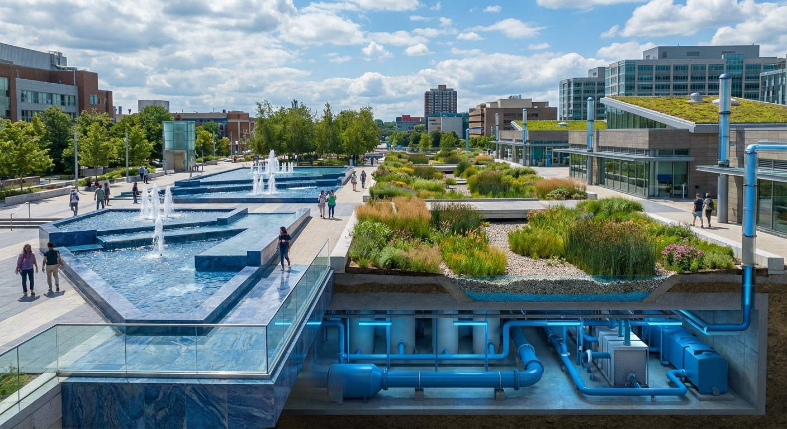

# APPENDIX C: THE WATER SYSTEMS

## Technical Specifications for Hydration in the Living City

---

## C.1 Water Balance

### Inflows

| Source | Volume (L/person/day) | % of Total | Notes |
|--------|----------------------|------------|-------|
| Rainfall (captured) | 40 | 25% | All surfaces |
| Regional supply | 60 | 38% | Supplemental |
| Desalination | 30 | 19% | Solar-powered |
| Atmospheric (AWG) | 10 | 6% | Emergency/backup |
| Recycled greywater | 50 | - | Internal cycle |
| Recycled blackwater | 30 | - | Internal cycle |
| **Net fresh input** | **140** | **100%** | (vs 300-500 L in typical cities) |

### Outflows

| Destination | Volume (L/person/day) | % of Total |
|-------------|----------------------|------------|
| Evapotranspiration | 60 | 43% |
| Groundwater recharge | 40 | 29% |
| River/ocean discharge | 30 | 21% |
| Product incorporation | 5 | 4% |
| Losses | 5 | 4% |
| **Total** | **140** | **100%** |

### Internal Cycles

Water is used multiple times before leaving the system:

**Cycle 1**: Potable use (drinking, cooking) → 10 L/person/day
**Cycle 2**: Hygiene (bathing, handwashing) → greywater → 40 L/person/day
**Cycle 3**: Greywater → toilet flushing, laundry → 40 L/person/day
**Cycle 4**: All water → blackwater treatment → 80 L/person/day
**Cycle 5**: Treated water → irrigation, industrial → 80 L/person/day

Average water molecule cycles: 5-7 times before exiting

---

## C.2 Capture Systems

### Rainwater Harvesting

**Rooftop capture**:
- 100% of roof area equipped for harvesting
- First-flush diversion (initial runoff bypassed)
- Storage: 100 L per m² roof area
- Treatment: Filtration + UV for non-potable use

**Green roof systems**:
- 50% of roofs are vegetated
- Absorption capacity: 50-100 L/m² per rain event
- Slow release over 24-72 hours

### Permeable Surfaces

**Streets and sidewalks**:
- 80% permeable pavement
- Infiltration rate: 50-100 mm/hour
- Subsurface storage: 150 L/m²

**Parks and open space**:
- Bioswales every 50 m along streets
- Rain gardens at every intersection
- Infiltration basins in parks

### Flood Management

**Extreme event capacity**:
- Design for 1-in-500-year storm
- Underground cisterns: 10,000 L per resident
- Detention capacity in parks and open spaces
- Flood-safe building design (ground floors elevated or floodable)

---

## C.3 Treatment Systems

### Potable Water Treatment

**Sources requiring treatment**:
- Rainwater (after first-flush)
- Recycled wastewater (highest treatment level)
- Surface water (regional)

**Treatment train**:
1. Coagulation/flocculation
2. Sedimentation
3. Membrane filtration (ultrafiltration)
4. Reverse osmosis (for recycled water)
5. Advanced oxidation (UV + ozone)
6. Mineral addition (for taste and health)
7. Final disinfection (chloramine residual)

**Quality standard**: Exceeds all international drinking water guidelines

### Greywater Treatment

**At building level**:
- Every building has on-site greywater treatment
- Capacity: sized for 100% of building greywater flow

**Treatment process**:
1. Primary settling (solids removal)
2. Biological treatment (constructed wetland or biofilter)
3. Disinfection (UV)

**Reuse applications**:
- Toilet flushing
- Laundry (cold water)
- Irrigation
- Building cooling towers

### Blackwater Treatment

**Neighborhood facilities**:
- One treatment facility per 5,000-10,000 residents
- Compact footprint (underground where possible)

**Treatment process**:
1. Primary settling
2. Anaerobic digestion (produces biogas)
3. Membrane bioreactor
4. Nutrient recovery (struvite precipitation)
5. Reverse osmosis
6. Advanced oxidation
7. Post-treatment (for potable or non-potable reuse)

**Products**:
- Biogas → energy system (see Appendix B)
- Struvite → fertilizer for food system (see Appendix A)
- Clean water → potable or non-potable reuse

---

## C.4 Distribution Networks

### Potable Water Network

**Design principles**:
- Dual supply where feasible (mains + rainwater)
- Looped network (no dead ends)
- Smart metering at every connection
- Real-time pressure and quality monitoring

**Specifications**:
- Pressure: 3-5 bar at point of use
- Velocity: 0.5-1.5 m/s
- Pipe material: Ductile iron or HDPE (no lead, no PVC)
- Age of infrastructure: Average <25 years

### Non-Potable Water Networks

**Separate networks for**:
- Greywater reuse (building-level)
- Treated effluent (irrigation, industrial)
- Rainwater (non-potable applications)

**Color coding**:
- Blue: Potable
- Purple: Recycled water
- Green: Rainwater

### Hot Water Distribution

**Options**:
- Individual hot water (heat pump or solar thermal at building)
- District hot water (circulating loop from central source)

**Preferred**: District hot water where density supports it
- Temperature: 60°C supply, 40°C return
- Eliminates individual water heaters
- Enables waste heat recovery

---

## C.5 Building Water Systems

### Water Efficiency Standards

| Fixture | Maximum Flow/Flush |
|---------|-------------------|
| Toilets | 3 L/flush (or vacuum 1 L) |
| Urinals | 0.5 L/flush (or waterless) |
| Showers | 6 L/min |
| Faucets | 4 L/min |
| Dishwashers | 10 L/cycle |
| Washing machines | 6 L/kg laundry |

### Water Harvesting

**Every building includes**:
- Rainwater tank (minimum 2,000 L per dwelling unit)
- First-flush diverter
- Pump and filtration for non-potable use
- Connection to irrigation and toilets

### Water Recycling

**Building-level greywater system**:
- Required for all buildings >10 units
- Treats shower/bath/sink water
- Reuse for toilets, laundry, irrigation

**Building-level blackwater** (for large buildings):
- Membrane bioreactor
- Optional for buildings >100 units
- Required for buildings >500 units

### Smart Water Management

**Required systems**:
- Leak detection (acoustic sensors, flow anomaly detection)
- Automated shutoff (in case of major leak)
- Usage monitoring and feedback to residents
- Integration with city water management system

---

## C.6 Industrial Water

### Water Use Standards

**Manufacturing**:
- Closed-loop cooling required
- Zero liquid discharge preferred
- Water intensity targets by industry type

**Cooling towers**:
- Recycled water only (no potable)
- Minimum 5 cycles of concentration
- Side-stream treatment for blowdown recycling

### Industrial Symbiosis

**Water cascading**:
- High-quality water for sensitive processes
- Effluent becomes input for less sensitive processes
- Final effluent to irrigation or treatment

**Example cascade**:
```
Potable water →
  Electronics manufacturing (ultra-pure needed) →
    Cooling tower makeup →
      General cleaning →
        Irrigation →
          Groundwater recharge
```

---

## C.7 Desalination

### Capacity

**Baseline**: 30 L/person/day
**Emergency surge**: 100 L/person/day

**For 100,000 residents**:
- Baseline capacity: 3 ML/day
- Surge capacity: 10 ML/day

### Technology

**Primary**: Reverse osmosis (energy-efficient membranes)

**Energy requirements**:
- Current best practice: 2.5-3.0 kWh/m³
- Target: <2.0 kWh/m³ (with energy recovery)

**Power source**: 100% renewable (dedicated solar + battery)

### Brine Management

**Approaches**:
- Dilution with cooling water outflows (where coastal)
- Zero liquid discharge (crystallization) for inland
- Resource recovery (minerals, salt products)

---

## C.8 Emergency Systems

### Drought Response

**Levels**:
| Level | Trigger | Actions |
|-------|---------|---------|
| Watch | Storage <80% | Voluntary conservation |
| Warning | Storage <60% | Mandatory restrictions (outdoor use) |
| Emergency | Storage <40% | Essential use only, desalination surge |
| Critical | Storage <20% | Distribution rationing |

**Minimum supply** (critical level): 50 L/person/day (health and hygiene)

### Infrastructure Failure

**Backup systems**:
- Emergency interconnections with neighboring systems
- Mobile treatment units (truck-mounted)
- Emergency storage at neighborhood level (3-day supply)
- Atmospheric water generators (AWG) as ultimate backup

### Contamination Response

**Monitoring**:
- Real-time quality sensors throughout network
- Automated isolation of contaminated sections
- Alert systems to affected residents

**Response**:
- Alternative supply activation (bottled, tanker)
- Rapid source identification
- Remediation protocols

---

## C.9 Ecosystem Integration

### Urban Waterways

**Design principles**:
- Daylighting of buried streams
- Natural channel design (no concrete)
- Riparian buffers (minimum 10 m each side)
- Public access where appropriate

**Functions**:
- Stormwater conveyance
- Habitat corridor
- Recreation
- Aesthetic value

### Groundwater Management

**Recharge**:
- All stormwater infiltrated where feasible
- Treated effluent used for aquifer recharge
- Artificial recharge basins in parks

**Protection**:
- Source water protection zones
- Prohibition on groundwater-contaminating activities
- Monitoring wells throughout city

**Target**: Net positive aquifer balance (more recharge than extraction)

### Wetlands

**Constructed wetlands for**:
- Final effluent polishing
- Stormwater treatment
- Habitat creation
- Public amenity

**Design**: 1 m² wetland per 10 residents (10 ha per 100,000)

---

## C.10 Governance and Economics

### Water Authority

**Responsibilities**:
- Water supply and treatment
- Wastewater collection and treatment
- Stormwater management
- Pricing and allocation

**Structure**:
- Public utility model
- Independent board
- Full cost recovery (no subsidies, no profits)

### Pricing

**Principles**:
- Block pricing (higher use = higher rate)
- Lifeline rate (basic use at low cost)
- Full cost recovery (including infrastructure replacement)
- True cost (including environmental externalities)

**Rate structure example**:
| Block | Use (L/person/day) | Rate |
|-------|-------------------|------|
| 1 (lifeline) | 0-50 | $0.50/kL |
| 2 (efficient) | 50-100 | $1.00/kL |
| 3 (standard) | 100-150 | $2.00/kL |
| 4 (excess) | >150 | $5.00/kL |

### Targets and Metrics

| Metric | Current Typical | Living City Target |
|--------|-----------------|-------------------|
| Per capita use | 300 L/day | 140 L/day |
| Non-revenue water | 25% | <5% |
| Recycled water use | 5% | 60% |
| Energy per kL treated | 1.0 kWh | 0.3 kWh |
| Downtime | 24 hrs/yr | <1 hr/yr |

---

*End of Appendix C*
